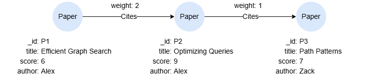

# AI Completion

AI completion functions use a large language model to generate or execute GQL queries from natural language. Use `ai.set_completion_provider()` to set the active completion AI provider.

## Example Graph

<center></center>

```gql
INSERT (p1:Paper {_id:'P1', title:'Efficient Graph Search', score:6, author:'Alex'}),
       (p2:Paper {_id:'P2', title:'Optimizing Queries', score:9, author:'Alex'}),
       (p3:Paper {_id:'P3', title:'Path Patterns', score:7, author:'Zack'}),
       (p1)-[:Cites {weight:2}]->(p2),
       (p2)-[:Cites {weight:1}]->(p3)
```

## Streaming Procedures

`ai.gql()` and `ai.read()` are streaming procedures, not scalar functions. They produce multiple rows of output (one per pipeline stage) as the NL-to-GQL pipeline executes. Because scalar functions used with `RETURN` must produce a single value, these are invoked with `CALL ... YIELD` instead.

### ai.gql()

Converts a natural language question into a GQL query using the configured completion provider via a streaming procedure. The pipeline automatically includes the current graph's schema (labels, properties, edge patterns) as context for the LLM. Streams one row per pipeline stage.

```gql
CALL ai.gql({nl: "Find all papers written by Alex"})
YIELD stage, detail, elapsed_ms, tokens_input, tokens_output, tokens_cached, data
```

Result columns:

| Column | Type | Description |
| -- | -- | -- |
| `stage` | STRING | Pipeline stage: `start` (initiated), `routing` (intent classification), `grounding` (schema selection), `generation` (LLM query generation, may appear multiple times), `tool` (tool call e.g. `validate_gql`, `sample_query`), `validation` (final validation), `execution` (`ai.read` only — runs the query), `final` (complete, `data.gql` contains the query), `error` (failed). |
| `detail` | STRING | Short human-readable summary. |
| `elapsed_ms` | INT | Milliseconds since the call began. |
| `tokens_input` | INT | Cumulative LLM input tokens. |
| `tokens_output` | INT | Cumulative LLM output tokens. |
| `tokens_cached` | INT | Cumulative cached-prefix input tokens (prompt caching). |
| `data` | MAP | Stage-specific payload. The `final` stage contains the generated GQL in `data.gql`. |

Result:

```json
[
  {"stage": "start", "detail": "Find all papers written by Alex", "elapsed_ms": 0, "tokens_input": 0, "tokens_output": 0, "tokens_cached": 0, "data": {"require_read": false}},
  {"stage": "routing", "detail": "MATCH intent — using LLM path", "elapsed_ms": 0, "tokens_input": 0, "tokens_output": 0, "tokens_cached": 0, "data": {}},
  {"stage": "grounding", "detail": "2 labels, 1 patterns selected", "elapsed_ms": 1888, "tokens_input": 0, "tokens_output": 0, "tokens_cached": 0, "data": {"node_labels": ["Paper"], "edge_labels": ["Cites"], "pattern_count": 1}},
  {"stage": "generation", "detail": "requested 1 tool call(s)", "elapsed_ms": 3308, "tokens_input": 2842, "tokens_output": 29, "tokens_cached": 1920, "data": {"step": 0, "tool_calls": 1}},
  {"stage": "tool", "detail": "validate_gql → {\"valid\":true}", "elapsed_ms": 3308, "tokens_input": 2842, "tokens_output": 29, "tokens_cached": 1920, "data": {"name": "validate_gql", "args": "{\"query\":\"MATCH (p:Paper) WHERE p.author = 'Alex' RETURN p\"}", "result": "{\"class\":\"read\",\"valid\":true}"}},
  {"stage": "generation", "detail": "MATCH (p:Paper) WHERE p.author = 'Alex' RETURN p", "elapsed_ms": 4130, "tokens_input": 5723, "tokens_output": 45, "tokens_cached": 4736, "data": {"step": 1, "has_text": true}},
  {"stage": "generation", "detail": "final candidate: MATCH (p:Paper) WHERE p.author = 'Alex' RETURN p", "elapsed_ms": 4130, "tokens_input": 5723, "tokens_output": 45, "tokens_cached": 4736, "data": {"candidate": "MATCH (p:Paper) WHERE p.author = 'Alex' RETURN p", "steps": 2, "termination": "final"}},
  {"stage": "validation", "detail": "passed", "elapsed_ms": 4130, "tokens_input": 5723, "tokens_output": 45, "tokens_cached": 4736, "data": {"passed": true, "class": "read"}},
  {"stage": "final", "detail": "MATCH (p:Paper) WHERE p.author = 'Alex' RETURN p", "elapsed_ms": 4130, "tokens_input": 5723, "tokens_output": 45, "tokens_cached": 4736, "data": {"gql": "MATCH (p:Paper) WHERE p.author = 'Alex' RETURN p"}}
]
```

To output the generated query directly:

```gql
CALL ai.gql({nl: "Find all papers written by Alex"})
YIELD stage, data
FILTER stage = "final"
RETURN data.gql
```

Result:

| data.gql |
| -- |
| "MATCH (p:Paper) WHERE p.author = 'Alex' RETURN p" |

### ai.read()

Converts a natural language question into a read-only GQL query, executes it, and streams pipeline progress. Write/DDL queries are rejected. Returns the same columns as `CALL ai.gql()`, with an additional `execution` stage that runs the generated query.

```gql
CALL ai.read({nl: "How many papers did Alex write in total?"})
YIELD stage, detail, elapsed_ms, tokens_input, tokens_output, tokens_cached, data
```

Result columns same with `ai.gql()`.

## Scalar Functions

These functions return a single value and are used with `RETURN`.

### ai.explain()

Runs the NL-to-GQL pipeline and returns the generated query alongside a reasoning trace (schema used, tool calls, refinements). Does not execute the query.

<table style="width: 100%;">
  <colgroup>
    <col style="width:20%;">
    <col style="width:15%;">
    <col style="width:17%;">
    <col>
  </colgroup>
  <tbody>
    <tr>
      <td><b>Syntax</b></td>
      <td colspan="3"><code>ai.explain(&lt;question&gt;)</code></td>
    </tr>
    <tr>
      <td rowspan="2"><b>Arguments</b></td>
      <td><b>Name</b></td>
      <td><b>Type</b></td>
      <td><b>Description</b></td>
    </tr>
    <tr>
      <td><code>&lt;question&gt;</code></td>
      <td><code>STRING</code></td>
      <td>A natural language question</td>
    </tr>
    <tr>
      <td><b>Return Type</b></td>
      <td colspan="3"><code>RECORD</code></td>
    </tr>
  </tbody>
</table>

The returned map contains:

| Field | Type | Description |
| -- | -- | -- |
| `gql` | STRING | The generated GQL query. |
| `trace` | MAP | Pipeline details including schema used, generation steps, tool calls, validation result, and token usage. |

```gql
RETURN ai.explain("Find ALL papers written by Alex")
```

Result:

```json
{
  "gql": "MATCH (p:Paper) WHERE p.author = 'Alex' RETURN p",
  "trace": {
    "nl": "Find ALL papers written by Alex",
    "total_duration_ms": 4753,
    "termination": "success",
    "schema": {
      "label_count": 2,
      "pattern_count": 1,
      "node_labels": ["Paper"],
      "edge_labels": ["Cites"]
    },
    "generation": {
      "used_tool_use": true,
      "termination": "final",
      "steps": [
        {"assistant_text": "", "duration_ms": 1517, "tool_calls": [{"name": "validate_gql", "args": "{\"query\":\"MATCH (p:Paper) WHERE p.author = 'Alex' RETURN p\"}", "result": "{\"class\":\"read\",\"valid\":true}"}]},
        {"assistant_text": "MATCH (p:Paper) WHERE p.author = 'Alex' RETURN p", "duration_ms": 1837, "tool_calls": []}
      ]
    },
    "validation": {"passed": true, "class": "read"},
    "token_usage": {
      "provider": "openai",
      "model": "gpt-4o-mini",
      "input_tokens": 6325,
      "output_tokens": 45,
      "total_tokens": 6370,
      "calls": 2
    }
  }
}
```

### ai.trace()

Returns the most recent NL-to-GQL pipeline trace recorded by `ai.gql()`, `ai.read()`, or `ai.explain()`. Returns `NULL` if no pipeline call has run in the current session. Useful for debugging when a generated query is incorrect — you can inspect which labels were selected, what tool calls were made, and where the pipeline went wrong.

<table style="width: 100%;">
  <colgroup>
    <col style="width:20%;">
    <col style="width:15%;">
    <col style="width:17%;">
    <col>
  </colgroup>
  <tbody>
    <tr>
      <td><b>Syntax</b></td>
      <td colspan="3"><code>ai.trace()</code></td>
    </tr>
    <tr>
      <td><b>Arguments</b></td>
      <td colspan="3">None</td>
    </tr>
    <tr>
      <td><b>Return Type</b></td>
      <td colspan="3"><code>RECORD</code></td>
    </tr>
  </tbody>
</table>

```gql
RETURN ai.trace()
```

```json
{
  "nl": "Find ALL papers written by Alex",
  "total_duration_ms": 4753,
  "termination": "success",
  "schema": {
    "label_count": 2,
    "pattern_count": 1,
    "node_labels": ["Paper"],
    "edge_labels": ["Cites"]
  },
  "generation": {
    "used_tool_use": true,
    "termination": "final",
    "steps": [
      {"assistant_text": "", "duration_ms": 1517, "tool_calls": [{"name": "validate_gql", "args": "{\"query\":\"MATCH (p:Paper) WHERE p.author = 'Alex' RETURN p\"}", "result": "{\"class\":\"read\",\"valid\":true}"}]},
      {"assistant_text": "MATCH (p:Paper) WHERE p.author = 'Alex' RETURN p", "duration_ms": 1837, "tool_calls": []}
    ]
  },
  "validation": {"passed": true, "class": "read"},
  "token_usage": {
    "provider": "openai",
    "model": "gpt-4o-mini",
    "input_tokens": 6325,
    "output_tokens": 45,
    "total_tokens": 6370,
    "calls": 2
  }
}
```

## Pipeline Configuration

### ai.ai_config()

Returns the current NL-to-GQL pipeline configuration.

<table style="width: 100%;">
  <colgroup>
    <col style="width:20%;">
    <col style="width:15%;">
    <col style="width:17%;">
    <col>
  </colgroup>
  <tbody>
    <tr>
      <td><b>Syntax</b></td>
      <td colspan="3"><code>ai.ai_config()</code></td>
    </tr>
    <tr>
      <td><b>Arguments</b></td>
      <td colspan="3">None</td>
    </tr>
    <tr>
      <td><b>Return Type</b></td>
      <td colspan="3"><code>RECORD</code></td>
    </tr>
  </tbody>
</table>

```gql
RETURN ai.ai_config()
```

Result:

```json
{
  "max_steps": 4,
  "max_refinements": 2,
  "schema_top_k": 8,
  "patterns_top_k": 8,
  "examples_top_k": 3,
  "query_memory_enabled": false,
  "query_memory_size": 256,
  "pipeline": "agentic"
}
```

### ai.set_ai_config()

Sets a configuration parameter for the NL-to-GQL pipeline.

<table style="width: 100%;">
  <colgroup>
    <col style="width:20%;">
    <col style="width:15%;">
    <col style="width:35%;">
    <col>
  </colgroup>
  <tbody>
    <tr>
      <td><b>Syntax</b></td>
      <td colspan="3"><code>ai.set_ai_config(&lt;key&gt;, &lt;value&gt;)</code></td>
    </tr>
    <tr>
      <td rowspan="3"><b>Arguments</b></td>
      <td><b>Name</b></td>
      <td><b>Type</b></td>
      <td><b>Description</b></td>
    </tr>
    <tr>
      <td><code>&lt;key&gt;</code></td>
      <td><code>STRING</code></td>
      <td>Configuration key</td>
    </tr>
    <tr>
      <td><code>&lt;value&gt;</code></td>
      <td><code>STRING</code> / <code>INT</code> / <code>FLOAT</code> / <code>BOOL</code></td>
      <td>Configuration value</td>
    </tr>
    <tr>
      <td><b>Return Type</b></td>
      <td colspan="3"><code>BOOL</code></td>
    </tr>
  </tbody>
</table>

Available configuration keys:

| Key | Type | Description |
| -- | -- | -- |
| `max_steps` | `INT` | Maximum number of pipeline steps |
| `max_refinements` | `INT` | Maximum query refinement attempts |
| `schema_top_k` | `INT` | Number of top schema elements to include |
| `patterns_top_k` | `INT` | Number of top edge patterns to include |
| `examples_top_k` | `INT` | Number of similar query examples to include |
| `query_memory_enabled` | `BOOL` | Enable query memory for learning from past queries |
| `query_memory_size` | `INT` | Maximum number of queries to remember |
| `pipeline` | `STRING` | Pipeline mode to use |

```gql
RETURN ai.set_ai_config("max_refinements", 3)
```