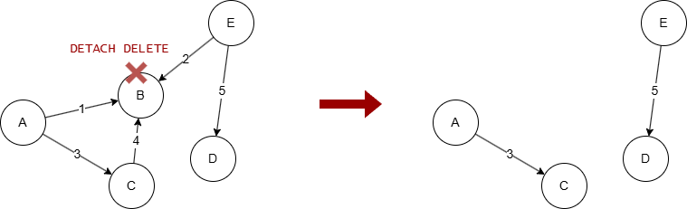
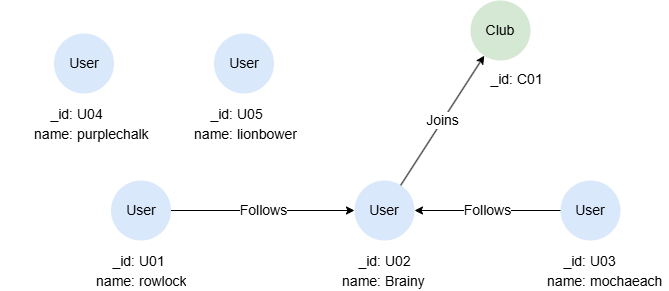

# DELETE

## Overview

The `DELETE` statement allows you to delete nodes and edges from a graph. These nodes or edges must first be retrieved using the `MATCH` statement.

An edge cannot exist when any of its endpoints is removed from the graph. Therefore, by default GQL does not allow to delete a node while it still has edges connected to it. You can bypass this restriction by explicitly using the keyword `DETACH` to enable the deletion of nodes along with their connected edges. For example, when node `B` is deleted by `DETACH DELETE`, edges `1`, `2` and `4` will also be deleted.

<center></center>

Without `DETACH`, the deletion of node `B` will fail, which can be useful as a security measure to prevent unintended deletions.

The keyword `NODETACH` makes the non-cascading behavior explicit: `NODETACH DELETE` is equivalent to plain `DELETE`.

## Example Graph

<center></center>

```gql
INSERT (rowlock:User {_id: "U01", name: "rowlock"}),
       (brainy:User {_id: "U02", name: "Brainy"}),
       (mochaeach:User {_id: "U03", name: "mochaeach"}),
       (purplechalk:User {_id: "U04", name: "purplechalk"}),
       (lionbower:User {_id: "U05", name: "lionbower"}),
       (c:Club {_id: "C01"}),
       (rowlock)-[:Follows]->(brainy),
       (mochaeach)-[:Follows]->(brainy),
       (brainy)-[:Joins]->(c)
```

## Deleting Isolated Nodes

Delete the isolated nodes `purplechalk` and `lionbower`:

```gql
MATCH (n:User) WHERE n.name IN ["purplechalk", "lionbower"] 
DELETE n
```

The `DELETE` statement (without `DETACH`) can only delete isolated nodes. If any node specified has connected edges, an error will be thrown.

## Deleting Any Nodes

Delete the node `rowlock` along with its connected edges:

```gql
MATCH (n:User {name: 'rowlock'})
DETACH DELETE n
```

## Deleting All Nodes and Edges

Delete all nodes along with all edges:

```gql
MATCH (n)
DETACH DELETE n
```

## Deleting Edges

Delete all `Follows` edges:

```gql
MATCH ()-[e:Follows]->()
DELETE e
```

## Limiting the Amount to Delete

To limit the number of nodes or edges to delete, apply the `LIMIT` statement after `MATCH` to keep only the first N records before passing the variable to the `DELETE` statement.

Delete any two edges:

```gql
MATCH ()-[e]->() LIMIT 2
DELETE e
```