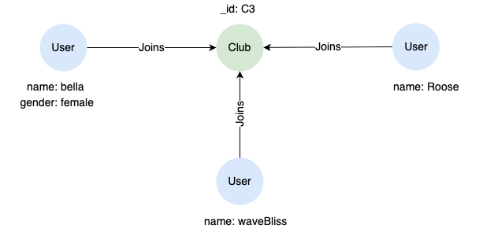

# INSERT

## Overview

The `INSERT` statement allows you to add new nodes and edges into the graph using node and edge patterns.

```syntax
<insert statement> ::=
  "INSERT" <insert path pattern> [ { "," <insert path pattern> } ... ]

<insert path pattern> ::=
  <insert node pattern> [ { <insert edge pattern> <insert node pattern> } ... ]

<insert node pattern> ::=
  "(" [ <node variable declaration> ] [ <label expression> ] [ <property specification> ] ")"

<insert edge pattern> ::=
    "-" [ <edge variable declaration> ] [ <label expression> ] [ <property specification> ] "->"
  | "<-" [ <edge variable declaration> ] [ <label expression> ] [ <property specification> ] "-"
```

**Details**

- `<insert path pattern>` supports single node pattern or simple concatenation of node and edge patterns.
- `<insert path pattern>` does not support `WHERE` clause or undirected edges.

Ultipa supports open, closed, and ontology graphs. Their data insertion syntax is similar, but with important differences in requirements.

### Open Graphs

For an **open graph**, you can directly insert nodes and edges, and the labels and properties are created on the fly.

- **Labels**: You may assign zero, one, or multiple labels to a node or edge.
- **Properties**: Each node or edge has its own set of properties. Any property name is accepted — there is no schema validation. The property value type is inferred from the literal value at insertion time (e.g., `30` is stored as `INT`, `"hello"` as `STRING`, `[1,2]` as `LIST`). Unlike closed graphs where types are explicitly defined (e.g., `UINT32` vs `INT64`), open graphs have no fine-grained type control.

<a target="_blank" href="/docs/gql/open-graphs">Learn more about open graphs →</a>

### Closed Graphs

For a **closed graph**, any node or edge inserted must conform to its defined node or edge type:

- **Labels**: The insert label set must exactly match the full label set of a defined type. For example, if node type `User` has labels `[User, Employee]`, you must insert with `:User&Employee`. Each edge only supports one label.
- **Properties**: Only properties defined in the type are allowed. Each property has an explicitly defined value type (e.g., `STRING`, `UINT32`, `FLOAT`), and inserted values are validated against these types. Properties not provided in the insert default to `null`, unless a `NOT NULL` constraint is defined. Inserting an undefined property name results in an error.

<a target="_blank" href="/docs/gql/closed-graphs">Learn more about closed graphs →</a>

### Ontology Graphs

For an **ontology graph**, `INSERT` uses ontology-prefixed class labels (`@prefix:Class`), an optional `_iri` property for stable identity, and participates in OWL semantics (subclass reasoning, property characteristics, validation). Local and ontology labels can be mixed (e.g., `:Employee&@foaf:Person`).

<a target="_blank" href="/docs/ontology">Learn more about ontology graphs →</a>

## Inserting Nodes
  
Insert a single `User` node:

```gql
INSERT (:User {name: "claire", gender: "female"})
```

Insert multiple nodes and return them:

```gql
INSERT (n1:User&Employee {_id: "U2", name: "Quasar92"}),
       (n2:Club {_id: "C1"}),
       (n3:Club)
RETURN n1, n2, n3
```
> **Node `_id` on insert**: You can assign a custom `_id` on nodes at insert time; if `_id` is omitted, the node receives a system-generated UUID v4 `_id` value.

## Inserting Edges

Insert an edge between existing nodes, first retrieve the nodes using `MATCH`:

```gql
MATCH (n1:User {name: 'claire'}), (n2:Club {_id: 'C1'})
INSERT (n1)-[e:Joins {fee: 1200}]->(n2)
RETURN e
```

Insert a `Joins` edge from an existing `User` node to a new `Club` node:

```gql
MATCH (user:User {name: 'Quasar92'})
INSERT (user)-[:Joins]->(:Club {_id: "C2"})
```

> **Edge `_id` on insert**: edge `_id` is enabled on newly created graphs by default, you can assign a custom `_id` on edges at insert time; if `_id` is omitted, the edge receives a system-generated UUID v4 `_id` value. On graphs created with edge `_id` disabled (or toggled off later), each edge receives a system-assigned `_id` value in the `e:<N>` form, and supplying `_id` in the edge property specification is rejected. See <a target="_blank" href="/docs/gql/node-and-edge-ids">Node and Edge IDs</a>.

## Inserting Paths

Insert two `User` nodes and a `Follows` edge between them:

```gql
INSERT (:User {name: 'rowlock'})-[:Follows {since: date('2024-01-05')}]->(:User {name: 'Brainy', gender: 'male'})
```

Insert the 4 nodes and 3 edges shown below, consider it as two paths intersecting at the `Club` node:

<center></center>

```gql
INSERT (:User {name: 'waveBliss'})-[:Joins]->(c:Club {_id: 'C3'}),
       (:User {name: 'bella'})-[:Joins]->(c)<-[:Joins]-(:User {name: 'Roose'})
```

Alternatively, you can insert each node and edge individually:

```gql
INSERT (waveBliss:User {name: 'waveBliss'}),
       (bella:User {name: 'bella'}),
       (Roose:User {name: 'Roose'}),
       (C3:Club {_id: 'C3'}),
       (waveBliss)-[:Joins]->(C3),
       (bella)-[:Joins]->(C3),
       (Roose)-[:Joins]->(C3)
```

## Property Value Examples

Below are examples of property values for different types. See <a target="_blank" href="/docs/gql/values-and-types#Property-Value-Types">Property Value Types</a> for the complete list.

```gql
INSERT (:Person {
  // Numeric
  memberLevel: 2, score: 60.3,
  
  // Textual
  name: "John Doe", bio: 'A short bio',

  // Temporal Instance
  birthday: date('2000-01-15'),
  registered: local_datetime('2025-01-01 12:20:02'),
  lastLogin: 1762338059,
  meetingTime: time('14:30:00'),
  zonedAt: zoned_datetime('2025-01-01T12:20:02+08:00'),

  // Temporal Duration
  membership: duration('P2Y5M'),
  
  // Boolean
  isBlocked: FALSE,

  // Spatial
  location: point(125.6, 22.3),
  position: point3d(10, 3.4, 6.2),
  
  // Record
  bodyInfo: {height: 175, weight: 68, hairColor: "brown"},
  
  // List
  tags: ["IT", "happy", "geek"],
  
  // Binary
  avatar: "data:image/png;base64,iVBORw0KGgo...",

  // Vector (using AI.VECTOR function)
  embedding: ai.vector([0.12, 0.45, 0.78, 0.33])
})
```

## NULL Property Semantics

An explicit `null` literal in an `INSERT` (or `UPSERT` / `MERGE`) pattern is a real value: the property is stored as `NULL`, appears in `properties(n)`, and `n.x IS NULL` returns `true`.

In an **open graph** this differs from **omitting** the property: an omitted property is not present on the element at all (it does not appear in `properties(n)`), whereas an explicit `null` is present with a `NULL` value. 

In a **closed graph** every declared column exists regardless, so an omitted nullable column also defaults to `NULL`.

```gql
INSERT (n:T {name: 'hello', ip: null})
RETURN properties(n),   // {name: 'hello', ip: null}, 'ip' is present
       n.ip IS NULL     // true
```
