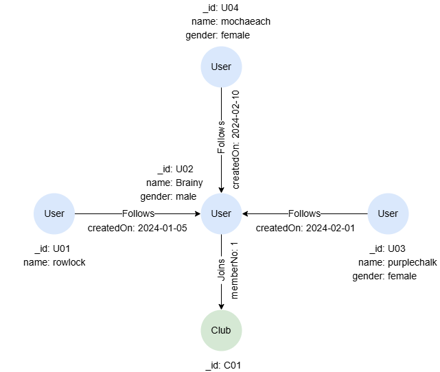

# SET

## Overview

The `SET` statement allows you to set properties and labels on nodes and edges. These nodes or edges must first be retrieved using the `MATCH` statement.

**Note:** The unique identifier `_id` is immutable.

## Example Graph

<center></center>

```gql
INSERT (rowlock:User {_id: "U01", name: "rowlock"}),
       (brainy:User {_id: "U02", name: "Brainy", gender: "male"}),
       (purplechalk:User {_id: "U03", name: "purplechalk", gender: "female"}),
       (mochaeach:User {_id: "U04", name: "mochaeach", gender: "female"}),
       (c:Club {_id: "C01"}),
       (rowlock)-[:Follows {createdOn: date("2024-01-05")}]->(brainy),
       (purplechalk)-[:Follows {createdOn: date("2024-02-01")}]->(brainy),
       (mochaeach)-[:Follows {createdOn: date("2024-02-10")}]->(brainy),
       (brainy)-[:Joins {memberNo: 1}]->(c)
```

## Setting Individual Properties

Update the value of each specified property:

```gql
MATCH (n:User {name: 'rowlock'})-[e:Follows]->(:User {name: 'Brainy'})
SET n.gender = 'male', e.createdOn = date('2024-01-07')
RETURN n.gender, e.createdOn
```

Setting a property to `null` removes it in an **open graph**, or sets its value to `null` (the column remains) in a **closed graph** — the same behavior as <a target="_blank" href="/docs/gql/remove">`REMOVE`</a>:

```gql
MATCH (n:User {name: 'mochaeach'})
SET n.gender = null
```

## Replacing All Properties

You can replace all properties (except `_id`) of a node or edge using a record. Any property included in the record will be updated, while all other properties will be set to `null` (closed graph) or removed (open graph).

```gql
MATCH (n:User {name: 'purplechalk'})
SET n = {name: 'MasterSwift'}
RETURN n
```

Remove all property values by setting an empty record:

```gql
MATCH (n:User {name: 'rowlock'})
SET n = {}
RETURN n
```

## Merging Properties

While `SET n = {record}` **replaces** the entire property set, `SET n += {record}` **merges** the record into the existing properties: keys in the record are added or updated, and all other existing properties are preserved.

```gql
MATCH (n:User {name: 'purplechalk'})
SET n += {gender: 'female', city: 'NYC'}
RETURN n
```

## Nested Property Assignment

A chained `SET` target writes into a value **nested inside** a `RECORD`, `LIST`, or `VECTOR` — updating just that leaf without rewriting the entire root property. For example:

- a record field (`n.rec.field`)
- a nested record field (`n.rec.subRec.field`)
- a list element (`n.list[i]`)
- a record field within a list (`n.list[i].field`)
- a vector element (`n.vec[i]`, which must be numeric)

`RECORD` fields that do not exist yet are created automatically; `LIST` / `VECTOR` positions are **not** auto-created.

```gql
-- RECORD: set one field
MATCH (n:User {_id: 'U01'}) SET n.profile.email = 'a@example.com'

-- RECORD: set one field in a sub-record
MATCH (n:User {_id: 'U01'}) SET n.profile.address.city = 'Tokyo'

-- LIST<RECORD>: index then key; first index [0] → then key .tag (the position must already exist)
-- e.g., n.history = [{tag: 'old', note: 'first'}, {tag: 'foo'}] -> [{tag: 'pinned', note: 'first'}, {tag: 'foo'}]
MATCH (n:User {_id: 'U01'}) SET n.history[0].tag = 'pinned'

-- LIST<Type>: set an element by index (the position must already exist)
-- e.g., n.scores = [10, 20, 30]  ->  [10, 99, 30]
MATCH (n:User {_id: 'U01'}) SET n.scores[1] = 99

-- VECTOR: set a numeric element by index (the position must already exist)
-- e.g., n.embedding = [0.1, 0.2, 0.3]  ->  [0.95, 0.2, 0.3]
MATCH (n:User {_id: 'U01'}) SET n.embedding[0] = 0.95
```

## Setting Labels

Add one label to a node:

```gql
MATCH (n:User {name: 'rowlock'})
SET n:Player

-- 'IS <Label>' is an ISO-standard synonym for ':<Label>'
MATCH (n:User {name: 'rowlock'})
SET n IS Player
```

Add multiple labels to a node:

```gql
MATCH (n:User {name: 'rowlock'})
SET n:Player, n:Employee
```

Update labels of `FOLLOWS` edges to `Links` (each edge has up to one label):

```gql
MATCH ()-[e:Follows]->()
SET e:Links
```

> To remove labels from nodes or edges, use the <a target="_blank" href="/docs/gql/remove">REMOVE</a> statement.
