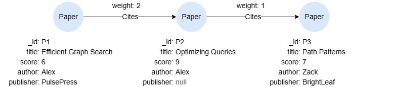

# CASE

The `CASE` expression is a conditional expression that allows you to evaluate one or more conditions and return different results based on those conditions.

```syntax
<case expression> ::= <simple case> | <general case>
```

GQL supports two forms of the `CASE` expression:

- <a href="#Simple-CASE">Simple CASE</a>
- <a href="#General-CASE">General CASE</a>

## Example Graph

<center></center>

```gql
INSERT (p1:Paper {_id:'P1', title:'Efficient Graph Search', score:6, author:'Alex', publisher:'PulsePress'}),
       (p2:Paper {_id:'P2', title:'Optimizing Queries', score:9, author:'Alex'}),
       (p3:Paper {_id:'P3', title:'Path Patterns', score:7, author:'Zack', publisher:'BrightLeaf'}),
       (p1)-[:Cites {weight:2}]->(p2),
       (p2)-[:Cites {weight:1}]->(p3)
```

## Simple CASE

The simple `CASE` expression evaluates a single expression against multiple possible values, returning the result associated with the first matching value.

```syntax
<simple case> ::=
  "CASE" <expr>
    { "WHEN" <value> "THEN" <expr> }...
    [ "ELSE" <expr> ]
  "END"
```

**Details**

- The `<expr>` is evaluated once, then compared for equality against each `WHEN` value in order.
- The first match returns the corresponding `THEN` value.
- If no match is found, returns the `ELSE` value. If `ELSE` is omitted, `null` is returned.
- Only equality comparison is supported. For conditions involving operators (`<`, `>`, `IS NULL`, etc.), use <a href="#General-CASE">General CASE</a>.

```gql
MATCH (n:Paper WHERE n.score > 6)
RETURN CASE count(n) WHEN 3 THEN "Y" ELSE "N" END AS result
```
  
Result: "N"

```gql
MATCH (n:Paper)
RETURN n.title, n.score,
CASE n.score
  WHEN 6 THEN "Low"
  WHEN 7 THEN "Medium"
  WHEN 8 THEN "Medium"
ELSE "High" END AS scoreLevel
```

Result:

| n.title | n.score | scoreLevel |
| -- | -- | -- |
| Efficient Graph Search | 6 | Low |
| Optimizing Queries | 9 | High |
| Path Patterns | 7 | Medium |

## General CASE

The general `CASE` expression evaluates multiple conditions, returning the result associated with the first condition that evaluates to true.

```syntax
<general case> ::=
  "CASE"
    { "WHEN" <condition> "THEN" <expr> }...
    [ "ELSE" <expr> ]
  "END"
```

**Details**

- Each `<condition>` is a boolean expression evaluated sequentially.
- The first condition that evaluates to true returns the corresponding `THEN` value.
- If no condition is true, returns the `ELSE` value. If `ELSE` is omitted, `null` is returned.

```gql
MATCH (n:Paper)
RETURN n.title,
CASE
  WHEN n.publisher IS NULL THEN "Publisher N/A"
  WHEN n.score < 7 THEN -1
  ELSE n.author
END AS note
```

Result:

| n.title | note |
| -- | -- |
| Optimizing Queries | Publisher N/A |
| Efficient Graph Search | -1 |
| Path Patterns | Zack |

```gql
MATCH (n:Paper)
RETURN n.title, n.score,
CASE
  WHEN n.score < 7 THEN "Low"
  WHEN n.score <= 8 THEN "Medium"
  ELSE "High"
END AS scoreLevel
```

Result:

| n.title | n.score | scoreLevel |
| -- | -- | -- |
| Efficient Graph Search | 6 | Low |
| Optimizing Queries | 9 | High |
| Path Patterns | 7 | Medium |
