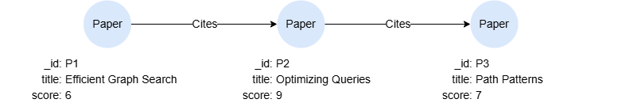

# Value Query Expression

The value query expression allows you to specify a scalar value derived from a nested query specification. The output of this expression is expected to be either a single value or `null`.

```syntax
<value query expression> ::= "VALUE {" <query> "}"
```

**Details**

- The `<query>` is executed as a complete query and must end with a `RETURN` that projects exactly one return item (a single column). Returning more than one column raises an error.
- The query must evaluate to at most one row:
  - No rows: the expression yields `null`.
  - Exactly one row: that single value is returned.
  - More than one row: the query raises an error.
- To guarantee a single row, have the return item use an aggregation function (e.g. `avg()`, `count()`) or add an explicit `LIMIT 1` to the body.

## Example Graph

<center></center>

```gql
INSERT (p1:Paper {_id:'P1', title:'Efficient Graph Search', score:6}),
       (p2:Paper {_id:'P2', title:'Optimizing Queries', score:9}),
       (p3:Paper {_id:'P3', title:'Path Patterns', score:7}),
       (p1)-[:Cites]->(p2),
       (p2)-[:Cites]->(p3)
```

## Examples

```gql
LET avgScore = VALUE {MATCH (n) RETURN avg(n.score)}
MATCH (n) WHERE n.score > avgScore
RETURN n.title
```

Result:

| n.title |
| -- |
| Optimizing Queries |