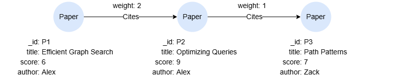

# Path Functions

## Example Graph

<center></center>

```gql
INSERT (p1:Paper {_id:'P1', title:'Efficient Graph Search', score:6, author:'Alex'}),
       (p2:Paper {_id:'P2', title:'Optimizing Queries', score:9, author:'Alex'}),
       (p3:Paper {_id:'P3', title:'Path Patterns', score:7, author:'Zack'}),
       (p1)-[:Cites {weight:2}]->(p2),
       (p2)-[:Cites {weight:1}]->(p3)
```

## path_length()

Returns the number of edges in a path. `length()` is a synonym.

<table style="width: 100%;">
  <colgroup>
    <col style="width:20%;">
    <col>
    <col>
    <col style="width:40%;">
  </colgroup>
  <tbody>
    <tr>
      <td><b>Syntax</b></td>
      <td colspan="3"><code>path_length(&lt;pathVar&gt;)</code></td>
    </tr>
    <tr>
      <td rowspan="2"><b>Arguments</b></td>
      <td><b>Name</b></td>
      <td><b>Type</b></td>
      <td><b>Description</b></td>
    </tr>
    <tr>
      <td><code>&lt;pathVar&gt;</code></td>
      <td><code>PATH</code></td>
      <td>Path variable reference</td>
    </tr>
    <tr>
      <td><b>Return Type</b></td>
      <td colspan="3"><code>UINT</code></td>
    </tr>
  </tbody>
</table>

```gql
MATCH p = ()->{1,3}()
RETURN p, path_length(p) AS length
```

Result:

| p | length |
| -- | -- |
| <center></center> | 2 |
| <center></center> | 1 |
| <center></center> | 1 |

## elements()

Returns a list containing the nodes and edges that make up a path, interleaved in order.

<table style="width: 100%;">
  <colgroup>
    <col style="width:20%;">
    <col>
    <col>
    <col style="width:40%;">
  </colgroup>
  <tbody>
    <tr>
      <td><b>Syntax</b></td>
      <td colspan="3"><code>elements(&lt;pathVar&gt;)</code></td>
    </tr>
    <tr>
      <td rowspan="2"><b>Arguments</b></td>
      <td><b>Name</b></td>
      <td><b>Type</b></td>
      <td><b>Description</b></td>
    </tr>
    <tr>
      <td><code>&lt;pathVar&gt;</code></td>
      <td><code>PATH</code></td>
      <td>Path variable reference</td>
    </tr>
    <tr>
      <td><b>Return Type</b></td>
      <td colspan="3"><code>LIST</code></td>
    </tr>
  </tbody>
</table>

```gql
MATCH p = ()->()
LET items = elements(p)
FOR item IN items WITH ORDINALITY index
FILTER index %2 = 1
RETURN item
```

Result:

```json
[
  {"id": "P2", "labels": ["Paper"], "properties": {"title": "Optimizing Queries", "author": "Alex", "score": 9}},
  {"id": "P3", "labels": ["Paper"], "properties": {"title": "Path Patterns", "author": "Zack", "score": 7}},
  {"id": "P1", "labels": ["Paper"], "properties": {"title": "Efficient Graph Search", "author": "Alex", "score": 6}},
  {"id": "P2", "labels": ["Paper"], "properties": {"title": "Optimizing Queries", "author": "Alex", "score": 9}}
]
```

## pnodes()

Returns the nodes of a path as a list. `nodes()` is a synonym.

<table style="width: 100%;">
  <colgroup>
    <col style="width:20%;">
    <col>
    <col>
    <col style="width:40%;">
  </colgroup>
  <tbody>
    <tr>
      <td><b>Syntax</b></td>
      <td colspan="3"><code>pnodes(&lt;pathVar&gt;)</code></td>
    </tr>
    <tr>
      <td rowspan="2"><b>Arguments</b></td>
      <td><b>Name</b></td>
      <td><b>Type</b></td>
      <td><b>Description</b></td>
    </tr>
    <tr>
      <td><code>&lt;pathVar&gt;</code></td>
      <td><code>PATH</code></td>
      <td>Path variable reference</td>
    </tr>
    <tr>
      <td><b>Return Type</b></td>
      <td colspan="3"><code>LIST</code></td>
    </tr>
  </tbody>
</table>

```gql
MATCH p = ({_id: "P1"})->()
RETURN pnodes(p)
```

Result:

```json
[
  {
    "id": "P1",
    "labels": ["Paper"],
    "properties": {"score": 6, "author": "Alex", "title": "Efficient Graph Search"}
  },
  {
    "id": "P2",
    "labels": ["Paper"],
    "properties": {"title": "Optimizing Queries", "score": 9, "author": "Alex"}
  }
]
```

## pedges()

Returns the edges of a path as a list. `relationships()` is a synonym.

<table style="width: 100%;">
  <colgroup>
    <col style="width:20%;">
    <col>
    <col>
    <col style="width:40%;">
  </colgroup>
  <tbody>
    <tr>
      <td><b>Syntax</b></td>
      <td colspan="3"><code>pedges(&lt;pathVar&gt;)</code></td>
    </tr>
    <tr>
      <td rowspan="2"><b>Arguments</b></td>
      <td><b>Name</b></td>
      <td><b>Type</b></td>
      <td><b>Description</b></td>
    </tr>
    <tr>
      <td><code>&lt;pathVar&gt;</code></td>
      <td><code>PATH</code></td>
      <td>Path variable reference</td>
    </tr>
    <tr>
      <td><b>Return Type</b></td>
      <td colspan="3"><code>LIST</code></td>
    </tr>
  </tbody>
</table>

```gql
MATCH p = ({_id: "P1"})->()
RETURN pedges(p)
```

Result:

```json
[
  {
    "id": "e:1",
    "label": "Cites",
    "fromNodeId": "P1",
    "toNodeId": "P2",
    "properties": {"weight": 2}
  }
]
```

## node_ids()

Collects the `_id` values of nodes in a path into a list. `pnodeIds()` is a synonym.

<table style="width: 100%;">
  <colgroup>
    <col style="width:20%;">
    <col>
    <col>
    <col style="width:40%;">
  </colgroup>
  <tbody>
    <tr>
      <td><b>Syntax</b></td>
      <td colspan="3"><code>node_ids(&lt;pathAlias&gt;)</code></td>
    </tr>
    <tr>
      <td rowspan="2"><b>Arguments</b></td>
      <td><b>Name</b></td>
      <td><b>Type</b></td>
      <td><b>Description</b></td>
    </tr>
    <tr>
      <td><code>&lt;pathAlias&gt;</code></td>
      <td><code>PATH</code></td>
      <td>Path alias reference</td>
    </tr>
    <tr>
      <td><b>Return Type</b></td>
      <td colspan="3"><code>LIST</code></td>
    </tr>
  </tbody>
</table>

```gql
MATCH p = ({_id: "P1"})-[]->{1,2}()
RETURN node_ids(p)
```

Result:

| node_ids(p) |
| -- |
| ["P1","P2"] |
| ["P1","P2","P3"] |

## edge_ids()

Collects the `_id` values of edges in a path into a list. `pedgeUuids()` is a synonym.

<table style="width: 100%;">
  <colgroup>
    <col style="width:20%;">
    <col>
    <col>
    <col style="width:40%;">
  </colgroup>
  <tbody>
    <tr>
      <td><b>Syntax</b></td>
      <td colspan="3"><code>edge_ids(&lt;pathAlias&gt;)</code></td>
    </tr>
    <tr>
      <td rowspan="2"><b>Arguments</b></td>
      <td><b>Name</b></td>
      <td><b>Type</b></td>
      <td><b>Description</b></td>
    </tr>
    <tr>
      <td><code>&lt;pathAlias&gt;</code></td>
      <td><code>PATH</code></td>
      <td>Path alias reference</td>
    </tr>
    <tr>
      <td><b>Return Type</b></td>
      <td colspan="3"><code>LIST</code></td>
    </tr>
  </tbody>
</table>

```gql
MATCH p = ({_id: "P1"})-[]->{1,2}()
RETURN edge_ids(p)
```

Result:

| edge_ids(p) |
| -- |
| ["e:1"] |
| ["e:1","e:2"] |

## ids()

Generic ID accessor that works on a path, a single node/edge, or a list of nodes/edges. Returns:

- For a path: a flat list of `_id` values, with nodes and edges interleaved in path order.
- For a single node or edge: the element's `_id` as a string.
- For a list of nodes/edges: a list of their `_id` values (preserving null slots).

<table style="width: 100%;">
  <colgroup>
    <col style="width:20%;">
    <col>
    <col>
    <col style="width:40%;">
  </colgroup>
  <tbody>
    <tr>
      <td><b>Syntax</b></td>
      <td colspan="3"><code>ids(&lt;expr&gt;)</code></td>
    </tr>
    <tr>
      <td rowspan="2"><b>Arguments</b></td>
      <td><b>Name</b></td>
      <td><b>Type</b></td>
      <td><b>Description</b></td>
    </tr>
    <tr>
      <td><code>&lt;expr&gt;</code></td>
      <td><code>PATH</code>, <code>NODE</code>, <code>EDGE</code>, or <code>LIST&lt;NODE&#124;EDGE&gt;</code></td>
      <td>The input expression</td>
    </tr>
    <tr>
      <td><b>Return Type</b></td>
      <td colspan="3"><code>STRING</code> or <code>LIST&lt;STRING&gt;</code></td>
    </tr>
  </tbody>
</table>

```gql
MATCH p = ({_id: "P1"})-[]->()
RETURN ids(p)
```

Result:

| ids(p) |
| -- |
| ["P1","e:1","P2"] |