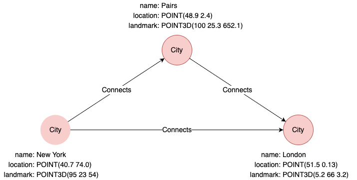

# Spatial Functions

## Coordinate Reference Systems

`POINT` and `POINT3D` values carry a **coordinate reference system (CRS)**, identified by an integer SRID. Four CRSs are supported:

| SRID | CRS name | Dimensions | Distance |
| -- | -- | -- | -- |
| `4326` | `wgs-84` | 2D (longitude, latitude) | Great-circle (haversine), meters |
| `4979` | `wgs-84-3d` | 3D (longitude, latitude, height) | Haversine + height, meters |
| `7203` | `cartesian` | 2D (x, y) | Euclidean, raw coordinate units |
| `9157` | `cartesian-3d` | 3D (x, y, z) | Euclidean, raw coordinate units |

The CRS determines how [`distance()`](#distance) is computed. Two points must share the same CRS to be compared.

## Example Graph

<center></center>

```gql
INSERT (paris:City {name: "Paris", location: point(2.4, 48.9), landmark: point3d(100, 25.3, 652.1)}),
       (newYork:City {name: "New York", location: point(-74.0, 40.7), landmark: point3d(95, 23, 54)}),
       (london:City {name: "London", location: point(-0.13, 51.5), landmark: point3d(5.2, 66, 3.2)}),
       (newYork)-[:Connects]->(paris),
       (newYork)-[:Connects]->(london),
       (paris)-[:Connects]->(london)
```

## point()

Creates a `POINT` (2D) or `POINT3D` (3D when a `z`/`altitude`/`height` key is present in the map form) value.

<table style="width: 100%;">
  <colgroup>
    <col style="width:20%;">
    <col style="width:20%;">
    <col style="width:20%;">
    <col>
  </colgroup>
  <tbody>
    <tr>
      <td><b>Syntax</b></td>
      <td colspan="3"><code>point(&lt;longitude&gt;, &lt;latitude&gt;)</code> or <code>point(&lt;map&gt;)</code></td>
    </tr>
    <tr>
      <td rowspan="3"><b>Arguments</b></td>
      <td><b>Form</b></td>
      <td><b>Behavior</b></td>
      <td><b>CRS</b></td>
    </tr>
    <tr>
      <td>Positional <code>(longitude, latitude)</code></td>
      <td>Two numeric arguments.</td>
      <td>Always <code>wgs-84</code> (SRID 4326).</td>
    </tr>
    <tr>
      <td>Map <code>({...})</code></td>
      <td>Single map literal with coordinate keys (and optional <code>crs</code>/<code>srid</code>).</td>
      <td>Inferred from keys; overridable.</td>
    </tr>
    <tr>
      <td><b>Return Type</b></td>
      <td colspan="3"><code>POINT</code>, or <code>POINT3D</code> when the map carries a third coordinate.</td>
    </tr>
  </tbody>
</table>

**Map form rules**:

- **Coordinate keys** (aliases are interchangeable):
  - 1st: `x` / `longitude` / `lng`
  - 2nd: `y` / `latitude` / `lat`
  - 3rd (optional, promotes to `POINT3D`): `z` / `altitude` / `height`
- **CRS inference** (when neither `crs` nor `srid` is given):
  - Any geographic key (`longitude`/`latitude`/`lng`/`lat`/`height`) → `wgs-84` (or `wgs-84-3d` if 3D).
  - Otherwise → `cartesian` (or `cartesian-3d` if 3D).
- **Explicit override**: `crs: '<name>'` or `srid: <number>`. CRS must match the dimensionality of the coordinates.

```gql
-- Positional: WGS-84 by default
RETURN point(116.3, 39.9)

-- Map form, WGS-84 inferred from key names
RETURN point({longitude: 116.3, latitude: 39.9})

-- Map form, cartesian inferred from x/y
RETURN point({x: 1.5, y: 2.5})

-- Map form with z promotes to POINT3D (cartesian-3d)
RETURN point({x: 1, y: 2, z: 3})

-- Map form with height promotes to POINT3D (wgs-84-3d)
RETURN point({longitude: 116.3, latitude: 39.9, height: 100})

-- Explicit CRS override
RETURN point({x: 1.5, y: 2.5, crs: 'wgs-84'})
RETURN point({x: 1.5, y: 2.5, srid: 4326})
```

## point3d()

Creates a `POINT3D` value. Same map-form rules as [`point()`](#point); the map argument must include the third coordinate.

<table style="width: 100%;">
  <colgroup>
    <col style="width:20%;">
    <col style="width:20%;">
    <col style="width:20%;">
    <col>
  </colgroup>
  <tbody>
    <tr>
      <td><b>Syntax</b></td>
      <td colspan="3"><code>point3d(&lt;x&gt;, &lt;y&gt;, &lt;z&gt;)</code> or <code>point3d(&lt;map&gt;)</code></td>
    </tr>
    <tr>
      <td rowspan="3"><b>Arguments</b></td>
      <td><b>Form</b></td>
      <td><b>Behavior</b></td>
      <td><b>CRS</b></td>
    </tr>
    <tr>
      <td>Positional <code>(x, y, z)</code></td>
      <td>Three numeric arguments.</td>
      <td>Always <code>cartesian-3d</code> (SRID 9157).</td>
    </tr>
    <tr>
      <td>Map <code>({...})</code></td>
      <td>Single map literal with three coordinate keys (and optional <code>crs</code>/<code>srid</code>).</td>
      <td>Inferred from keys; overridable.</td>
    </tr>
    <tr>
      <td><b>Return Type</b></td>
      <td colspan="3"><code>POINT3D</code></td>
    </tr>
  </tbody>
</table>

```gql
-- Positional: cartesian-3d by default
RETURN point3d(10, 15, 5)

-- Map form, cartesian-3d inferred from x/y/z
RETURN point3d({x: 10, y: 15, z: 5})

-- Map form, wgs-84-3d inferred from longitude/latitude/height
RETURN point3d({longitude: 116.3, latitude: 39.9, height: 100})

-- Explicit CRS override
RETURN point3d({x: 1, y: 2, z: 3, crs: 'wgs-84-3d'})
```

## distance()

Computes the distance between two points. The formula is chosen by the **CRS** the points carry (not by Go type):

- Geographic (`wgs-84`, `wgs-84-3d`) — great-circle (haversine) distance in **meters**. The 3D form adds the height difference (Pythagoras).
- Cartesian (`cartesian`, `cartesian-3d`) — Euclidean distance in the raw coordinate units.

Both points must share the same CRS, otherwise the call errors.

<table style="width: 100%;">
  <colgroup>
    <col style="width:20%;">
    <col style="width:20%;">
    <col style="width:30%;">
    <col>
  </colgroup>
  <tbody>
    <tr>
      <td><b>Syntax</b></td>
      <td colspan="3"><code>distance(&lt;point1&gt;, &lt;point2&gt;)</code></td>
    </tr>
    <tr>
      <td rowspan="3"><b>Arguments</b></td>
      <td><b>Name</b></td>
      <td><b>Type</b></td>
      <td><b>Description</b></td>
    </tr>
    <tr>
      <td><code>&lt;point1&gt;</code></td>
      <td><code>POINT</code> or <code>POINT3D</code></td>
      <td>The first point</td>
    </tr>
    <tr>
      <td><code>&lt;point2&gt;</code></td>
      <td><code>POINT</code> or <code>POINT3D</code></td>
      <td>The second point; must be the same type as <code>&lt;point1&gt;</code></td>
    </tr>
    <tr>
      <td><b>Return Type</b></td>
      <td colspan="3"><code>DOUBLE</code></td>
    </tr>
  </tbody>
</table>

```gql
MATCH (n1:City {name: 'New York'})
MATCH (n2:City {name: 'London'})
RETURN distance(n1.location, n2.location)
```

Result: `5570833.653336142` (meters)

## point_get()

Extracts a coordinate value from a `POINT` or `POINT3D` value by index.

<table style="width: 100%;">
  <colgroup>
    <col style="width:20%;">
    <col style="width:23%;">
    <col style="width:13%;">
    <col>
  </colgroup>
  <tbody>
    <tr>
      <td><b>Syntax</b></td>
      <td colspan="3"><code>point_get(&lt;point&gt;, &lt;index&gt;)</code></td>
    </tr>
    <tr>
      <td rowspan="3"><b>Arguments</b></td>
      <td><b>Name</b></td>
      <td><b>Type</b></td>
      <td><b>Description</b></td>
    </tr>
    <tr>
      <td><code>&lt;point&gt;</code></td>
      <td><code>POINT</code> or <code>POINT3D</code></td>
      <td>A point value</td>
    </tr>
    <tr>
      <td><code>&lt;index&gt;</code></td>
      <td><code>INT</code></td>
      <td>Coordinate index. For <code>POINT</code>: <code>0</code> = longitude, <code>1</code> = latitude. For <code>POINT3D</code>: <code>0</code> = x, <code>1</code> = y, <code>2</code> = z.</td>
    </tr>
    <tr>
      <td><b>Return Type</b></td>
      <td colspan="3"><code>DOUBLE</code></td>
    </tr>
  </tbody>
</table>

```gql
MATCH (n {name: "New York"})
RETURN point_get(n.location, 0) AS longitude, point_get(n.location, 1) AS latitude
```

Result:

| longitude | latitude |
| -- | -- |
| -74.0 | 40.7 |
