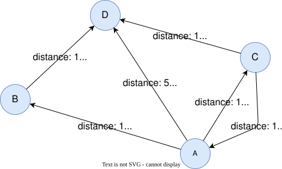
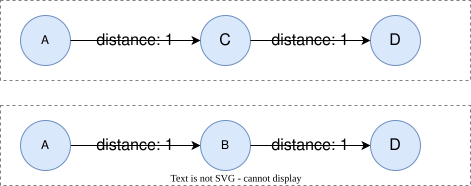
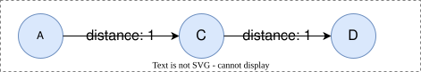
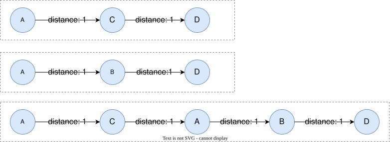
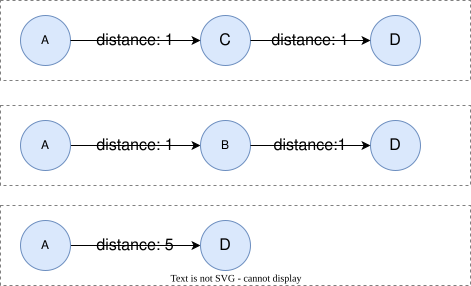
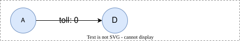
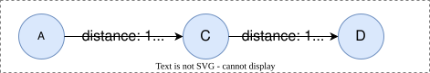
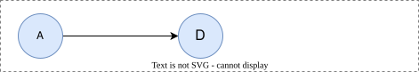

# Cheapest Paths

## Overview

Cheapest paths between two nodes are those with the smallest total cost, where the cost of each edge is supplied through a `COST` clause. Unlike <a target="_blank" href="/docs/gql/shortest-paths">shortest paths</a> which minimize the number of edges, cheapest paths minimize a weighted sum, so the cheapest path is not necessarily the one with the fewest hops.

You can select cheapest paths from each **partition** of the match results using the following path selectors. A "partition" refers to a group of paths that share the same start and end nodes.

| Cheapest Path Selector | Description |
| -- | -- |
| `ALL CHEAPEST` | Selects all cheapest paths from each partition. |
| `ANY CHEAPEST` | Selects any one cheapest path from each partition. |
| `CHEAPEST` | Selects one cheapest path from each partition. |
| `CHEAPEST k` | Selects any `k` (non-negative integer) cheapest paths from each partition. If a partition has fewer than `k` cheapest paths, continues selecting the second cheapest, third cheapest, and so on, until the required number is reached or no more paths are available. |

A cheapest selector, an optional path mode, and the path pattern combine as follows:

```syntax
<cheapest path pattern> ::=
  [ <path variable> "=" ] <cheapest path selector> [ <path mode> ] <path pattern expression>
```

**Details**

- The cheapest path selectors are typically used with variable-length <a target="_blank" href="/docs/gql/quantified-paths">quantified paths</a>. 
- The <a target="_blank" href="/docs/gql/path-patterns#Path-Mode">path mode</a> is placed after the selector and controls how paths are traversed, for example `ALL CHEAPEST WALK (a)-[e:Road COST e.distance]->{1,5}(b)`. When no path mode is given, it defaults to `TRAIL`, where repeated edges are not allowed. See examples in <a href="#CHEAPEST-k">CHEAPEST k</a>.

### COST Clause

The `COST` clause appears inside an edge pattern and provides the per-edge cost expression. The expression is evaluated for each matched edge, and the path's total cost is the sum of these per-edge costs.

```syntax
<cheapest path edge pattern> ::=
    "<-[" <cheapest edge pattern filter> "]-"
  | "-[" <cheapest edge pattern filter> "]->"
  | "-[" <cheapest edge pattern filter> "]-"

<cheapest edge pattern filter> ::= [ <edge variable> ] [ <label expression> ] <cost clause>

<cost clause> ::= "COST" <value expression>
```

**Details**

- `COST` cannot be used with property specification or inline `WHERE` within the same edge pattern.
- The `<value expression>` in `COST` can reference edge properties, including arithmetic combinations of multiple properties.
- If the `COST` expression evaluates to `NULL` for an edge (for example, the referenced weight property is absent on that edge), the edge is treated as **non-traversable** and is skipped — it is *not* traversed at a default cost. A destination reachable only through `NULL`-cost edges yields no path. This makes it possible to run `CHEAPEST` over a *projected weighted subgraph*: materialize a cost only on the edges that should participate, and every other edge of the same type drops out of the search.

<p tit="Cheapest Path Edge Pattern"></p>

```gql
-- Cost from a single property
-[e:Road COST e.distance]->

-- Combined cost from multiple properties
-[e:Road COST e.distance + e.toll]->

-- Constant cost (every edge counted equally)
-[e:Road COST 1]->
```

Negative cost values are allowed.

## Example Graph

<center></center>

```gql
INSERT (a:City {_id: 'A'}), (b:City {_id: 'B'}),
       (c:City {_id: 'C'}), (d:City {_id: 'D'}),
       (a)-[:Road {distance: 1, toll: 5}]->(b), (a)-[:Road {distance: 1, toll: 0}]->(c),
       (a)-[:Road {distance: 5, toll: 0}]->(d), (b)-[:Road {distance: 1, toll: 5}]->(d),
       (c)-[:Road {distance: 1, toll: 0}]->(d), (c)-[:Road {distance: 1, toll: 0}]->(a)
```

## ALL CHEAPEST

Find every path from `A` to `D` whose total `distance` equals the minimum:

```gql
MATCH p = ALL CHEAPEST ({_id: 'A'})-[e:Road COST e.distance]->{1,5}({_id: 'D'})
RETURN p
```

Result: `p`

<center></center>

## CHEAPEST

Without an explicit selector keyword, `CHEAPEST` returns one cheapest path per partition:

```gql
MATCH p = CHEAPEST ({_id: 'A'})-[e:Road COST e.distance]->{1,5}({_id: 'D'})
RETURN p
```

Result: `p`

<center></center>

## ANY CHEAPEST

Return one cheapest path per partition. When multiple paths share the minimum cost, the engine returns any one of them:

```gql
MATCH p = ANY CHEAPEST ({_id: 'A'})-[e:Road COST e.distance]->{1,5}({_id: 'D'})
RETURN p
```

Result: `p`

<center></center>

## CHEAPEST k

```gql
MATCH p = CHEAPEST 2 ({_id: 'A'})-[e:Road COST e.distance]->{1,5}({_id: 'D'})
RETURN p
```

Result: `p`

<center></center>

```gql
MATCH p = CHEAPEST 3 ({_id: 'A'})-[e:Road COST e.distance]->{1,5}({_id: 'D'})
RETURN p
```

Since only two paths with the cheapest cost of `2` exist between `A` and `D`, one path with the second cheapest cost needs to be selected. In this example, there is only one path with the second cheapest cost of `4`, therefore the following three paths are returned:

<center></center>

Adding the `ACYCLIC` path mode forbids repeated nodes, so the loop `A→C→A→B→D` (which revisits `A`) is excluded. The third cheapest path is now the direct `A→D` at cost `5`:

```gql
MATCH p = CHEAPEST 3 ACYCLIC ({_id: 'A'})-[e:Road COST e.distance]->{1,5}({_id: 'D'})
RETURN p
```

<center></center>

## COST Expressions

Cheapest path by `toll` instead of `distance`:

```gql
MATCH p = CHEAPEST ({_id: 'A'})-[e:Road COST e.toll]->{1,5}({_id: 'D'})
RETURN p
```

Result: `p`

<center></center>

Cheapest path by combined cost (`distance + toll`):

```gql
MATCH p = CHEAPEST ({_id: 'A'})-[e:Road COST e.distance + e.toll]->{1,5}({_id: 'D'})
RETURN p
```

Result: `p`

<center></center>

A constant cost of `1` per edge degenerates to shortest path by hop count, returning the direct path `A → D`:

```gql
MATCH p = CHEAPEST ({_id: 'A'})-[e:Road COST 1]->{1,5}({_id: 'D'})
RETURN p
```

Result: `p`

<center></center>
