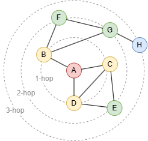

# K-Hop Traversal

## Overview

The **K-hop neighbors** of a node are the nodes located at a shortest distance of `K` from that node. The shortest distance is the number of edges in the shortest path.

<center></center>

In this graph, nodes `{B, C, D}` are the 1-hop neighbors of node `A`, `{E, F, G}` are the 2-hop neighbors, and `{H}` is the 3-hop neighbor.

Key properties of K-hop neighbors:

- `K` is determined solely by the shortest distance and is **unique**. For example, there may be many paths between two nodes, but `K` is always the shortest. A node will only appear at one hop level.
- K-hop results are **deduplicated**. Even if multiple shortest paths exist to the same node, it appears only once.

Ultipa provides the `KHOP` path mode for K-hop neighbor search, finding the distinct destination nodes reachable from a starting node within a given hop range. `KHOP` is well suited for reachability queries (Who can `A` reach in `n` hops?) and neighbor counts, where the question is about *which nodes* rather than *how many distinct paths*.

```syntax
<k-hop traversal statement> ::= "MATCH KHOP" <quantified path pattern>
```

The hop range is expressed through the <a target="_blank" href="/docs/gql/quantified-paths">quantifier</a> on the edge pattern, for example `->{2}` for exactly 2 hops or `->{1,3}` for 1 to 3 hops.

**Details**

- The starting node is not included in the result, even when a cycle leads back to it.
- Destination nodes are deduplicated; each node is returned at most once per starting node.
- `KHOP` accelerates `count()` queries via a count-only execution path.

## Example Graph

<center></center>

```gql
INSERT (alice:Person {name: 'Alice'}), (bob:Person {name: 'Bob'}),
       (carol:Person {name: 'Carol'}), (david:Person {name: 'David'}),
       (eve:Person {name: 'Eve'}), (frank:Person {name: 'Frank'}),
       (alice)-[:Knows]->(bob), (alice)-[:Knows]->(carol),
       (alice)-[:Knows]->(eve), (bob)-[:Knows]->(david),
       (carol)-[:Knows]->(eve), (david)-[:Knows]->(frank)
```

## Exact Hop Distance

Find people exactly 2 hops away from `Alice`:

```gql
MATCH KHOP (a:Person {name: 'Alice'})-[:Knows]->{2}(n:Person)
RETURN n.name
```

Result:

| n.name |
| -- |
| David |

## Hop Range

Find people within 1 to 2 hops from `Alice`:

```gql
MATCH KHOP (a:Person {name: 'Alice'})-[:Knows]->{1,2}(n:Person)
RETURN n.name
```

Result:

| n.name |
| -- |
| Carol |
| Eve |
| Bob |
| David |

## Counting Reachable Neighbors

`count()` over a `KHOP` match returns the number of distinct destination nodes:

```gql
MATCH KHOP (a:Person {name: 'Alice'})-[:Knows]->{1,3}(n:Person)
RETURN count(n)
```

Result:

| count(n) |
| -- |
| 5 |

## Deduplication

When multiple paths lead to the same destination node, `KHOP` returns that node once. 

`Eve` is reachable from `Alice` directly (1 hop) and through `Carol` (2 hops). A 1-to-2-hop `KHOP` query returns `Eve` only once:

```gql
MATCH KHOP (a:Person {name: 'Alice'})-[:Knows]->{1,2}(n:Person WHERE n.name = 'Eve')
RETURN n.name
```

Result:

| n.name |
| -- |
| Eve |