# Quantified Paths

## Overview

A quantified path is a variable-length path where the complete path or a part of it is repeated a specified number of times.

Quantified paths are useful when you:

- Don’t know the exact number of hops required between nodes.
- Need to capture relationships at varying depths. 
- Want to simplify queries by compressing repetitive pattens.

## Quantifiers

A quantifier is written as a postfix to either an edge pattern or a parenthesized path pattern to specify how many times the pattern should repeat.

| <div table-width="20">Quantifier</div> | Description |
| -- | -- |
| `{m,n}` | Between `m` and `n` repetitions. |
| `{m}` | Exactly `m` repetitions. |
| `{m,}` | `m` or more repetitions. |
| `{,n}` | Between `0` and `n` repetitions. |
| `*` | Between `0` and more repetitions. |
| `+` | Between `1` and more repetitions. |

## Example Graph

<center></center>

```gql
INSERT (jack:User {_id: "U01", name: "Jack"}),
       (mike:User {_id: "U02", name: "Mike"}),
       (c1:Device {_id: "Comp1"}),
       (c2:Device {_id: "Comp2"}),
       (c3:Device {_id: "Comp3"}),
       (c4:Device {_id: "Comp4"}),
       (jack)-[:Owns]->(c1),
       (mike)-[:Owns]->(c4),
       (c1)-[:Flows {packets: 20}]->(c2),
       (c1)-[:Flows {packets: 30}]->(c4),
       (c2)-[:Flows {packets: 34}]->(c3),
       (c2)-[:Flows {packets: 12}]->(c4),
       (c3)-[:Flows {packets: 74}]->(c4)
```

## Building Quantified Paths

When writing a quantified path to its full form:

- **Two consecutive node patterns** are merged into a single node pattern with their filtering conditions combined using logical `AND`.
- **Two consecutive edge patterns** are implicitly connected by an empty node pattern.

### Quantified Edge

Edge patterns can be directly followed by a quantifier, and both the full and abbreviated edge patterns are supported.

<center>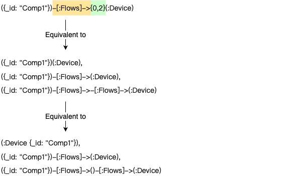</center>

### Quantified Entire Path

You can enclose the entire path pattern in parentheses `()` and append a quantifier.

<center>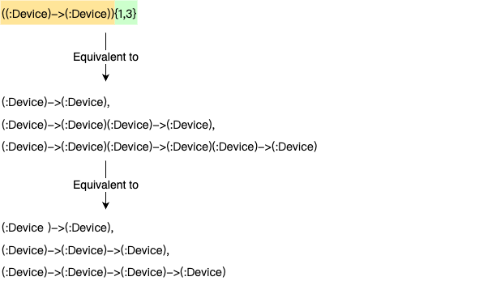</center>

When a quantifier is applied to an entire path pattern, a step count of `0` produces no result.

### Quantified Partial Path

You can enclose part of a path pattern in parentheses `()` and append a quantifier for it.

<center>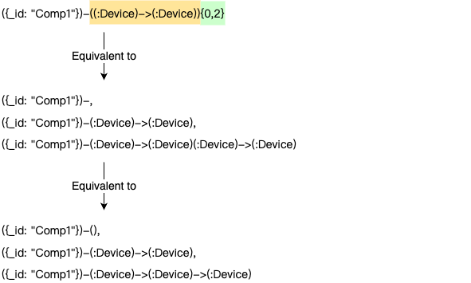</center>

Another example:

<center>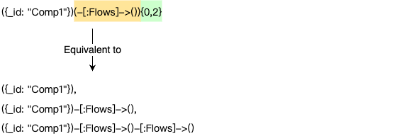</center>

## Examples

### Lowerbound and Upperbound

```gql
MATCH p = ({name: 'Jack'})->()-[f:Flows WHERE f.packets > 20]->{1,3}()<-({name: 'Mike'})
RETURN p
```

Result: `p`

<center>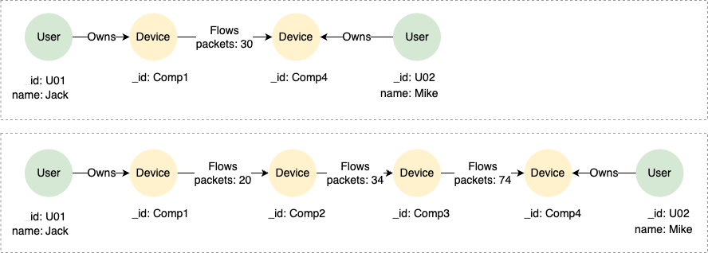</center>

### Fixed Length

```gql
MATCH p = ((:Device)->(:Device)){2}
RETURN p
```

Result: `p`

<center>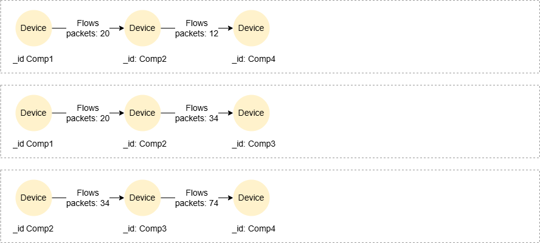</center>

### Fixed Lowerbound

```gql
MATCH ({_id: 'Comp1'})->{2,}(n)
RETURN COLLECT_LIST(n._id)
```

Result:

| COLLECT_LIST(n.\_id) |
| -- |
| ["Comp4","Comp3","Comp4"] |

```gql
MATCH p = ({_id: 'Comp1'})-[f:Flows WHERE f.packets > 20]->*()
RETURN p
```

Result: `p`

<center>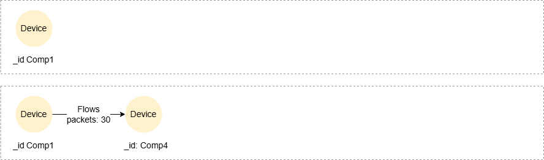</center>

```gql
MATCH p = ({_id: 'Comp1'})-[f:Flows WHERE f.packets > 20]->+()
RETURN p
```

Result: `p`

<center>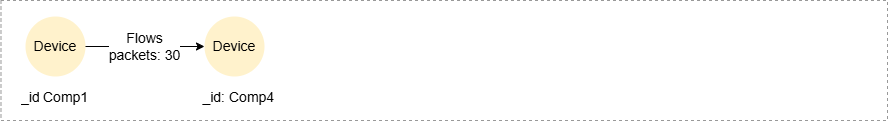</center>

### Fixed Upperbound

```gql
MATCH p = ({name: 'Jack'})->(()-[f:Flows WHERE f.packets > 20]->()){,2}<-({name: 'Mike'})
RETURN p
```

Result: `p`

<center>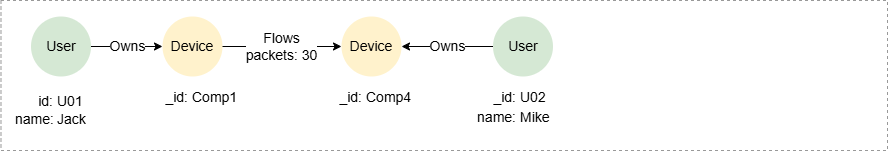</center>

## Group Variables

Element variables declared within the repeatable part of a quantified path are bound to a list of nodes or edges, known as **group variables** or **group list**.

### Example Graph

<center>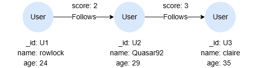</center>

```gql
INSERT (rowlock:User {_id: "U1", name: "rowlock", age: 24}),
       (quasar92:User {_id: "U2", name: "Quasar92", age: 29}),
       (claire:User {_id: "U3", name: "claire", age: 35}),
       (rowlock)-[:Follows {score: 2}]->(quasar92),
       (quasar92)-[:Follows {score: 3}]->(claire)
```

### Referencing Outside the Quantified Segment

Whenever a group variable is referenced outside the repeatable part of the quantified path where it is declared, it refers to a list of nodes or edges.

In this query, variables `a` and `b` represent lists of nodes encountered along the matched paths, rather than individual nodes:

```gql
MATCH p = ((a)-[]->(b)){1,2}
RETURN p, a, b
```

Result:

<table>
  <thead>
    <tr>
      <th style="width:45%">p</th>
      <th>a</th>
      <th>b</th>
    </tr>
  </thead>
  <tbody>
    <tr>
      <td>
<center>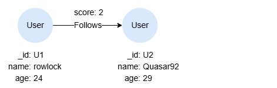</center>
      </td>
      <td><pre>[{"id": "U1", "labels": ["User"], "properties": {"name": "rowlock", "age": 24}}]</pre></td>
      <td><pre>[{"id": "U2", "labels": ["User"], "properties": {"name": "Quasar92", "age": 29}}]</pre></td>
    </tr>
    <tr>
      <td>
<center>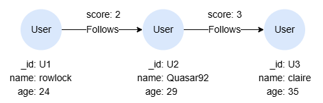</center>
      </td>
      <td><pre>[{"id": "U1", "labels": ["User"], "properties": {"name": "rowlock", "age": 24}},
 {"id": "U2", "labels": ["User"], "properties": {"name": "Quasar92", "age": 29}}]</pre></td>
      <td><pre>[{"id": "U2", "labels": ["User"], "properties": {"name": "Quasar92", "age": 29}},
 {"id": "U3", "labels": ["User"], "properties": {"name": "claire", "age": 35}}]</pre></td>
    </tr>
    <tr>
      <td>
<center>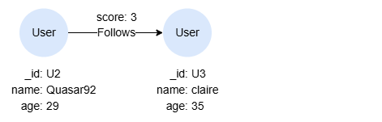</center>
      </td>
      <td><pre>[{"id": "U2", "labels": ["User"], "properties": {"name": "Quasar92", "age": 29}}]</pre></td>
      <td><pre>[{"id": "U3", "labels": ["User"], "properties": {"name": "claire", "age": 35}}]</pre></td>
    </tr>
  </tbody>
</table>
        
To aggregate the group variables, use the `FOR` statement to expand it into individual records:

```gql
MATCH path = ()-[edges]->{1,2}()
CALL (path, edges) {
  FOR edge IN edges
  RETURN sum(edge.score) AS scores 
}
FILTER scores > 2
RETURN path, scores
```

Result:

<table>
  <thead>
    <tr>
      <th style="width:80%">p</th>
      <th>scores</th>
    </tr>
  </thead>
  <tbody>
    <tr>
      <td>
<center></center>
      </td>
      <td>3</td>
    <tr>
    <tr>
      <td>
<center></center>
      </td>
      <td>5</td>
    </tr>
  </tbody>
</table>

The following query throws syntax error since `a` and `b` are lists:

<p tit="GQL - Syntax Error"></p>

```gql
MATCH p = ((a)-[]->(b)){1,2}
WHERE a.age < b.age
RETURN p
```

### Referencing Inside the Quantified Segment

A group variable has a singleton reference only when it is referenced within the repeatable part of the quantified path where it is declared.

In this query, `a` and `b` are treated as singletons that represent individual nodes. The condition `a.age < b.age` is evaluated for each pair of nodes `a` and `b` as the path is matched:

```gql
MATCH p = ((a)-[]->(b) WHERE a.age < b.age){1,2}
RETURN p
```

Result: `p`

<center>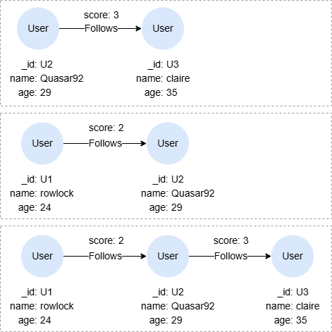</center>
