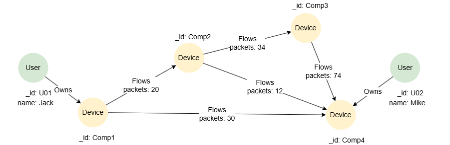

# Questioned Paths

## Overview

A questioned path makes a path pattern **optional** — it matches zero or one occurrence. This is useful when you want to include a connection in a pattern but it may not always exist.

A questioned path is written by appending `?` to a parenthesized path pattern expression.

```syntax
<questioned path pattern> ::=
  "(" <path pattern expression> ")" "?"
```

When the path exists, it is included in the result; when it doesn't, the match still succeeds with the optional part absent.

### Difference from `{0,1}`

Although `?` and `{0,1}` both match zero or one occurrence, they differ in how variables are exposed:

- **`{0,1}`** (quantified path): Variables declared inside become **group variables** — they are exposed as lists (e.g., a single-element list or an empty list).
- **`?`** (questioned path): Variables declared inside remain **singletons** — they keep their original type but become **conditional singletons** that are null when the optional path is absent.

## Example Graph

<center></center>

```gql
INSERT (jack:User {_id: "U01", name: "Jack"}),
       (mike:User {_id: "U02", name: "Mike"}),
       (c1:Device {_id: "Comp1"}),
       (c2:Device {_id: "Comp2"}),
       (c3:Device {_id: "Comp3"}),
       (c4:Device {_id: "Comp4"}),
       (jack)-[:Owns]->(c1),
       (mike)-[:Owns]->(c4),
       (c1)-[:Flows {packets: 20}]->(c2),
       (c1)-[:Flows {packets: 30}]->(c4),
       (c2)-[:Flows {packets: 34}]->(c3),
       (c2)-[:Flows {packets: 12}]->(c4),
       (c3)-[:Flows {packets: 74}]->(c4)
```

## Examples

Find all devices reachable from `Comp1` with an optional second hop:

```gql
MATCH (d1 {_id: 'Comp1'})->(d2:Device)(->(d3:Device))?
RETURN d1._id AS start, d2._id AS firstHop, d3._id AS secondHop
```

Result:

| start | firstHop | secondHop |
| -- | -- | -- |
| Comp1 | Comp2 | `null` |
| Comp1 | Comp2 | Comp3 |
| Comp1 | Comp2 | Comp4 |
| Comp1 | Comp4 | `null` |

When the optional path matches, `d3` contains the device. When it doesn't, `d3` is `null`. This is because `?` exposes variables as **conditional singletons** rather than group variables.