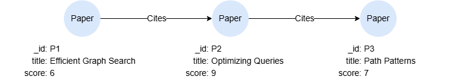

# LET Value Expression

The LET value expression allows you to define variables and use them immediately in an expression. It can be used for improving readability and simplifying more complex expressions.

Unlike the <a href="/docs/gql/let">`LET` statement</a> which defines a variable for use in subsequent statements, the LET value expression is a self-contained inline expression, the variables are scoped to the `IN ... END` block and produce a single value.

<p tit="Syntax"></p>

```
<let value expression> ::= "LET" <variable definitions> "IN" <value expression> "END"

<variable definitions> ::= <variable definition> [ { "," <variable definition> }... ]

<let variable definition> ::= <variable> "=" <value expression>
```

## Example Graph

<center></center>

```gql
INSERT (p1:Paper {_id:'P1', title:'Efficient Graph Search', score:6}),
       (p2:Paper {_id:'P2', title:'Optimizing Queries', score:9}),
       (p3:Paper {_id:'P3', title:'Path Patterns', score:7}),
       (p1)-[:Cites]->(p2),
       (p2)-[:Cites]->(p3)
```

## Examples

```gql
RETURN LET x = 2, y = 1 IN x^2+y END
```

Result: 5

```gql
MATCH (n:Paper)
RETURN n.title, LET plus = 1 IN n.score + plus END AS newScore
```

Result:

| n.title | newScore |
| -- | -- |
| Optimizing Queries | 10 |
| Efficient Graph Search | 7 |
| Path Patterns | 8 |
