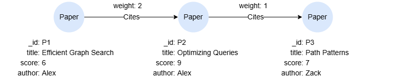

# Aggregate Functions

## Overview

An aggregate function performs a calculation on a set of values and returns a single scalar value.

### DISTINCT

All aggregate functions support the use of the set quantifier `DISTINCT` to deduplicate values before aggregation.

### Null Values

Rows containing `null` values are ignored by all aggregate functions, except `count(*)`.

## Example Graph

<center></center>

```gql
INSERT (p1:Paper {_id:'P1', title:'Efficient Graph Search', score:6, author:'Alex'}),
       (p2:Paper {_id:'P2', title:'Optimizing Queries', score:9, author:'Alex'}),
       (p3:Paper {_id:'P3', title:'Path Patterns', score:7, author:'Zack'}),
       (p1)-[:Cites {weight:2}]->(p2),
       (p2)-[:Cites {weight:1}]->(p3)
```

## collect()

Collects a set of values into a list. `collect_list()` is a synonym.

<table style="width: 100%;">
  <colgroup>
    <col style="width:20%;">
    <col>
    <col>
    <col style="width:30%;">
  </colgroup>
  <tbody>
    <tr>
      <td><b>Syntax</b></td>
      <td colspan="3"><code>collect(&lt;values&gt;)</code></td>
    </tr>
    <tr>
      <td rowspan="2"><b>Arguments</b></td>
      <td><b>Name</b></td>
      <td><b>Type</b></td>
      <td><b>Description</b></td>
    </tr>
    <tr>
      <td><code>&lt;values&gt;</code></td>
      <td>Any</td>
      <td>The target values</td>
    </tr>
    <tr>
      <td><b>Return Type</b></td>
      <td colspan="3"><code>LIST</code></td>
    </tr>
  </tbody>
</table>

```gql
MATCH (n)
RETURN collect(n.title)
```

Result:

| collect(n.title) |
| -- |
| ["Optimizing Queries","Efficient Graph Search","Path Patterns"] |

## collect_distinct()

Collects a set of values into a list, removing duplicates. Equivalent to `collect(DISTINCT <values>)`.

<table style="width: 100%;">
  <colgroup>
    <col style="width:20%;">
    <col>
    <col>
    <col style="width:30%;">
  </colgroup>
  <tbody>
    <tr>
      <td><b>Syntax</b></td>
      <td colspan="3"><code>collect_distinct(&lt;values&gt;)</code></td>
    </tr>
    <tr>
      <td rowspan="2"><b>Arguments</b></td>
      <td><b>Name</b></td>
      <td><b>Type</b></td>
      <td><b>Description</b></td>
    </tr>
    <tr>
      <td><code>&lt;values&gt;</code></td>
      <td>Any</td>
      <td>The target values</td>
    </tr>
    <tr>
      <td><b>Return Type</b></td>
      <td colspan="3"><code>LIST</code></td>
    </tr>
  </tbody>
</table>

```gql
MATCH (n:Paper)
RETURN collect_distinct(n.author)
```

Result:

| collect_distinct(n.publisher) |
| -- |
| ["Zack","Alex"] |

## count()

Returns the number of rows in the input.

<table style="width: 100%;">
  <colgroup>
    <col style="width:20%;">
    <col>
    <col>
    <col style="width:30%;">
  </colgroup>
  <tbody>
    <tr>
      <td><b>Syntax</b></td>
      <td colspan="3"><code>count(&lt;values&gt;)</code></td>
    </tr>
    <tr>
      <td rowspan="2"><b>Arguments</b></td>
      <td><b>Name</b></td>
      <td><b>Type</b></td>
      <td><b>Description</b></td>
    </tr>
    <tr>
      <td><code>&lt;values&gt;</code></td>
      <td>Any</td>
      <td>The target values</td>
    </tr>
    <tr>
      <td><b>Return Type</b></td>
      <td colspan="3"><code>UINT</code></td>
    </tr>
  </tbody>
</table>

```gql
MATCH (n)
RETURN count(n)
```

Result: 3

### count(*)

`count(*)` returns the number of rows in the intermediate result table.

Comparing the following two queries, the `null` values are only considered when using `count(*)`:

```gql
FOR item IN [1, "a", "2", "b3", null]
RETURN count(item)
```

Result: 4

```gql
FOR item IN [1, "a", "2", "b3", null]
RETURN count(*)
```

Result: 5

### count(DISTINCT)

You can include the set quantifier `DISTINCT` in `count()` to return the number of distinct rows in the input.

```gql
FOR item IN [1, 1, "a", "2", "b3", null]
RETURN count(DISTINCT item)
```

Result: 4

## max()

Returns the maximum value in a set of values.

<table style="width: 100%;">
  <colgroup>
    <col style="width:20%;">
    <col>
    <col>
    <col style="width:30%;">
  </colgroup>
  <tbody>
    <tr>
      <td><b>Syntax</b></td>
      <td colspan="3"><code>max(&lt;values&gt;)</code></td>
    </tr>
    <tr>
      <td rowspan="2"><b>Arguments</b></td>
      <td><b>Name</b></td>
      <td><b>Type</b></td>
      <td><b>Description</b></td>
    </tr>
    <tr>
      <td><code>&lt;values&gt;</code></td>
      <td>Any</td>
      <td>The target values</td>
    </tr>
    <tr>
      <td><b>Return Type</b></td>
      <td colspan="3">Numeric</td>
    </tr>
  </tbody>
</table>

```gql
MATCH (n)
RETURN max(n.score)
```

Result: 9

## min()

Returns the minimum value in a set of values.

<table style="width: 100%;">
  <colgroup>
    <col style="width:20%;">
    <col>
    <col>
    <col style="width:30%;">
  </colgroup>
  <tbody>
    <tr>
      <td><b>Syntax</b></td>
      <td colspan="3"><code>min(&lt;values&gt;)</code></td>
    </tr>
    <tr>
      <td rowspan="2"><b>Arguments</b></td>
      <td><b>Name</b></td>
      <td><b>Type</b></td>
      <td><b>Description</b></td>
    </tr>
    <tr>
      <td><code>&lt;values&gt;</code></td>
      <td>Any</td>
      <td>The target values</td>
    </tr>
    <tr>
      <td><b>Return Type</b></td>
      <td colspan="3">Numeric</td>
    </tr>
  </tbody>
</table>

```gql
MATCH (n)
RETURN min(n.score)
```

Result: 6

## avg()

Computes the average of a set of numeric values.

<table style="width: 100%;">
  <colgroup>
    <col style="width:20%;">
    <col>
    <col>
    <col style="width:30%;">
  </colgroup>
  <tbody>
    <tr>
      <td><b>Syntax</b></td>
      <td colspan="3"><code>avg(&lt;values&gt;)</code></td>
    </tr>
    <tr>
      <td rowspan="2"><b>Arguments</b></td>
      <td><b>Name</b></td>
      <td><b>Type</b></td>
      <td><b>Description</b></td>
    </tr>
    <tr>
      <td><code>&lt;values&gt;</code></td>
      <td>Numeric</td>
      <td>The target values</td>
    </tr>
    <tr>
      <td><b>Return Type</b></td>
      <td colspan="3"><code>DOUBLE</code></td>
    </tr>
  </tbody>
</table>

```gql
MATCH (n)
RETURN avg(n.score)
```

Result: 7.333333333333333

## sum()

Computes the sum of a set of numeric values.

<table style="width: 100%;">
  <colgroup>
    <col style="width:20%;">
    <col>
    <col>
    <col style="width:30%;">
  </colgroup>
  <tbody>
    <tr>
      <td><b>Syntax</b></td>
      <td colspan="3"><code>sum(&lt;values&gt;)</code></td>
    </tr>
    <tr>
      <td rowspan="2"><b>Arguments</b></td>
      <td><b>Name</b></td>
      <td><b>Type</b></td>
      <td><b>Description</b></td>
    </tr>
    <tr>
      <td><code>&lt;values&gt;</code></td>
      <td>Numeric</td>
      <td>The target values</td>
    </tr>
    <tr>
      <td><b>Return Type</b></td>
      <td colspan="3"><code>DOUBLE</code></td>
    </tr>
  </tbody>
</table>

```gql
MATCH (n)
RETURN sum(n.score)
```

Result: 22

## percentile_cont()

Computes the continuous percentile value over a set of numeric values.

<table style="width: 100%;">
  <colgroup>
    <col style="width:20%;">
    <col>
    <col>
    <col style="width:40%;">
  </colgroup>
  <tbody>
    <tr>
      <td><b>Syntax</b></td>
      <td colspan="3"><code>percentile_cont(&lt;values&gt;, &lt;percentile&gt;)</code></td>
    </tr>
    <tr>
      <td rowspan="3"><b>Arguments</b></td>
      <td><b>Name</b></td>
      <td><b>Type</b></td>
      <td><b>Description</b></td>
    </tr>
    <tr>
      <td><code>&lt;values&gt;</code></td>
      <td>Numeric</td>
      <td>The target values</td>
    </tr>
    <tr>
      <td><code>&lt;percentile&gt;</code></td>
      <td>Numeric</td>
      <td>Number between 0.0 and 1.0</td>
    </tr>
    <tr>
      <td><b>Return Type</b></td>
      <td colspan="3"><code>DOUBLE</code></td>
    </tr>
  </tbody>
</table>

`percentile_cont()` is computed using the following steps:

- Sort the values in ascending order.
- Compute the percentile position as `p = percentile × (n − 1) + 1`, where `n` is the number of non-null values.
- Determine the percentile value using linear interpolation:
  - If `p` is an integer, the corresponding value at that position is the percentile value.
  - If `p` is a decimal between two integers `p1` and `p2` (`p1` < `p` < `p2`), interpolate between the value `v1` at position `p1` and the value `v2` at position `p2` to compute the percentile value as `v1 + (p - p1) × (v2 - v1)`.

```gql
FOR item IN [3, 9, 4, 7, 6]
RETURN percentile_cont(item, 0.4)
```

Result: 5.2

```gql
FOR item IN [3, 9, 4, 7, 6]
RETURN percentile_cont(item, 0.5)
```

Result: 6

## percentile_disc()

Computes the discrete percentile value over a set of numeric values.

<table style="width: 100%;">
  <colgroup>
    <col style="width:20%;">
    <col>
    <col>
    <col style="width:40%;">
  </colgroup>
  <tbody>
    <tr>
      <td><b>Syntax</b></td>
      <td colspan="3"><code>percentile_disc(&lt;values&gt;, &lt;percentile&gt;)</code></td>
    </tr>
    <tr>
      <td rowspan="3"><b>Arguments</b></td>
      <td><b>Name</b></td>
      <td><b>Type</b></td>
      <td><b>Description</b></td>
    </tr>
    <tr>
      <td><code>&lt;values&gt;</code></td>
      <td>Numeric</td>
      <td>The target values</td>
    </tr>
    <tr>
      <td><code>&lt;percentile&gt;</code></td>
      <td>Numeric</td>
      <td>Number between 0.0 and 1.0</td>
    </tr>
    <tr>
      <td><b>Return Type</b></td>
      <td colspan="3"><code>DOUBLE</code></td>
    </tr>
  </tbody>
</table>

`percentile_disc()` is computed using the following steps:

- Sort the values in ascending order.
- Compute the percentile position as `p = ceil(percentile × n)`, where `n` is the number of non-null values.
- The value at the position `p` is selected as the percentile value.

```gql
FOR item IN [3, 9, 4, 7, 6]
RETURN percentile_disc(item, 0.4)
```

Result: 4

```gql
FOR item IN [3, 9, 4, 7, 6]
RETURN percentile_disc(item, 0.5)
```

Result: 6

## stddev_samp()

Computes the sample standard deviation of a set of numeric values. `stddev()` is a synonym.

<div style="text-align: center;">
  <math>
    <mrow>
      <mi>stddev_samp(</mi>
      <msub>
        <mi>x</mi>
        <mi>1</mi>
      </msub>
      <mi>, ...,&nbsp;</mi>
      <msub>
        <mi>x</mi>
        <mi>n</mi>
      </msub>
      <mi>)</mi>
      <mo>=</mo>
      <msqrt>
        <mfrac>
          <mn>1</mn>
          <mrow>
            <mi>n</mi>
            <mo>&#x2212;</mo>
            <mn>1</mn>
          </mrow>
        </mfrac>
        <msubsup>
          <mo>∑</mo>
          <msub>
            <mi>i</mi>
            <mo>=</mo>
            <mn>1</mn>
          </msub>
          <mn>n</mn>
        </msubsup>
        <mrow>
          <msup>
            <mrow>
              <mo>(</mo>
              <msub>
                <mi>x</mi>
                <mi>i</mi>
              </msub>
              <mo>&#x2212;</mo>
              <mover>
                <mi>x</mi>
                <mo>&#x2014;</mo>
              </mover>
              <mo>)</mo>
            </mrow>
            <mn>2</mn>
          </msup>
        </mrow>
      </msqrt>
    </mrow>
  </math>
</div><br>

<table style="width: 100%;">
  <colgroup>
    <col style="width:20%;">
    <col>
    <col>
    <col style="width:30%;">
  </colgroup>
  <tbody>
    <tr>
      <td><b>Syntax</b></td>
      <td colspan="3"><code>stddev_samp(&lt;values&gt;)</code></td>
    </tr>
    <tr>
      <td rowspan="2"><b>Arguments</b></td>
      <td><b>Name</b></td>
      <td><b>Type</b></td>
      <td><b>Description</b></td>
    </tr>
    <tr>
      <td><code>&lt;values&gt;</code></td>
      <td>Numeric</td>
      <td>The target values</td>
    </tr>
    <tr>
      <td><b>Return Type</b></td>
      <td colspan="3"><code>DOUBLE</code></td>
    </tr>
  </tbody>
</table>

```gql
MATCH (n)
RETURN stddev_samp(n.score)
```

Result: 1.5275252316519468

## stddev_pop()

Computes the population standard deviation of a set of numeric values.

<div style="text-align: center;">
  <math>
    <mrow>
      <mi>stddev_pop(</mi>
      <msub>
        <mi>x</mi>
        <mi>1</mi>
      </msub>
      <mi>, ...,&nbsp;</mi>
      <msub>
        <mi>x</mi>
        <mi>n</mi>
      </msub>
      <mi>)</mi>
      <mo>=</mo>
      <msqrt>
        <mfrac>
          <mn>1</mn>
          <mrow>
            <mi>n</mi>
          </mrow>
        </mfrac>
        <msubsup>
          <mo>∑</mo>
          <msub>
            <mi>i</mi>
            <mo>=</mo>
            <mn>1</mn>
          </msub>
          <mn>n</mn>
        </msubsup>
        <mrow>
          <msup>
            <mrow>
              <mo>(</mo>
              <msub>
                <mi>x</mi>
                <mi>i</mi>
              </msub>
              <mo>&#x2212;</mo>
              <mover>
                <mi>x</mi>
                <mo>&#x2014;</mo>
              </mover>
              <mo>)</mo>
            </mrow>
            <mn>2</mn>
          </msup>
        </mrow>
      </msqrt>
    </mrow>
  </math>
</div><br>

<table style="width: 100%;">
  <colgroup>
    <col style="width:20%;">
    <col>
    <col>
    <col style="width:30%;">
  </colgroup>
  <tbody>
    <tr>
      <td><b>Syntax</b></td>
      <td colspan="3"><code>stddev_pop(&lt;values&gt;)</code></td>
    </tr>
    <tr>
      <td rowspan="2"><b>Arguments</b></td>
      <td><b>Name</b></td>
      <td><b>Type</b></td>
      <td><b>Description</b></td>
    </tr>
    <tr>
      <td><code>&lt;values&gt;</code></td>
      <td>Numeric</td>
      <td>The target values</td>
    </tr>
    <tr>
      <td><b>Return Type</b></td>
      <td colspan="3">Numeric</td>
    </tr>
  </tbody>
</table>

```gql
MATCH (n)
RETURN stddev_pop(n.score)
```

Result: 1.247219128924647

## var_samp()

Computes the sample variance of a set of numeric values (the square of `stddev_samp()`). `variance()` is a synonym.

<table style="width: 100%;">
  <colgroup>
    <col style="width:20%;">
    <col>
    <col>
    <col style="width:30%;">
  </colgroup>
  <tbody>
    <tr>
      <td><b>Syntax</b></td>
      <td colspan="3"><code>variance(&lt;values&gt;)</code> or <code>var_samp(&lt;values&gt;)</code></td>
    </tr>
    <tr>
      <td rowspan="2"><b>Arguments</b></td>
      <td><b>Name</b></td>
      <td><b>Type</b></td>
      <td><b>Description</b></td>
    </tr>
    <tr>
      <td><code>&lt;values&gt;</code></td>
      <td>Numeric</td>
      <td>The target values</td>
    </tr>
    <tr>
      <td><b>Return Type</b></td>
      <td colspan="3"><code>DOUBLE</code></td>
    </tr>
  </tbody>
</table>

```gql
MATCH (n)
RETURN variance(n.score)
```

Result: 2.3333333333333335

## var_pop()

Computes the population variance of a set of numeric values (the square of `stddev_pop()`).

<table style="width: 100%;">
  <colgroup>
    <col style="width:20%;">
    <col>
    <col>
    <col style="width:30%;">
  </colgroup>
  <tbody>
    <tr>
      <td><b>Syntax</b></td>
      <td colspan="3"><code>var_pop(&lt;values&gt;)</code></td>
    </tr>
    <tr>
      <td rowspan="2"><b>Arguments</b></td>
      <td><b>Name</b></td>
      <td><b>Type</b></td>
      <td><b>Description</b></td>
    </tr>
    <tr>
      <td><code>&lt;values&gt;</code></td>
      <td>Numeric</td>
      <td>The target values</td>
    </tr>
    <tr>
      <td><b>Return Type</b></td>
      <td colspan="3"><code>DOUBLE</code></td>
    </tr>
  </tbody>
</table>

```gql
MATCH (n)
RETURN var_pop(n.score)
```

Result: 1.5555555555555556