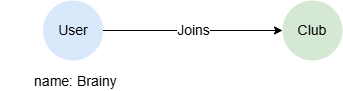
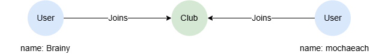
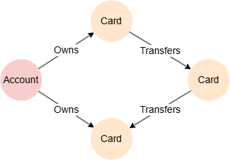
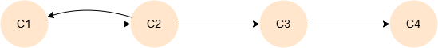
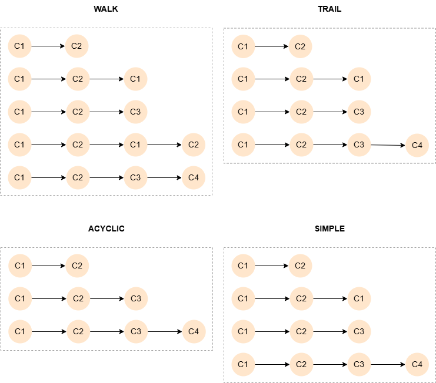
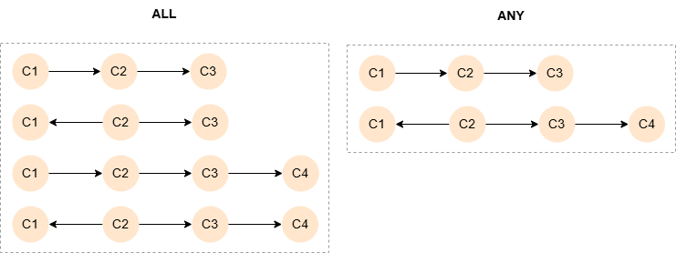
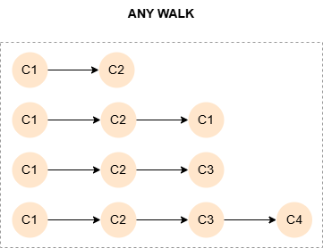

# Path Patterns

## Overview

A path pattern is to match paths in the graph. It is composed of three parts:

- <a href="#Path-Variable-Declaration">Path Variable Declaration</a> (Optional)
- <a href="#Path-Pattern-Prefix">Path Pattern Prefix</a> (Optional)
- <a href="#Path-Pattern-Expression">Path Pattern Expression</a>

<p tit="Syntax"></p>

```
<path pattern> ::=
  [ <path variable declaration> ] [ <path pattern prefix> ] <path pattern expression>
```

## Path Pattern Expression

A path pattern expression (or *path pattern* for short) defines the nodes and edges that make up a path. Essentially, it is a sequence of node and edge patterns concatenated according to the topological rules of a path - it must **start and end with a node and alternate between nodes and edges**.

### Basic Paths

This path pattern starts from the node `Brainy`, connecting to a `Club` node through an outgoing `Joins` edge:

<center></center>

<p tit="Path Pattern"></p>

```gql
(:User {name: 'Brainy'})-[:Joins]->(:Club)
```

You can keep on chaining edge and node patterns to create more complex path patterns. This path pattern describes that `Brainy` and `mochaeach` join the same club, with the `Club` node bound to the variable `c`: 

<center></center>

<p tit="Path Pattern"></p>

```gql
(:User {name: 'Brainy'})-[:Joins]->(c:Club)<-[:Joins]-(:User {name: 'mochaeach'})
```

This path pattern reuses the variable `a` to form a ring-like structure that starts and ends with the same `Account` node:

<center></center>

<p tit="Path Pattern"></p>

```gql
(a:Account)-[:Owns]->(:Card)-[:Transfers]->(:Card)-[:Transfers]->(:Card)<-[:Owns]-(a)
```

### Advanced Paths

GQL supports the following advanced path patterns:

- <a target="_blank" href="/docs/gql/quantified-paths">Quantified Paths</a>
- <a target="_blank" href="/docs/gql/questioned-paths">Questioned Paths</a>
- <a target="_blank" href="/docs/gql/shortest-paths">Shortest Paths</a>

## Path Variable Declaration

A path variable is declared at the start of a path pattern with `=`.

The variable `p` is bound to paths connecting any two nodes through an outgoing `Follows` edge:

```gql
MATCH p = ()-[:Follows]->()
RETURN p
```

## Path Pattern Prefix

There are two types of path pattern prefixes:

- <a href="#Path-Mode">Path Mode</a>
- <a href="#Path-Selector">Path Selector</a>

### Example Graph

<center></center>

```gql
INSERT (c1:default {_id: 'C1'}),
       (c2:default {_id: 'C2'}),
  	   (c3:default {_id: 'C3'}),
       (c4:default {_id: 'C4'}),
       (c1)-[:default]->(c2),
       (c2)-[:default]->(c1),
       (c2)-[:default]->(c3),
       (c3)-[:default]->(c4)
```

### Path Mode

Path modes control how paths are traversed and whether nodes or edges can be revisited. A path mode may be placed at the head of a path pattern expression.

| <div table-width="15">Path Mode</div> | Description |
| -- | -- |
| `TRAIL` | **The default.** Paths may repeat nodes but not edges. |
| `ACYCLIC` | No repeated nodes are allowed in the paths. |
| `SIMPLE` | No repeated nodes allowed in the paths unless it forms a cycle by starting and ending at the same node. |
| `WALK` | Non-restrictive. |

In addition to the four path modes above, Ultipa supports the `KHOP` mode for K-hop neighbor search, which returns distinct destination nodes within a hop range rather than materializing every distinct path. See <a target="_blank" href="/docs/gql/khop-traversal">K-Hop Traversal</a>.

The following queries find 1- to 3-step outgoing paths from `C1` using different path modes:

<div tab="code">
  
<p tit="WALK"></p>

```gql
MATCH p = WALK ({_id: 'C1'})->{1,3}()
RETURN p
```
  
<p tit="TRAIL"></p>

```gql
MATCH p = ({_id: 'C1'})->{1,3}()
RETURN p
```
  
<p tit="ACYCLIC"></p>

```gql
MATCH p = ACYCLIC ({_id: 'C1'})->{1,3}()
RETURN p
```
  
<p tit="SIMPLE"></p>

```gql
MATCH p = SIMPLE ({_id: 'C1'})->{1,3}()
RETURN p
```
  
</div>

Result: `p`

<center></center>

### Path Selector

A path selector is used to select a limited number of paths from **each partition** of the match results. When a path pattern matches multiple start and end nodes, the results are conceptually partitioned into distinct pairs of start node and end node. The path selection is performed within each partition, and the result is the union of all paths found for each partition.

<table>
  <thead>
    <tr>
      <th style="width:25%;">Path Selector</th>
      <th>Description</th>
    </tr>
  </thead>
  <tbody>
    <tr>
      <td><code>ALL</code></td>
      <td><b>The default.</b> Non-selective.</td>
    </tr>
    <tr>
      <td><code>ANY</code></td>
      <td>Selects any one path from each partition.
</td>
    </tr>
    <tr>
      <td><code>ANY k</code></td>
      <td>Selects any <code>k</code> (non-negative integer) paths from each partition. If a partition has fewer than <code>k</code> paths, all are retained.</td>
    </tr>
    <tr>
      <td><code>ALL SHORTEST</code></td>
      <td rowspan="4">See <a target="_blank" href="/docs/gql/shortest-paths">Shortest Paths</a>.</td>
    </tr>
    <tr>
      <td><code>ANY SHORTEST</code></td>
    </tr>
    <tr>
      <td><code>SHORTEST k</code></td>
    </tr>
    <tr>
      <td><code>SHORTEST k GROUP</code></td>
    </tr>
    <tr>
      <td><code>ALL CHEAPEST</code></td>
      <td rowspan="4">See <a target="_blank" href="/docs/gql/cheapest-paths">Cheapest Paths</a>.</td>
    </tr>
    <tr>
      <td><code>ANY CHEAPEST</code></td>
    </tr>
    <tr>
      <td><code>CHEAPEST</code></td>
    </tr>
    <tr>
      <td><code>CHEAPEST k</code></td>
    </tr>
  </tbody>
</table>

The following queries find 1- to 3-step paths between `C1` and target nodes `C3` and `C4`, selecting `ALL` or `ANY` paths from each partition:

<div tab="code">
  
<p tit="ALL"></p>

```gql
MATCH p = ({_id: 'C1'})-{1,3}(target WHERE target._id IN ['C3', 'C4'])
RETURN p
```
  
<p tit="ANY"></p>

```gql
MATCH p = ANY ({_id: 'C1'})-{1,3}(target WHERE target._id IN ['C3', 'C4'])
RETURN p
```
  
</div>

Result: `p`

<center></center>

### Combined Usage

When a query includes both a path selector and a path mode, the path selector should precede the path mode.

Find any 1- to 3-step outgoing `WALK` paths from `C1` (from each partition):

```gql
MATCH p = ANY WALK ({_id: 'C1'})->{1,3}()
RETURN p
```

<center></center>

## Special Considerations

### Edge Pattern Juxtaposition

Two consecutive edge patterns conceptually have an empty node pattern between them. For example,

<p tit="Path Term"></p>

```gql
(:User)-[]->-[]->(u)
```

This path term implicitly extends to:

<p tit="Path Term"></p>

```gql
(:User)-[]->()-[]->(u)
```

> A path term should not juxtapose a token that exposes a minus sign on the right  (`]-`, `<-`, `-`) followed by a token that exposes a minus sign on the left (`-[`, `->`, `-`), as this combination introduces the comment symbol `--`. See <a target="_blank" href="/docs/gql/comments">Comments</a>.

### Node Pattern Juxtaposition

Node pattern juxtaposition is only supported for <a target="_blank" href="/docs/gql/quantified-paths">quantified paths</a>.
