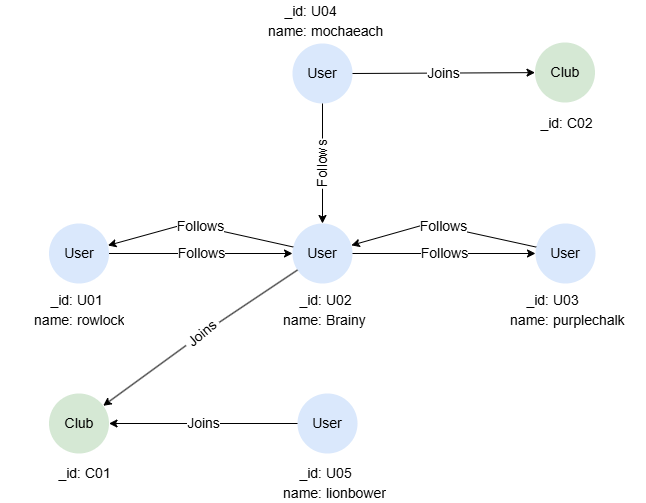

# Composite Query

## Overview

A composite query combines the result sets of multiple <a target="_blank" href="/docs/gql/query-composition#Linear-Query">linear queries</a> using the following query conjunctions:

| Query Conjunction | Description |
| -- | -- |
| `UNION` | Returns **distinct** records from all result sets. |
| `UNION ALL` | Returns all records from all result sets. |
| `EXCEPT` | Returns **distinct** records in the 1st result set that do not appear in others. |
| `EXCEPT ALL` | Returns all records in the 1st result set that do not appear in others. |
| `INTERSECT` | Returns **distinct** records that appear in all result sets. |
| `INTERSECT ALL` | Returns all records that appear in all result sets. |
| `OTHERWISE` | Returns the first non-empty result set, in order of appearance. |

**Details**

- `UNION`, `EXCEPT`, and `INTERSECT` perform deduplication on the final result set by default.
- Different query conjunctions can be used within a composite query statement.

To combine the result sets of multiple linear queries, the `RETURN` statements in all linear queries include the same number of return items, in the same order and with the same names. Each return item with the same name must also have the same type.

## Example Graph

<center></center>

```gql
INSERT (rowlock:User {_id:'U01', name:'rowlock'}),
       (brainy:User {_id:'U02', name:'Brainy'}),
       (purplechalk:User {_id:'U03', name:'purplechalk'}),
       (mochaeach:User {_id:'U04', name:'mochaeach'}),
       (lionbower:User {_id:'U05', name:'lionbower'}),
       (c01:Club {_id:'C01'}),
       (c02:Club {_id:'C02'}),
       (rowlock)-[:Follows]->(brainy),
       (brainy)-[:Follows]->(rowlock),
       (mochaeach)-[:Follows]->(brainy),
       (brainy)-[:Follows]->(purplechalk),
       (purplechalk)-[:Follows]->(brainy),
       (brainy)-[:Joins]->(c01),
       (lionbower)-[:Joins]->(c01),
       (mochaeach)-[:Joins]->(c02)
```

## UNION

```gql
MATCH (n:Club) RETURN n
UNION
MATCH (n) RETURN n
```

Result:

```json
[
  {"id": "C02", "labels": ["Club"], "properties": {}},
  {"id": "C01", "labels": ["Club"], "properties": {}},
  {"id": "U01", "labels": ["User"], "properties": {"name": "rowlock"}},
  {"id": "U02", "labels": ["User"], "properties": {"name": "Brainy"}},
  {"id": "U03", "labels": ["User"], "properties": {"name": "purplechalk"}},
  {"id": "U04", "labels": ["User"], "properties": {"name": "mochaeach"}},
  {"id": "U05", "labels": ["User"], "properties": {"name": "lionbower"}}
]
```

## UNION ALL

```gql
MATCH (n:Club) RETURN n
UNION ALL
MATCH (n) RETURN n
```

Result:

```json
[
  {"id": "C02", "labels": ["Club"], "properties": {}},
  {"id": "C01", "labels": ["Club"], "properties": {}},
  {"id": "U01", "labels": ["User"], "properties": {"name": "rowlock"}},
  {"id": "U02", "labels": ["User"], "properties": {"name": "Brainy"}},
  {"id": "U03", "labels": ["User"], "properties": {"name": "purplechalk"}},
  {"id": "U04", "labels": ["User"], "properties": {"name": "mochaeach"}},
  {"id": "U05", "labels": ["User"], "properties": {"name": "lionbower"}},
  {"id": "C02", "labels": ["Club"], "properties": {}},
  {"id": "C01", "labels": ["Club"], "properties": {}}
]
```

## EXCEPT

```gql
MATCH ({_id: "U02"})-(n) RETURN n
EXCEPT
MATCH ({_id: "U05"})-(n) RETURN n
```

Result:

```json
[
  {"id": "U04", "labels": ["User"], "properties": {"name": "mochaeach"}},
  {"id": "U03", "labels": ["User"], "properties": {"name": "purplechalk"}},
  {"id": "U01", "labels": ["User"], "properties": {"name": "rowlock"}}
]
```

## EXCEPT ALL

```gql
MATCH ({_id: "U02"})-(n) RETURN n
EXCEPT ALL
MATCH ({_id: "U05"})-(n) RETURN n
```

Result:

```json
[
  {"id": "U01", "labels": ["User"], "properties": {"name": "rowlock"}},
  {"id": "U03", "labels": ["User"], "properties": {"name": "purplechalk"}},
  {"id": "U04", "labels": ["User"], "properties": {"name": "mochaeach"}},
  {"id": "U03", "labels": ["User"], "properties": {"name": "purplechalk"}},
  {"id": "U01", "labels": ["User"], "properties": {"name": "rowlock"}}
]
```

## INTERSECT

```gql
MATCH ({_id: "U01"})-(u:User) RETURN u
INTERSECT
MATCH ({_id: "U03"})-(u:User) RETURN u
```

Result:

```json
[
  {"id": "U02", "labels": ["User"], "properties": {"name": "Brainy"}}
]
```

## INTERSECT ALL

```gql
MATCH ({_id: "U01"})-(u:User) RETURN u
INTERSECT ALL
MATCH ({_id: "U03"})-(u:User) RETURN u
```

Result:

```json
[
  {"id": "U02", "labels": ["User"], "properties": {"name": "Brainy"}},
  {"id": "U02", "labels": ["User"], "properties": {"name": "Brainy"}}
]
```

## OTHERWISE

```gql
MATCH ({_id: "U04"})<-[]-(u:User) RETURN u
OTHERWISE
MATCH ({_id: "U02"})<-[]-(u:User) RETURN u
```

Result:

```json
[
  {"id": "U01", "labels": ["User"], "properties": {"name": "rowlock"}},
  {"id": "U03", "labels": ["User"], "properties": {"name": "purplechalk"}},
  {"id": "U04", "labels": ["User"], "properties": {"name": "mochaeach"}}
]
```

In this example, the result set of the first linear query returns a `null` value due to the usage of `OPTIONAL`:

```gql
OPTIONAL MATCH ({_id: "U04"})<-[]-(u:User) RETURN u
OTHERWISE
MATCH ({_id: "U02"})<-[]-(u:User) RETURN u
```

Result:

| u |
| -- |
| `null` |

## Renaming Return Items

You may use the `AS` keyword to rename return items to ensure that the results of linear queries can be combined.

```gql
MATCH ({_id: "C01"})<-(u) RETURN u.name, 1 AS Club
UNION
MATCH ({_id: "C02"})<-(u) RETURN u.name, 2 AS Club
```

Result:

| u.name | Club |
| -- | -- |
| Brainy | 1 |
| lionbower | 1 |
| mochaeach | 2 |

## Using Different Query Conjunctions

```gql
MATCH (n:Club) RETURN n._id
OTHERWISE
MATCH (n) RETURN n._id
UNION ALL
MATCH (n)-[]->(:Club) RETURN n._id
```

Result:

| n.\_id |
| -- |
| C01 |
| C02 |
| U05 |
| U04 |
| U02 |