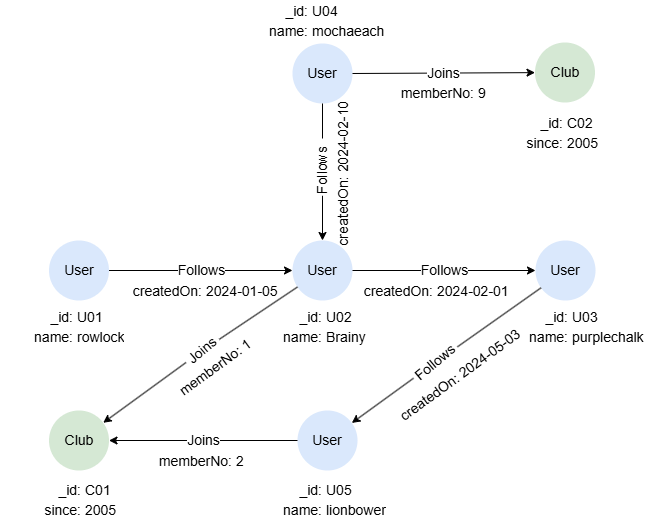

# FILTER

## Overview

The `FILTER` statement allows you to discard records in the intermediate result table that do not satisfy the search conditions.

<p tit="Syntax"></p>

```
<filter statement> ::= "FILTER" <search condition>
```

## FILTER vs. WHERE

`WHERE` is a clause bound to the `MATCH` statement, which is evaluated **during** pattern matching. `FILTER` is a standalone statement that is evaluated **after** the preceding statement produces its result.

In many cases they produce the same result:

```gql
-- Using WHERE (evaluated during MATCH)
MATCH (n:User) WHERE n.age > 25
RETURN n

-- Using FILTER (evaluated after MATCH)
MATCH (n:User)
FILTER n.age > 25
RETURN n
```

The difference matters with `OPTIONAL MATCH`. `WHERE` is applied before the optional logic, while `FILTER` is applied after — see <a target="_blank" href="/docs/gql/optional-match#The-Evaluation-of-WHERE">OPTIONAL MATCH</a> for details.

`FILTER` also works with non-`MATCH` statements like `FOR`:

```gql
FOR item IN [20, 34, 56]
FILTER item > 30
RETURN item
```

Replacing `FILTER` with `WHERE` in this query will cause syntax error.

## Example Graph

<center></center>

```gql
INSERT (rowlock:User {_id: 'U01', name: 'rowlock'}),
       (brainy:User {_id: 'U02', name: 'Brainy'}),
       (purplechalk:User {_id: 'U03', name: 'purplechalk'}),
       (mochaeach:User {_id: 'U04', name: 'mochaeach'}),
       (lionbower:User {_id: 'U05', name: 'lionbower'}),
       (c01:Club {_id: 'C01', since: 2005}),
       (c02:Club {_id: 'C02', since: 2005}),
       (rowlock)-[:Follows {createdOn: '2024-01-05'}]->(brainy),
       (mochaeach)-[:Follows {createdOn: '2024-02-10'}]->(brainy),
       (brainy)-[:Follows {createdOn: '2024-02-01'}]->(purplechalk),
       (lionbower)-[:Follows {createdOn: '2024-05-03'}]->(purplechalk),
       (brainy)-[:Joins {memberNo: 1}]->(c01),
       (lionbower)-[:Joins {memberNo: 2}]->(c01),
       (mochaeach)-[:Joins {memberNo: 9}]->(c02)
```

## Simple Filtering

```gql
MATCH (c:Club)
FILTER c._id = "C01"
RETURN c
```

Result:

```json
[
  {"id": "C01", "labels": ["Club"], "properties": {"since": 2005}}
]
```

## Filtering with Cartesian Product

This query returns users who follow `Brainy` and are also members of `C02`:

```gql
MATCH (u1:User)-[:Follows]->(:User {name: "Brainy"})
MATCH (u2:User)-({_id: "C02"})
FILTER u1 = u2
RETURN u1
```

Result:

```json
[
  {"id": "U04", "labels": ["User"], "properties": {"name": "mochaeach"}}
]
```

Note that the Cartesian product is formed between `u1` and `u2`, as they are produced by different `MATCH` statements, before the `FILTER` statement is applied to perform the filtering.
