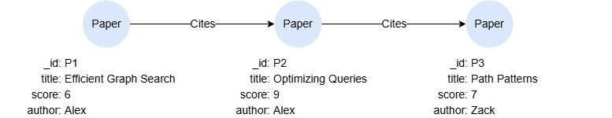
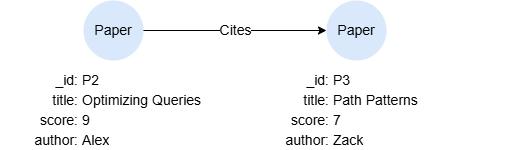

# LIMIT

## Overview

The `LIMIT` statement restricts the maximum number of rows to be retained in the intermediate result table or output table. A non-negative integer must be specified in the `LIMIT` statement.

```syntax
<limit statement> ::= "LIMIT" <non-negative integer>
```

## Example Graph

<center></center>

```gql
INSERT (p1:Paper {_id:'P1', title:'Efficient Graph Search', score:6, author:'Alex'}),
       (p2:Paper {_id:'P2', title:'Optimizing Queries', score:9, author:'Alex'}),
       (p3:Paper {_id:'P3', title:'Path Patterns', score:7, author:'Zack'}),
       (p1)-[:Cites]->(p2),
       (p2)-[:Cites]->(p3)
```

## Limiting Rows Returned

```gql
MATCH (n:Paper)
RETURN n.title LIMIT 2
```

Result:

| n.title |
| -- |
| Efficient Graph Search |
| Optimizing Queries |

## Limiting Rows Passed Forward

```gql
MATCH (n:Paper) LIMIT 1
MATCH p = (n)-()
RETURN p
```

Result: `p`

<center></center>

## Limiting Ordered Rows

```gql
MATCH (n:Paper)
ORDER BY n.title DESC 
LIMIT 1
RETURN n.title
```

Result:

| n.title |
| -- |
| Path Patterns |
