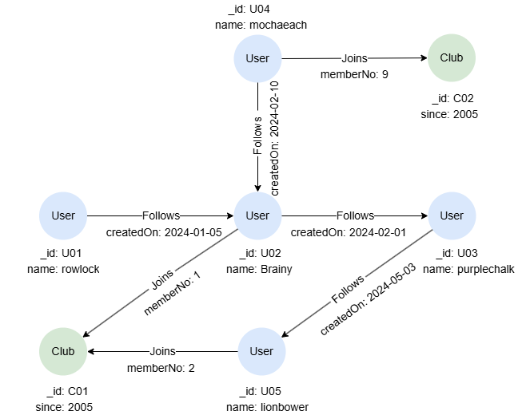
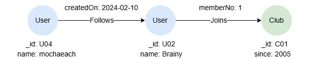
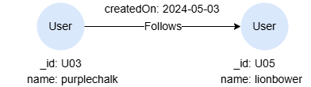
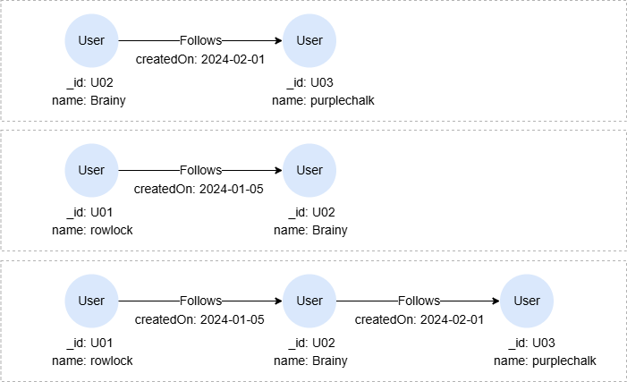
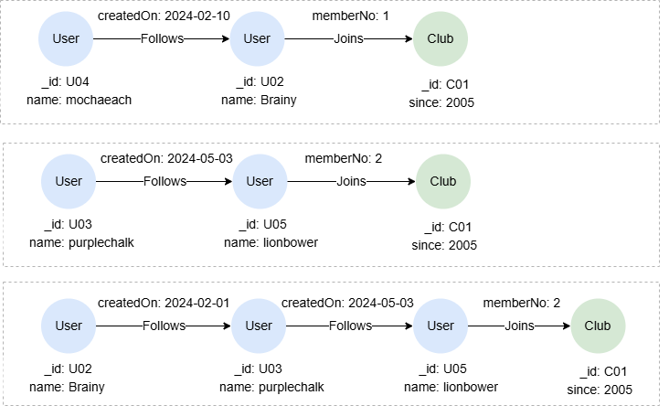
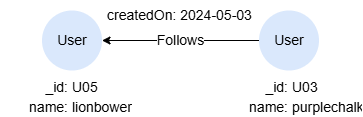

# MATCH

## Overview

The `MATCH` statement allows you to specify a <a target="_blank" href="/docs/gql/graph-pattern-matching">graph pattern</a> to search for in the graph. It is the fundamental statement for retrieving data from the graph database and binding them to variables for use in subsequent parts of the query. 

```syntax
<match statement> ::=
  "MATCH" <graph pattern> 
  [ "YIELD" <graph pattern yield item> [ { "," <graph pattern yield item> } ... ] ]

<graph pattern yield item> ::= 
  <node variable reference> | <edge variable reference> | <path variable reference>
```

## Example Graph

<center></center>

```gql
INSERT (rowlock:User {_id: 'U01', name: 'rowlock'}),
       (brainy:User {_id: 'U02', name: 'Brainy'}),
       (purplechalk:User {_id: 'U03', name: 'purplechalk'}),
       (mochaeach:User {_id: 'U04', name: 'mochaeach'}),
       (lionbower:User {_id: 'U05', name: 'lionbower'}),
       (c01:Club {_id: 'C01', since: 2005}),
       (c02:Club {_id: 'C02', since: 2005}),
       (rowlock)-[:Follows {createdOn: '2024-01-05'}]->(brainy),
       (mochaeach)-[:Follows {createdOn: '2024-02-10'}]->(brainy),
       (brainy)-[:Follows {createdOn: '2024-02-01'}]->(purplechalk),
       (purplechalk)-[:Follows {createdOn: '2024-05-03'}]->(lionbower),
       (brainy)-[:Joins {memberNo: 1}]->(c01),
       (lionbower)-[:Joins {memberNo: 2}]->(c01),
       (mochaeach)-[:Joins {memberNo: 9}]->(c02)
```

## Matching All Nodes

```gql
MATCH (n)
RETURN n
```

Result:

```json
[
  {"id": "U05", "labels": ["User"], "properties": {"name": "lionbower"}},
  {"id": "U04", "labels": ["User"], "properties": {"name": "mochaeach"}},
  {"id": "U03", "labels": ["User"], "properties": {"name": "purplechalk"}},
  {"id": "U02", "labels": ["User"], "properties": {"name": "Brainy"}},
  {"id": "U01", "labels": ["User"], "properties": {"name": "rowlock"}},
  {"id": "C02", "labels": ["Club"], "properties": {"since": 2005}},
  {"id": "C01", "labels": ["Club"], "properties": {"since": 2005}}
]
```

## Matching All Edges

```gql
MATCH ()-[e]->()
RETURN e
```

Result:

```json
[
  {"id": "e:1", "label": "Follows", "fromNodeId": "U01", "toNodeId": "U02", "properties": {"createdOn": "2024-01-05"}},
  {"id": "e:2", "label": "Follows", "fromNodeId": "U02", "toNodeId": "U03", "properties": {"createdOn": "2024-02-01"}},
  {"id": "e:3", "label": "Follows", "fromNodeId": "U03", "toNodeId": "U05", "properties": {"createdOn": "2024-05-03"}},
  {"id": "e:4", "label": "Follows", "fromNodeId": "U04", "toNodeId": "U02", "properties": {"createdOn": "2024-02-10"}},
  {"id": "e:5", "label": "Joins", "fromNodeId": "U02", "toNodeId": "C01", "properties": {"memberNo": 1}},
  {"id": "e:6", "label": "Joins", "fromNodeId": "U05", "toNodeId": "C01", "properties": {"memberNo": 2}},
  {"id": "e:7", "label": "Joins", "fromNodeId": "U04", "toNodeId": "C02", "properties": {"memberNo": 9}}
]
```

Notice that if you don't specifiy the edge direction,  either as outgoing or incoming, each edge in the graph will be returned twice, as two paths are considered distinct when their element sequences differ, i.e., `(n1)-[e]->(n2)` and `(n2)<-[e]-(n1)` are different paths.

<p tit="GQL - Each edge will be returned twice"></p>

```gql
MATCH ()-[e]-()
RETURN e
```

## Matching with Labels

Both node pattern and edge pattern support the <a target="_blank" href="/docs/gql/node-and-edge-patterns#Label-Expression">label expression</a> to specify labels.

Retrieve all `Club` nodes:

```gql
MATCH (n:Club)
RETURN n
```

Result:

```json
[
  {"id": "C02", "labels": ["Club"], "properties": {"since": 2005}},
  {"id": "C01", "labels": ["Club"], "properties": {"since": 2005}}
]
```

Retrieve all outgoing nodes from `Brainy` with `Follows` or `Joins` edges:

```gql
MATCH (:User {name: 'Brainy'})-[:Follows|Joins]->(n)
RETURN n
```

Result:

```json
[
  {"id": "U03", "labels": ["User"], "properties": {"name": "purplechalk"}},
  {"id": "C01", "labels": ["Club"], "properties": {"since": 2005}}
]
```

## Matching with Property Specification

<a target="_blank" href="/docs/gql/node-and-edge-patterns#Property-Specification">Property specification</a> can be included in node and edge patterns to apply **joint equalities** to filter nodes and edges with key-value pairs.

Retrieve `Club` nodes whose `_id` and `since` have specific values:    

```gql
MATCH (n:Club {_id: 'C01', since: 2005})
RETURN n
```

Result:

```json
[
  {"id": "C01", "labels": ["Club"], "properties": {"since": 2005}}
]
```

Retrieve the name of the member of club `C01` whose `memberNo` is 1:

```gql
MATCH (:Club {_id: 'C01'})<-[:Joins {memberNo: 1}]-(n)
RETURN n.name
```

Result: `n`

| n.name |
| -- |
| Brainy |

## Matching with Abbreviated Edges

You can use <a target="_blank" href="/docs/gql/node-and-edge-patterns#Abbreviated-Edge-Pattern">abbreviated edge patterns</a> when you do not need to filter edges or assign them to a variable. Even with the abbreviated form, you may still specify the direction of the edge when necessary.

Retrieve nodes connected with `mochaeach` with any outgoing edges:

```gql
MATCH (:User {name: 'mochaeach'})->(n)
RETURN n
```

Result:

```json
[
  {"id": "U02", "labels": ["User"], "properties": {"name": "Brainy"}},
  {"id": "C02", "labels": ["Club"], "properties": {"since": 2005}}
]
```

## Matching Paths

Retrieve users followed by `mochaeach`, and the clubs joined by those users:

```gql
MATCH p = (:User {name: 'mochaeach'})-[:Follows]->(:User)-[:Joins]->(:Club)
RETURN p
```

Result: `p`

<center></center>

## Matching with WHERE Clauses

The `WHERE` clause can be used within an element pattern (node or edge pattern), a parenthesized path pattern, or immediately after a graph pattern in the `MATCH` statement to specify various search conditions.

### Element Pattern WHERE Clause

Retrieve 1-step paths with outgoing `Follows` edges, where their `createdOn` values are greater than a specified date:  

```gql
MATCH p = ()-[e:Follows WHERE e.createdOn > '2024-04-01']->()
RETURN p
```

Result: `p`

<center></center>

### Parenthesized Path Pattern WHERE Clause

Retrieve one- or two-step paths containing outgoing `Follows` edges, where their `createdOn` values are smaller than a specified value:

```gql
MATCH p = (()-[e:Follows]->() WHERE e.createdOn < "2024-02-05"){1,2}
RETURN p
```

Result: `p`

<center></center>

### Graph Pattern WHERE Clause

Retrieve members of club `C01` whose `memberNo` is greater than 1:

```gql
MATCH (c:Club)<-[e:Joins]-(n)
WHERE c._id = 'C01' AND e.memberNo > 1
RETURN n
```

Result:

```json
[
  {"id": "U05", "labels": ["User"], "properties": {"name": "lionbower"}}
]
```

## Matching Quantified Paths

A <a target="_blank" href="/docs/gql/quantified-paths">quantified path</a> is a variable-length path where the complete path or a part of it is repeated a specified number of times.

Retrieve distinct nodes related to `lionbower` in 1 to 3 hops:

```gql
MATCH (:User {name: 'lionbower'})-[]-{1,3}(n)
RETURN collect_list(DISTINCT n._id) AS IDs
```

Result: 

| IDs |
| -- |
| ["C01","U01","U02","U03","U04"] |

Retrieve paths that begin with one- or two-step subpaths containing `Follows` edges, where their `createdOn` values are greater than a specified value, and these subpaths must connect to node `C01`:

```gql
MATCH p = (()-[e:Follows]->() WHERE e.createdOn > "2024-01-31"){1,2}()-({_id:"C01"})
RETURN p
```

Result: `p`

<center></center>

## Matching Shortest Paths

A <a target="_blank" href="/docs/gql/shortest-paths">shortest paths</a> between two nodes are the paths that has the fewest edges.

Retrieve all the shortest paths between `lionbower` and `purplechalk` within 5 hops:

```gql
MATCH p = ALL SHORTEST (n1:User)-[]-{,5}(n2:User)
WHERE n1.name = 'lionbower' AND n2.name = 'purplechalk'
RETURN p
```

Result: `p`

<center></center>

## Matching Multiple Paths

When a `MATCH` statement contains multiple path patterns, each pattern is matched independently against the graph to produce its own result set. These result sets are then combined by performing an **equi-join** on the shared node or edge variables.

Retrieve users who joined club `C02` and also follow `Brainy`:

```gql
MATCH (u)-[:Joins]->(:Club {_id: 'C02'}), (u)-[:Follows]->(:User {name: 'Brainy'})
RETURN u
```

Result:

```json
[
  {"id": "U04", "labels": ["User"], "properties": {"name": "mochaeach"}}
]
```

The above query is equivalent to the following using two `MATCH`s:

```gql
MATCH (u)-[:Joins]->(:Club {_id: 'C02'})
MATCH (u)-[:Follows]->(:User {name: 'Brainy'})
RETURN u
```

If the path patterns share no common variables, the result sets are combined using a **Cartesian product** — a behavior that is usually undesired. For example,

```gql
MATCH (c:Club), (u:User)-[f:Follows WHERE f.createdOn > '2024-02-01']->()
RETURN c._id, u.name
```

Result:

| c.\_id | u.name |
| -- | -- |
| C02 | mochaeach |
| C02 | purplechalk |
| C01 | mochaeach |
| C01 | purplechalk |

## MATCH YIELD

The `YIELD` clause can be used to select specific node, edge, or path variables from the `MATCH` statement, making them accessible for reference in subsequent parts of the query. Variables not selected with `YIELD` will no longer be available. If the `YIELD` clause is omitted, all variables are passed through by default.

This query only returns `c`, as `n` is not involved in `YIELD`:

```gql
MATCH (n:User)-[:Joins]->(c:Club)
YIELD c
RETURN *
```

Result:

```json
[
  {"c": {"id": "C01", "labels": ["Club"], "properties": {"since": 2005}}},
  {"c": {"id": "C02", "labels": ["Club"], "properties": {"since": 2005}}},
  {"c": {"id": "C01", "labels": ["Club"], "properties": {"since": 2005}}}
]
```

This query returns `n1` and `e`, `n2` is not included:

```gql
MATCH (n1:Club)
MATCH (n2:Club)<-[e:Joins WHERE e.memberNo < 3]-() YIELD e
RETURN *
```

Result:

<div tab="code">

<p tit="n1"></p>

```json
[
  {"id": "C02", "labels": ["Club"], "properties": {"since": 2005}},
  {"id": "C02", "labels": ["Club"], "properties": {"since": 2005}},
  {"id": "C01", "labels": ["Club"], "properties": {"since": 2005}},
  {"id": "C01", "labels": ["Club"], "properties": {"since": 2005}}
]
```

<p tit="e"></p>

```json
[
  {"id": "e:5", "label": "Joins", "fromNodeId": "U02", "toNodeId": "C01", "properties": {"memberNo": 1}},
  {"id": "e:6", "label": "Joins", "fromNodeId": "U05", "toNodeId": "C01", "properties": {"memberNo": 2}},
  {"id": "e:5", "label": "Joins", "fromNodeId": "U02", "toNodeId": "C01", "properties": {"memberNo": 1}},
  {"id": "e:6", "label": "Joins", "fromNodeId": "U05", "toNodeId": "C01", "properties": {"memberNo": 2}}
]
```

</div>

This query throws syntax error since `n2` is not selected in the `YIELD` clause, thus it cannot be accessed by the `RETURN` statement:

<p tit="GQL - Syntax Error"></p>

```gql
MATCH (n1:User), (n2:Club)
YIELD n1
RETURN n1, n2
```
