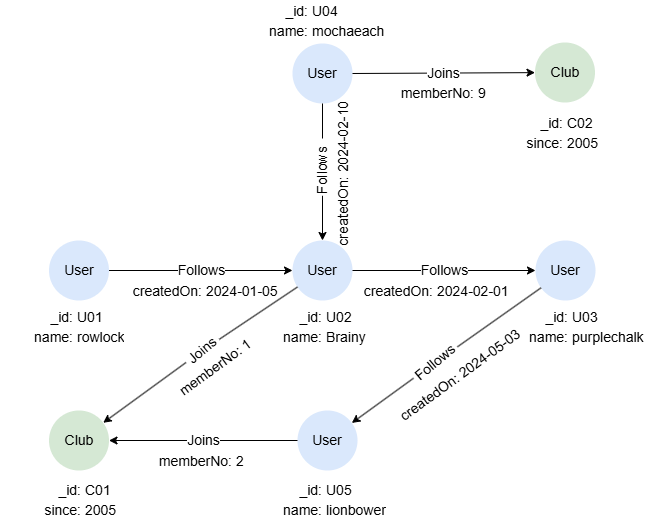

# OPTIONAL MATCH

## Overview

`OPTIONAL MATCH` functions similarly to `MATCH` in that it attempts to find patterns in the graph, but it tolerates the absence of matches:

- `MATCH`: If a graph pattern has no matches, it returns no records.
- `OPTIONAL MATCH`: If a graph pattern has no matches, it returns a `null` value.

The `OPTIONAL` keyword can be applied to a single `MATCH` statement, or to a block of `MATCH` statements.

<p tit="Syntax"></p>

```
<optional match statement> ::=
    "OPTIONAL" <match statement> 
  | "OPTIONAL" "(" <match statement block> ")"
  | "OPTIONAL" "{" <match statement block> "}"

<match statement block> ::= <match statement> ...
```

## Example Graph

<center></center>

```gql
INSERT (rowlock:User {_id: 'U01', name: 'rowlock'}),
       (brainy:User {_id: 'U02', name: 'Brainy'}),
       (purplechalk:User {_id: 'U03', name: 'purplechalk'}),
       (mochaeach:User {_id: 'U04', name: 'mochaeach'}),
       (lionbower:User {_id: 'U05', name: 'lionbower'}),
       (c01:Club {_id: 'C01', since: 2005}),
       (c02:Club {_id: 'C02', since: 2005}),
       (rowlock)-[:Follows {createdOn: '2024-01-05'}]->(brainy),
       (mochaeach)-[:Follows {createdOn: '2024-02-10'}]->(brainy),
       (brainy)-[:Follows {createdOn: '2024-02-01'}]->(purplechalk),
       (purplechalk)-[:Follows {createdOn: '2024-05-03'}]->(lionbower),
       (brainy)-[:Joins {memberNo: 1}]->(c01),
       (lionbower)-[:Joins {memberNo: 2}]->(c01),
       (mochaeach)-[:Joins {memberNo: 9}]->(c02)
```

## Checking Existence

The user `rowlock` hasn't joined the club `C01`, therefore this query yields no results:

```gql
MATCH (:User {name: "rowlock"})->(c:Club {_id: "C01"})
RETURN c
```

Result: No return data

If uses `OPTIONAL MATCH`, the query returns a row with `null`, indicating the absence of the match:

```gql
OPTIONAL MATCH (:User {name: "rowlock"})->(c:Club {_id: "C01"})
RETURN c
```

Result:

| c |
| -- |
| `null` |

## Retaining All Incoming Records

In this query, the two `MATCH` statements are **equi-joined** on the common variable `u`:

```gql
MATCH (u:User)
MATCH (u)-[:Joins]->(c:Club)
RETURN u.name, c._id
```

Result:

| u.name | c.\_id |
| -- | -- |
| mochaeach | C02 |
| Brainy | C01 |
| lionbower | C01 |

If we replace the second `MATCH` with `OPTIONAL MATCH`, the result sets of the two statements are **left-joined**, meaning all records from the first `MATCH` are preserved:

```gql
MATCH (u:User)
OPTIONAL MATCH (u)-[:Joins]->(c:Club)
RETURN u.name, c._id
```

Result:

| u.name | c.\_id |
| -- | -- |
| mochaeach | C02 |
| Brainy | C01 |
| rowlock | `null` |
| lionbower | C01 |
| purplechalk | `null` |

## Keeping the Query Running

In the case when a statement produces empty results, the query halts at that point, as there is no data for subsequent statements to operate on.

For example, the following query has no return because the `MATCH` fails to find a matching node. As a result, the `RETURN` is never executed.

```gql
MATCH (u:User) WHERE u.name = "Masterpiece1989"
RETURN CASE WHEN u IS NULL THEN "User not found" ELSE u END 
```

Result: No return data

To ensure that the query continues executing even when no match is found, use `OPTIONAL MATCH`:

```gql
OPTIONAL MATCH (u:User) WHERE u.name = "Masterpiece1989"
RETURN CASE WHEN u IS NULL THEN "User not found" ELSE u END
```

Result:

| col_0 |
| -- |
| "User not found" |

## The Evaluation of WHERE

When using `OPTIONAL MATCH`, keep in mind that the `WHERE` clause is evaluated during pattern matching, i.e., before the `OPTIONAL` logic is applied, not after.

This query returns users who have no followers:

```gql
MATCH (n:User)
OPTIONAL MATCH p = (n)<-[:Follows]-()
FILTER p IS NULL
RETURN collect_list(n.name) AS Names
```

Result:

| Names |
| -- |
| ["mochaeach","rowlock"] |

You won’t get the expected results if replaces `FILTER` with `WHERE`, since the `WHERE` clause is evaluated before `OPTIONAL` is applied:

```gql
MATCH (n:User)
OPTIONAL MATCH p = (n)<-[:Follows]-()
WHERE p IS NULL
RETURN collect_list(n.name) AS Names
```

Result:

| Names |
| -- |
| ["mochaeach","Brainy","rowlock","lionbower","purplechalk"] |

## Optional MATCH Block

You can wrap multiple `MATCH` statements inside braces `{}` or parentheses `()` and apply `OPTIONAL` to the entire block. This means that the whole block is treated as a unit: if any part of it fails to match, it doesn't stop the query—instead, it returns `null` for all variables introduced inside that block.

```gql
FOR name IN ["rowlock", "Masterpiece1989", "Brainy"]
OPTIONAL {
    MATCH (u:User) WHERE u.name = name
    MATCH (u)->(c:Club)
}
RETURN table(name, u.name, c._id)
```

Result:

| name | u.name | c.\_id |
| -- | -- | -- |
| rowlock | `null` | `null` |
| Masterpiece1989 | `null` | `null` |
| Brainy | Brainy | C01 |
