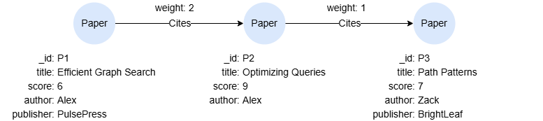
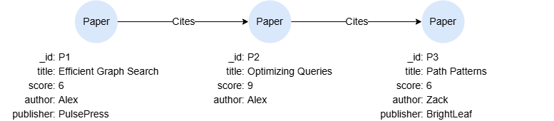

# ORDER BY

## Overview

The `ORDER BY` statement allows you to sort the intermediate result table or output table based on the specified items.

<p tit="Syntax"></p>

```
<order by statement> ::= 
  "ORDER BY" <sort specification> [ { "," <sort specification> }... ]

<sort specification> ::=
  <value expression> [ "ASC" | "DESC" ] [ "NULLS FIRST" | "NULLS LAST" ]
```

**Details**

- `ASC` (ascending) is applied by default. To reverse the order, you can explicitly use the `DESC` (descending) keyword.
- `NULLS FIRST` and `NULLS LAST` can be used to control whether `null` values appear before or after non-null values. When null ordering is not explicitly specified:
    - `NULLS LAST` is applied by default when ordering in the `ASC` order.
    - `NULLS FIRST` is applied by default when ordering in the `DESC` order.

## Example Graph

<center></center>

```gql
INSERT (p1:Paper {_id:'P1', title:'Efficient Graph Search', score:6, author:'Alex', publisher:'PulsePress'}),
       (p2:Paper {_id:'P2', title:'Optimizing Queries', score:9, author:'Alex'}),
       (p3:Paper {_id:'P3', title:'Path Patterns', score:7, author:'Zack', publisher:'BrightLeaf'}),
       (p1)-[:Cites {weight:2}]->(p2),
       (p2)-[:Cites {weight:1}]->(p3)
```

## Ordering by Property

```gql
MATCH (n:Paper)
ORDER BY n.score
RETURN n.title, n.score
```

Result:

| n.title | n.score |
| -- | -- |
| Efficient Graph Search | 6 |
| Path Patterns | 7 |
| Optimizing Queries | 9 |

## Ordering by Node or Edge Variable

When a node or edge variable is specified, it is sorted on the `_id` of the nodes or edges.

```gql
MATCH (n:Paper)
RETURN n.title, element_id(n) ORDER BY n
```

Result:

| n.title | element_id(n) |
| -- | -- |
| Efficient Graph Search | P1 |
| Optimizing Queries | P2 |
| Path Patterns | P3 |

## Ordering by Expression

```gql
MATCH p = (:Paper)->{1,2}(:Paper)
RETURN p, path_length(p) AS length ORDER BY length DESC
```

Result:

<table>
  <thead>
    <tr>
      <th>p</th>
      <th style="width:10%;">length</th>
    </tr>
  </thead>
  <tbody>
    <tr>
      <td>
<center></center>
      </td>
      <td>2</td>
    </tr>
    <tr>
      <td>
<center></center>
      </td>
      <td>1</td>
    </tr>
    <tr>
      <td>
        <center></center>
      </td>
      <td>1</td>
    </tr>
  </tbody>
</table>

## Multi-level Ordering

When there are multiple ordering specifications, it is sorted by the first specification listed, and for equals values, go to the next specification, and so on.

```gql
MATCH (n:Paper)
RETURN n.title, n.author, n.score 
ORDER BY n.author DESC, n.score
```

Result:

| n.title | n.author | n.score |
| -- | -- | -- |
| Path Patterns | Zack | 7 |
| Efficient Graph Search | Alex | 6 |
| Optimizing Queries | Alex | 9 |

## Discarding and Retaining Records After Ordering

You may use the `SKIP` or `LIMIT` statement after `ORDER BY` to skip a specified number of rows from the top, or to limit the number of rows retained.

Return titles of the two papers with the second and third highest scores:

```gql
MATCH (n:Paper)
RETURN n.title, n.score
ORDER BY n.score DESC SKIP 1 LIMIT 2
```

Result: 

| n.title | n.score |
| -- | -- |
| Path Patterns | 7 |
| Efficient Graph Search | 6 |

## Null Ordering

Return titles of the two papers with the second and third highest scores, ensuring `null` values appear at the front if applicable:

```gql
MATCH (n:Paper)
RETURN n.title, n.publisher
ORDER BY n.publisher NULLS FIRST
```

Result: 

| n.title | n.publisher |
| -- | -- |
| Optimizing Queries | `null` |
| Path Patterns | BrightLeaf |
| Efficient Graph Search | PulsePress |
