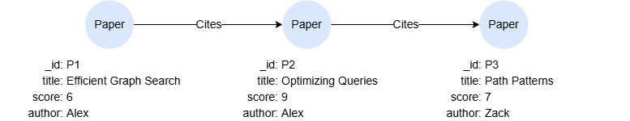
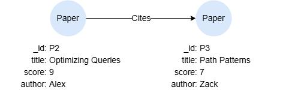

# SKIP

## Overview

The `SKIP` statement allows you to discard a specified number of rows from the start of the intermediate result table or output table. `OFFSET` is a synonym to `SKIP`.

<p tit="Syntax"></p>

```
<skip statement> ::= < "SKIP" | "OFFSET" > <non-negative integer>
```

## Example Graph

<center></center>

```gql
INSERT (p1:Paper {_id:'P1', title:'Efficient Graph Search', score:6, author:'Alex'}),
       (p2:Paper {_id:'P2', title:'Optimizing Queries', score:9, author:'Alex'}),
       (p3:Paper {_id:'P3', title:'Path Patterns', score:7, author:'Zack'}),
       (p1)-[:Cites]->(p2),
       (p2)-[:Cites]->(p3)
```

## Skipping N Rows

```gql
MATCH (n:Paper)
RETURN n.title SKIP 1
```

Result:

| n.title |
| -- |
| Efficient Graph Search |
| Path Patterns |

## Skipping N Ordered Rows

```gql
MATCH (n:Paper)
ORDER BY n.score 
SKIP 1
MATCH p = (n)->()
RETURN p
```

Result: `p`

<center></center>
