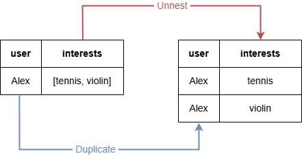
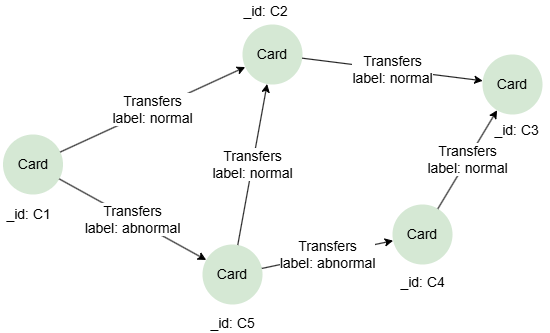

# FOR

## Overview

The `FOR` statement unnests a list into individual records and expands the intermediate result table accordingly.

```syntax
<for statement> ::= 
  "FOR" <binding variable> "IN" <list value expression> [ <ordinality or offset> ]

<ordinality or offset> ::= 
  "WITH" { "ORDINALITY" | "OFFSET" } <binding variable>
```

**Details**

- The `<ordinality or offset>` defines a variable to track the position of elements in the list:
  - `ORDINALITY` provides the ordinal position of each element, i.e., 1, 2, 3,....
  - `OFFSET` provides the zero-based position of each element, i.e., 0, 1, 2, ...
- The name of the `<binding variable>` in `<ordinality or offset>` must differ from the `<binding variable>` placed right after `FOR`.

> The `UNWIND <list> AS <variable>` syntax is accepted as a synonym for `FOR <variable> IN <list>` and behaves identically. However, `UNWIND` is not part of the GQL standard (ISO/IEC 39075): queries using it run normally but return an advisory warning recommending the standard `FOR ... IN` form.

## Unnesting a Simple List

```gql
FOR item IN [1,1,2,3,null]
RETURN item
```

Result:

| item |
| -- |
| 1 |
| 1 |
| 2 |
| 3 |
| `null` |

```gql
FOR item IN [[1,2], [2,3,5]]
RETURN item
```

Result:

| item |
| -- |
| [1,2] |
| [2,3,5] |

## Unnesting a Variable

```gql
LET user = "Alex"
LET interests = ["tennis", "violin"]
FOR interest IN interests
RETURN user, interest
```

Result:

| user | interest |
| -- | -- |
| Alex | tennis |
| Alex | violin |

In this query, the `FOR` statement unnests the list contained in the `interests` column of the working table into two records. Consequently, the corresponding record in the `user` column is duplicated to two records as well.

<center></center>

## Unnesting a Group Variable

<center></center>

```gql
INSERT (c1:Card {_id: 'C1'}),
  	   (c2:Card {_id: 'C2'}),
  	   (c3:Card {_id: 'C3'}),
  	   (c4:Card {_id: 'C4'}),
  	   (c5:Card {_id: 'C5'}),
       (c1)-[:Transfers {label: 'normal'}]->(c2),
       (c1)-[:Transfers {label: 'abnormal'}]->(c5),
       (c5)-[:Transfers {label: 'normal'}]->(c2),
       (c5)-[:Transfers {label: 'abnormal'}]->(c4),
       (c2)-[:Transfers {label: 'normal'}]->(c3),
       (c4)-[:Transfers {label: 'normal'}]->(c3)
```

Retrieve one shortest path between `C1` and `C3`, and return the `label` values on edges in the path:

```gql
MATCH SHORTEST 1 ({_id: "C1"})-[trans:Transfers]-{1,6}({_id: "C3"})
FOR tran IN trans
RETURN tran.label
```

Result:

| tran.label |
| -- |
| normal |
| normal |

In this query, the `trans` declared in a <a target="_blank" href="/docs/gql/quantified-paths">quantified path</a> is a group variable. To convert it to a singleton degree of reference, you can use `FOR` to unnest it.

## WITH ORDINALITY

To collect elements in even positions from a list to a new list:

```gql
FOR item in ["a", "b", "c", "d"] WITH ORDINALITY index // index starts from 1
FILTER index %2 = 0
RETURN collect_list(item)
```

Result:

| collect_list(item) |
| -- |
| ["b","d"] |

## WITH OFFSET

Return the second element in a list:

```gql
FOR item in ["a", "b", "c", "d"] WITH OFFSET index // index starts from 0
FILTER index = 1
RETURN item
```

Result:

| item |
| -- |
| b |
