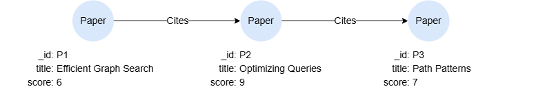

# LET

## Overview

The `LET` statement allows you to define new variables and adds corresponding columns to the intermediate result table. Each variable is assigned a value using the `=` operator.

```syntax
<let statement> ::= 
  "LET" <let variable definition> [ { "," <let variable definition> }... ]

<let variable definition> ::= 
  <variable> "=" <value expression>
```

**Details**

- `LET` adds new columns to the intermediate result table without changing the number of rows.
- Re-defining an existing variable in `LET` overwrites its value. See [Redefining Variables](#Redefining-Variables).
- Variables defined in the same `LET` cannot reference each other.

## Example Graph

<center></center>

Create this graph, run the following query against an empty graph:

```gql
INSERT (p1:Paper {_id:'P1', title:'Efficient Graph Search', score:6}),
       (p2:Paper {_id:'P2', title:'Optimizing Queries', score:9}),
       (p3:Paper {_id:'P3', title:'Path Patterns', score:7}),
       (p1)-[:Cites]->(p2),
       (p2)-[:Cites]->(p3)
```

## Defining Variables

```gql
LET threshold = 7
MATCH (p:Paper) WHERE p.score > threshold
RETURN p.title, p.score - threshold
```

Result:

| p.title | p.score - threshold |
| -- | -- |
| Optimizing Queries | 2 |

## Redefining Variables

A variable that is already defined can be redefined by a later `LET`. The new value replaces the old one in the same column, and no extra column is added. Since values are immutable, this is also the way to derive an updated value from an existing one: the new definition may reference the variable being redefined, in which case it reads the old value row by row.

```gql
MATCH (p:Paper)
LET s = p.score
LET s = s * 2
RETURN p.title, s
```

Result:

| p.title | s |
| -- | -- |
| Path Patterns | 14 |
| Optimizing Queries | 18 |
| Efficient Graph Search | 12 |

The same applies to a `RECORD`. Use the <a href="/docs/gql/operators#Record-Merge" target="_blank">record merge operator</a> `+` to produce an updated record, where the field values on the right-hand side win:

```gql
LET conf = {retries: 3, timeout: 30}
LET conf = conf + {timeout: 60, verbose: true}
RETURN conf
```

Result:

| conf |
| -- |
| {retries: 3, timeout: 60, verbose: true} |

The redefined value may be of a different type than the original, and if the same variable is defined more than once within a single `LET`, the last definition wins:

```gql
LET x = 1
LET x = 'abc'      -- INTEGER redefined as STRING
RETURN x           -- 'abc'
```

```gql
LET x = 1, x = 2
RETURN x           -- 2
```

A variable bound to a node or an edge can be redefined by `LET` as well. As it no longer references a graph element afterwards:

```gql
MATCH (n:Paper {_id: 'P1'})
LET n = 5
RETURN n           -- 5
```

Redefinition is an extension to the GQL standard, which requires each variable defined by `LET` to be new to the intermediate result table. Use distinct variable names to keep queries portable.

## Using Queries in LET

You can assign the result of a subquery to a variable using `VALUE { ... }`:

```gql
MATCH (p:Paper)
LET avgScore = VALUE { MATCH (p2:Paper) RETURN avg(p2.score) }
FILTER p.score > avgScore
RETURN p.title, p.score
```

Result:

| p.title | p.score |
| -- | -- |
| Optimizing Queries | 9 |

## Referencing Variables in LET

If any variable is referenced in `LET`, it will be evaluated it row by row.

This query references `x` in `LET` and determines whether its `score` property is greater than 7:

```gql
MATCH (x:Paper)
LET recommended = x.score > 7
RETURN x.title, recommended
```

It is equivalent to:

```gql
MATCH (x:Paper)
CALL (x) {
  LET recommended = x.score > 7
  RETURN x, recommended
}
RETURN x.title, recommended
```

Result:

| x.title | recommended |
| -- | -- |
| Optimizing Queries | true |
| Efficient Graph Search | false |
| Path Patterns | false |