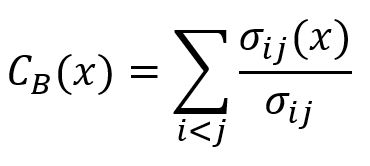
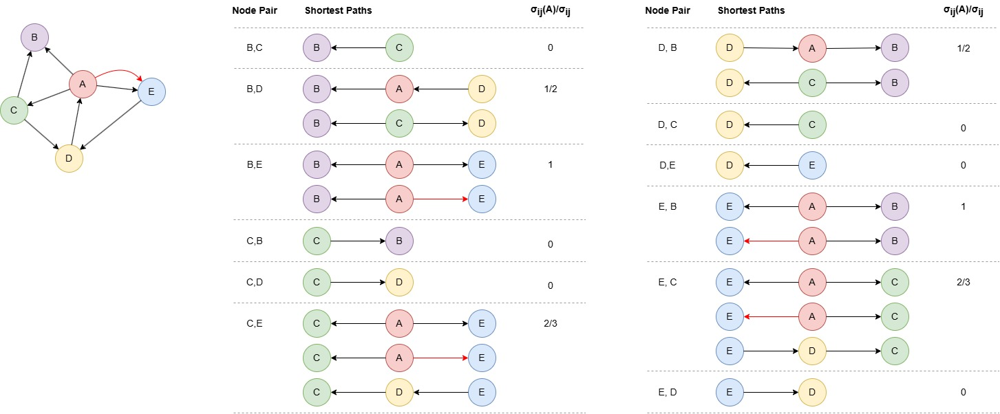
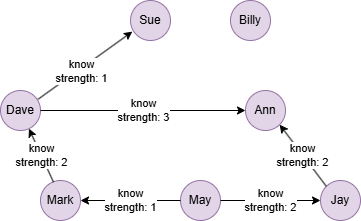

# Betweenness Centrality

## Overview

Betweenness centrality measures the likelihood of a node being on the shortest paths between any two other nodes. This metric effectively identifies "bridge" nodes that facilitate connectivity between different parts of a graph.

Betweenness centrality scores range from 0 to 1 (when normalized), with higher scores indicating nodes that exert greater influence over the flow and connectivity of the network.

References:

- L.C. Freeman, <a href="https://www.researchgate.net/profile/Linton-Freeman-2/publication/216637282_A_Set_of_Measures_of_Centrality_Based_on_Betweenness/links/54415c660cf2a76a3cc7e199/A-Set-of-Measures-of-Centrality-Based-on-Betweenness.pdf" target="_blank">A Set of Measures of Centrality Based on Betweenness</a> (1977)
- L.C. Freeman, <a href="https://www.albany.edu/~ravi/pdfs/freeman_1978.pdf" target="_blank">Centrality in Social Networks Conceptual Clarification</a> (1978)

## Concepts

### Shortest Path

The shortest paths between two nodes are the paths that contain the fewest edges. When considering edge weights, the (weighted) shortest paths are those with the lowest total weight sum.

### Betweenness Centrality

The betweenness centrality of a node `x` is computed by:

<center></center>

where,

- `i` and `j` are two distinct nodes in the graph, excluding `x`.
- <code>σ<sub>ij</sub></code> is the total number of shortest paths between `i` and `j`.
- <code>σ<sub>ij</sub>(x)</code> is the number of shortest paths between `i` and `j` that pass through node `x`.
- <code>σ<sub>ij</sub>(x)/σ<sub>ij</sub></code> gives the probability that `x` lies in the shortest paths between `i` and `j`. Note that if `i` and `j` are not connected, <code>σ<sub>ij</sub>(x)/σ<sub>ij</sub></code> is 0.

The final value is normalized by the factor `(k – 1)(k – 2)`, where `k` is the total number of nodes in the graph. This normalization ensures the result lies within a fixed range, making it comparable across graphs of different sizes.

<center></center>

The betweenness centrality of node `A` is computed as: `(1/2 + 1 + 2/3 + 1/2 + 1 + 2/3) / (4 * 3) = 0.3611111111`.

## Example Graph

<center></center>

```gql
INSERT (Sue:user {_id: "Sue"}), (Dave:user {_id: "Dave"}),
       (Ann:user {_id: "Ann"}), (Mark:user {_id: "Mark"}),
       (May:user {_id: "May"}), (Jay:user {_id: "Jay"}),
       (Billy:user {_id: "Billy"}),
       (Dave)-[:know {strength: 1}]->(Sue), (Dave)-[:know {strength: 3}]->(Ann),
       (Mark)-[:know {strength: 2}]->(Dave), (May)-[:know {strength: 1}]->(Mark),
       (May)-[:know {strength: 2}]->(Jay), (Jay)-[:know {strength: 2}]->(Ann)
```

## Parameters

| Name | Type | Default | Description |
| -- | -- | -- | -- |
| `ids` | `LIST` | / | `_id`s of nodes to compute (empty = all nodes). |
| `direction` | `STRING` | `both` | Edge direction: `in`, `out`, or `both`. |
| `normalized` | `BOOL` | `false` | Whether to normalize scores to [0, 1]. |
| `weight` | `STRING` or `LIST` | / | Numeric edge property for weighted shortest paths. |
| `samplingSize` | `INT` | `-1` | Number of source nodes to sample (-1 = all). Recommended for large graphs. |
| `limit` | `INT` | `-1` | Limits the number of results returned (-1 = all). |
| `order` | `STRING` | / | Sorts the results by `score`: `asc` or `desc`. |

## Run Mode

**Returns:**

| Column | Type | Description |
| -- | -- | -- |
| `nodeId` | `STRING` | Node identifier (`_id`) |
| `score` | `FLOAT` | Betweenness centrality score |
| `rank` | `INT` | Rank position (1 = highest betweenness) |

Normalized betweenness centrality for all nodes:

```gql
CALL algo.betweenness({
  normalized: true,
  order: "desc"
}) YIELD nodeId, score, rank
```

Result:

| nodeId | score | rank |
| -- | -- | -- |
| Dave | 0.3333333333333333 | 1 |
| Mark | 0.13333333333333333 | 2 |
| Ann | 0.13333333333333333 | 3 |
| May | 0.06666666666666667 | 4 |
| Jay | 0.06666666666666667 | 5 |
| Sue | 0 | 6 |
| Billy | 0 | 7 |

Weighted betweenness centrality:

```gql
CALL algo.betweenness({
  ids: ["Dave"],
  normalized: true,
  weight: ["strength"]
}) YIELD nodeId, score, rank
```

Result:

| nodeId | score | rank |
| -- | -- | -- |
|	Dave | 0.3 | 1 |

## Stream Mode

Returns the same columns as run mode, streamed for memory efficiency.

```gql
CALL algo.betweenness.stream({
  normalized: true,
  order: "desc"
}) YIELD nodeId, score
FILTER score > 0.1
RETURN nodeId, score
```

Result:

| nodeId | score |
| -- | -- |
| Dave | 0.3333333333333333 |
| Mark | 0.13333333333333333 |
| Ann | 0.13333333333333333 |

## Stats Mode

**Returns:**

| Column | Type | Description |
| -- | -- | -- |
| `nodeCount` | `INT` | Total number of nodes |
| `minScore` | `FLOAT` | Minimum betweenness score |
| `maxScore` | `FLOAT` | Maximum betweenness score |
| `avgScore` | `FLOAT` | Average betweenness score |

```gql
CALL algo.betweenness.stats({normalized: true}) YIELD nodeCount, minScore, maxScore, avgScore
```

Result:

| nodeCount | minScore | maxScore | avgScore |
| -- | -- | -- | -- |
| 7 | 0 | 0.3333333333333333 | 0.1047619047619048 |

## Write Mode

Computes results and writes them back to node properties. The write configuration is passed as a second argument map.

**Write parameters:**

| Name | Type | Description |
| -- | -- | -- |
| `db.property` | `STRING` or `MAP` | Node property to write results to. String: writes the `score` column in results to a property. Map: explicit column-to-property mapping (e.g., `{score: 'bc_score', rank: 'bc_rank'}`). |

**Writable columns:**

| Column | Type | Description |
| -- | -- | -- |
| `score` | `FLOAT` | Betweenness centrality score |
| `rank` | `INT` | Rank position |

**Returns:**

| Column | Type | Description |
| -- | -- | -- |
| `task_id` | `STRING` | Task identifier for tracking via `SHOW TASKS` |
| `nodesWritten` | `INT` | Number of nodes with properties written |
| `computeTimeMs` | `INT` | Time spent computing the algorithm (milliseconds) |
| `writeTimeMs` | `INT` | Time spent writing properties to storage (milliseconds) |

```gql
CALL algo.betweenness.write({normalized: true}, {
  db: {
    property: "bc_score"
  }
}) YIELD task_id, nodesWritten, computeTimeMs, writeTimeMs
```
