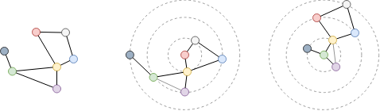
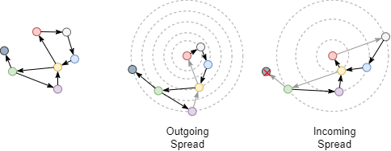
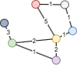
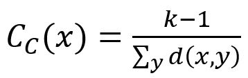
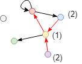
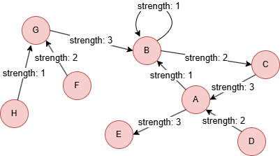

# Closeness Centrality

## Overview

Closeness centrality of a node is measured by the average shortest distance from the node to all other reachable nodes. The closer a node is to all other nodes, the more central the node is. This algorithm is widely used in applications such as discovering key social nodes and finding best locations for functional places.

> Closeness Centrality algorithm is best to be applied in connected graph. For disconnected graph, its variant, the <a target="_blank" href="/docs/graph-algorithms/harmonic-centrality">Harmonic Centrality</a>, is recommended.

Closeness centrality scores range from 0 to 1; nodes with higher scores have shorter distances to all other nodes.

Closeness centrality was originally defined by Alex Bavelas in 1950:

- A. Bavelas, <a href="https://doi.org/10.1121/1.1906679" target="_blank">Communication patterns in task-oriented groups</a> (1950)

## Concepts

### Shortest Distance

The shortest distance of two nodes is the number of edges contained in the shortest path between them. The shortest path is determined using the BFS principle, if node A is regarded as the start node and node B is one of the K-hop neighbors of node A, then K is the shortest distance between A and B.

<center></center>

Examine the shortest distance between the red and green nodes in the above graph. Since the graph is undirected, no matter which node (red or green) to start, the other node is the 2-hop neighbor. Thus, the shortest distance between them is 2.

<center></center>

Examine the shortest distance between the red and green nodes after converting the undirected graph to directed graph, the edge direction should be considered now. The outgoing shortest distance from the red node to the green node is 4, and the incoming shortest distance from the green node to the red node is 3.

When edge weights are considered, the shortest distance between two nodes is the least sum of weights of the edges in the path between them.

Examine the shortest distance between the red and green nodes after assigning weights to edges. To minimize the total weight, a path with more edges is chosen, resulting in a total weight of 5.

<center></center>

### Closeness Centrality

Closeness centrality score of a node defined by this algorithm is the inverse of the arithmetic mean of the shortest distances from the node to all other reachable nodes. The formula is:

<center></center>

where `x` is the target node,  `y` is any node that connects with `x` along edges (`x` itself is excluded), `k-1` is the number of `y`, `d(x,y)` is the shortest distance between `x` and `y`.

<center></center>

Calculate closeness centrality score of the red node in the incoming direction in the graph above. Only the blue, yellow and purple nodes can reach the red node in this direction, so the score is `3 / (2 + 1 + 2) = 0.6`. Since the green and grey nodes cannot reach the red node in the incoming direction, they are not included in the calculation.

## Considerations

- The closeness centrality score of isolated nodes is 0.
- When computing closeness centrality for a node, the unreachable nodes are excluded. For example, this includes isolated nodes, nodes in other connected components, or nodes within the same connected component that are unreachable in the specified direction.

## Example Graph

<center></center>

```gql
INSERT (A:user {_id: "A"}), (B:user {_id: "B"}),
       (C:user {_id: "C"}), (D:user {_id: "D"}),
       (E:user {_id: "E"}), (F:user {_id: "F"}),
       (G:user {_id: "G"}), (H:user {_id: "H"}),
       (A)-[:vote {strength: 1}]->(B), (A)-[:vote {strength: 3}]->(E),
       (B)-[:vote {strength: 1}]->(B), (B)-[:vote {strength: 2}]->(C),
       (C)-[:vote {strength: 3}]->(A), (D)-[:vote {strength: 2}]->(A),
       (F)-[:vote {strength: 2}]->(G), (G)-[:vote {strength: 3}]->(B),
       (H)-[:vote {strength: 1}]->(G)
```

## Parameters

| Name | Type | Default | Description |
| -- | -- | -- | -- |
| `ids` | `LIST` | / | `_id`s of nodes to compute (empty = all nodes). |
| `direction` | `STRING` | `both` | Edge direction: `in`, `out`, or `both`. |
| `weight` | `STRING` or `LIST` | / | Numeric edge property for weighted shortest paths. |
| `normalized` | `BOOL` | `false` | Normalize scores using Wasserman-Faust formula for disconnected graphs. |
| `samplingSize` | `INT` | `-1` | Number of source nodes to sample (-1 = all). |
| `limit` | `INT` | `-1` | Limits the number of results returned (-1 = all). |
| `order` | `STRING` | / | Sorts the results by `score`: `asc` or `desc`. |

## Run Mode

**Returns:**

| Column | Type | Description |
| -- | -- | -- |
| `nodeId` | `STRING` | Node identifier (`_id`) |
| `score` | `FLOAT` | Closeness centrality score (higher = more central) |
| `rank` | `INT` | Rank position (1 = highest closeness) |

Closeness centrality for all nodes:

```gql
CALL algo.closeness({
  order: "desc"
}) YIELD nodeId, score, rank
```

Result:

| nodeId | score | rank |
| -- | -- | -- |
| B | 0.6363636363636364 | 1 |
| A | 0.5833333333333334 | 2 |
| G | 0.5384615384615384 | 3 |
| C | 0.5 | 4 |
| E | 0.3888888888888889 | 5 |
| D | 0.3888888888888889 | 6 |
| F | 0.3684210526315789 | 7 |
| H | 0.3684210526315789 | 8 |

Weighted closeness centrality:

```gql
CALL algo.closeness({
  ids: ["A", "B"],
  weight: ["strength"]
}) YIELD nodeId, score, rank
```

Result:

|	nodeId | score | rank |
| -- | -- | -- |
|	B	| 0.3181818181818182 | 1 |
|	A	| 0.2916666666666667 | 2 |

## Stream Mode

Returns the same columns as run mode, streamed for memory efficiency.

```gql
CALL algo.closeness.stream({
  direction: "out"
}) YIELD nodeId, score
FILTER score > 0.5
RETURN nodeId, score
```

Result:

| nodeId | score |
| -- | -- |
| A | 0.75 |
| C | 0.6 |

## Stats Mode

**Returns:**

| Column | Type | Description |
| -- | -- | -- |
| `nodeCount` | `INT` | Total number of nodes |
| `minScore` | `FLOAT` | Minimum closeness score |
| `maxScore` | `FLOAT` | Maximum closeness score |
| `avgScore` | `FLOAT` | Average closeness score |

```gql
CALL algo.closeness.stats() YIELD nodeCount, minScore, maxScore, avgScore
```

Result:

| nodeCount | minScore | maxScore | avgScore |
| -- | -- | -- | -- |
| 8 | 0.3684210526315789 | 0.6363636363636364 | 0.4715972988999304 |

## Write Mode

Computes results and writes them back to node properties. The write configuration is passed as a second argument map.

**Write parameters:**

| Name | Type | Description |
| -- | -- | -- |
| `db.property` | `STRING` or `MAP` | Node property to write results to. String: writes the `score` column in results to a property. Map: explicit column-to-property mapping (e.g., `{score: 'cc_score', rank: 'cc_rank'}`). |

**Writable columns:**

| Column | Type | Description |
| -- | -- | -- |
| `score` | `FLOAT` | Closeness centrality score |
| `rank` | `INT` | Rank position |

**Returns:**

| Column | Type | Description |
| -- | -- | -- |
| `task_id` | `STRING` | Task identifier for tracking via `SHOW TASKS` |
| `nodesWritten` | `INT` | Number of nodes with properties written |
| `computeTimeMs` | `INT` | Time spent computing the algorithm (milliseconds) |
| `writeTimeMs` | `INT` | Time spent writing properties to storage (milliseconds) |

```gql
CALL algo.closeness.write({}, {
  db: {
    property: "cc_score"
  }
}) YIELD task_id, nodesWritten, computeTimeMs, writeTimeMs
```
