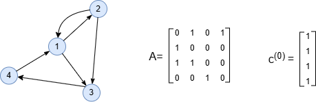
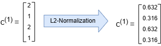
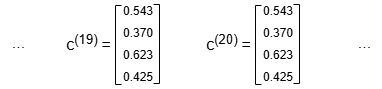
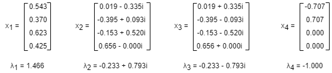
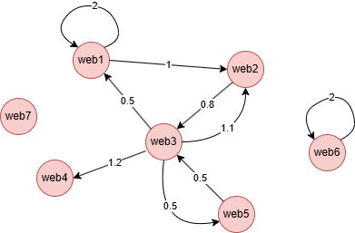

# Eigenvector Centrality

## Overview

Eigenvector centrality quantifies a node's influence within a graph. A node's importance is determined by its neighbors—it is both influenced by them and exerts influence on them. However, not all connections are equal; a node's centrality increases if it is connected to other highly influential nodes.

Eigenvector centrality scores range from 0 to 1; nodes with higher scores are more influential in the network.

## Concepts

### Eigenvector Centrality

The influence of a node is computed in a recursive way. Consider the graph below, and assume that nodes receive influence through incoming edges. In the adjacency matrix `A`, element <code>A<sub>ij</sub></code> reflects the number of incoming edges of node `i`. Initially, each node is randomly assigned a centrality value — all set to 1 as an example —represented by the vector <code>c<sup>(0)</sup></code>.

<center></center>

In each round of influence propagation, a node's centrality is updated as the sum of centralities of all its incoming neighbors. In the first round, this operation is equivalent to multiplying the vector <code>c<sup>(0)</sup></code> by the matrix `A`, i.e., <code>c<sup>(1)</sup> = Ac<sup>(0)</sup></code>. Afterward, the L2-normalization is applied to rescale the vector <code>c<sup>(1)</sup></code>:

<center></center>

After `k` rounds, <code>c<sup>(k)</sup></code> is computed by <code>c<sup>(k)</sup> = Ac<sup>(k-1)</sup></code>. As `k` grows, <code>c<sup>(k)</sup></code> stabilizes. In this example, stabilization is reached after approximately 20 rounds. The elements in <code>c<sup>(k)</sup></code> represent the centrality of the corresponding nodes.

<center></center>

The algorithm continues until the sum of changes of all elements in <code>c<sup>(k)</sup></code> converges to within some tolerance, or the maximum iteration rounds is met.

### Eigenvalue and Eigenvector

Given that `A` is an n x n square matrix, `λ` is a constant, and `x` is a non-zero n x 1 vector. If the equation `Ax = λx` is true, then `λ` is called the <b>eigenvalue</b> of `A`, and `x` is the <b>eigenvector</b> of `A` that corresponds to `λ`.

The above adjacency matrix `A` has four eigenvalues <code>λ<sub>1</sub></code>, <code>λ<sub>2</sub></code>, <code>λ<sub>3</sub></code> and <code>λ<sub>4</sub></code> that correspond to eigenvectors <code>x<sub>1</sub></code>, <code>x<sub>2</sub></code>, <code>x<sub>3</sub></code> and <code>x<sub>4</sub></code>, respectively. <code>x<sub>1</sub></code> is the eigenvector of the eigenvalue <code>λ<sub>1</sub></code> which has the largtest absolute value. <code>λ<sub>1</sub></code> is the **dominant eigenvalue**, and <code>x<sub>1</sub></code> the **dominant eigenvector**.

<center></center>

In fact, as `k` grows, <code>c<sup>(k)</sup></code> always converges to <code>x<sub>1</sub></code>, regardless of how <code>c<sup>(0)</sup></code> is initialized. This phenomenon is explained by the <a target="_blank" href="https://en.wikipedia.org/wiki/Perron%E2%80%93Frobenius_theorem">Perron–Frobenius theorem</a>. Therefore, computing the eigenvector centrality of nodes in a graph is equivalent to finding the dominant eigenvector of the adjacency matrix `A`.

## Considerations

- A self-loop counts as one in-link and one out-link.

## Example Graph

<center></center>

```gql
INSERT (web1:web {_id: "web1"}), (web2:web {_id: "web2"}),
       (web3:web {_id: "web3"}), (web4:web {_id: "web4"}),
       (web5:web {_id: "web5"}), (web6:web {_id: "web6"}),
       (web7:web {_id: "web7"}),
       (web1)-[:link {value: 2}]->(web1), (web1)-[:link {value: 1}]->(web2),
       (web2)-[:link {value: 0.8}]->(web3), (web3)-[:link {value: 0.5}]->(web1),
       (web3)-[:link {value: 1.1}]->(web2), (web3)-[:link {value: 1.2}]->(web4),
       (web3)-[:link {value: 0.5}]->(web5), (web5)-[:link {value: 0.5}]->(web3),
       (web6)-[:link {value: 2}]->(web6)
```

## Parameters

| Name | Type | Default | Description |
| -- | -- | -- | -- |
| `ids` | `LIST` | / | `_id`s of nodes to compute (empty = all nodes). |
| `direction` | `STRING` | `both` | Edge direction: `in`, `out`, or `both`. |
| `maxIterations` | `INT` | `100` | Maximum number of iterations. |
| `tolerance` | `FLOAT` | `0.000001` | Convergence tolerance. The algorithm terminates when score changes between iterations are less than this value. |
| `weight` | `STRING` or `LIST` | / | Numeric edge property for weighted adjacency. |
| `limit` | `INT` | `-1` | Limits the number of results returned (-1 = all). |
| `order` | `STRING` | / | Sorts the results by `score`: `asc` or `desc`. |

## Run Mode

**Returns:**

| Column | Type | Description |
| -- | -- | -- |
| `nodeId` | `STRING` | Node identifier (`_id`) |
| `score` | `FLOAT` | Eigenvector centrality score |
| `rank` | `INT` | Rank position (1 = highest eigenvector centrality) |

Eigenvector centrality for all nodes:

```gql
CALL algo.eigenvector({
  maxIterations: 50,
  tolerance: 0.000001,
  direction: "in",
  order: "desc"
}) YIELD nodeId, score, rank
```

Result:

| nodeId | score | rank |
| -- | -- | -- |
| web1 | 0.5736120501246498 | 1 |
| web2 | 0.5736120501246498 | 2 |
| web3 | 0.4600016017850023 | 3 |
| web5 | 0.25528117660613436 | 4 |
| web4 | 0.25528117660613436 | 5 |
| web6 | 1.7088326722892042e-9 | 6 |
| web7 | 0 | 7 |

## Stream Mode

Returns the same columns as run mode, streamed for memory efficiency.

```gql
CALL algo.eigenvector.stream({
  maxIterations: 300,
  tolerance: 0.000001,
  weight: ["value"],
  direction: "in",
  order: "desc"
}) YIELD nodeId, score
RETURN nodeId, score
```

Result:

| nodeId | score |
| -- | -- |
| web1 | 0.8354748144328726 |
| web2 | 0.4975228759458507 |
| web3 | 0.19890390105629813 |
| web4 | 0.11263830879446735 |
| web5 | 0.046932628664361396 |
| web6 | 0.000016189148967104193 |
| web7 | 0 |

## Stats Mode

**Returns:**

| Column | Type | Description |
| -- | -- | -- |
| `nodeCount` | `INT` | Total number of nodes |
| `minScore` | `FLOAT` | Minimum eigenvector centrality score |
| `maxScore` | `FLOAT` | Maximum eigenvector centrality score |
| `avgScore` | `FLOAT` | Average eigenvector centrality score |

```gql
CALL algo.eigenvector.stats() YIELD nodeCount, minScore, maxScore, avgScore
```

Result:

| nodeCount | minScore | maxScore | avgScore |
| -- | -- | -- | -- |
| 7 | 0 | 0.6195366525240715 | 0.2951366032678612 |

## Write Mode

Computes results and writes them back to node properties. The write configuration is passed as a second argument map.

**Write parameters:**

| Name | Type | Description |
| -- | -- | -- |
| `db.property` | `STRING` or `MAP` | Node property to write results to. String: writes the `score` column in results to a property. Map: explicit column-to-property mapping (e.g., `{score: 'ec_score', rank: 'ec_rank'}`). |

**Writable columns:**

| Column | Type | Description |
| -- | -- | -- |
| `score` | `FLOAT` | Eigenvector centrality score |
| `rank` | `INT` | Rank position |

**Returns:**

| Column | Type | Description |
| -- | -- | -- |
| `task_id` | `STRING` | Task identifier for tracking via `SHOW TASKS` |
| `nodesWritten` | `INT` | Number of nodes with properties written |
| `computeTimeMs` | `INT` | Time spent computing the algorithm (milliseconds) |
| `writeTimeMs` | `INT` | Time spent writing properties to storage (milliseconds) |

```gql
CALL algo.eigenvector.write({}, {
  db: {
    property: "ec_score"
  }
}) YIELD task_id, nodesWritten, computeTimeMs, writeTimeMs
```
