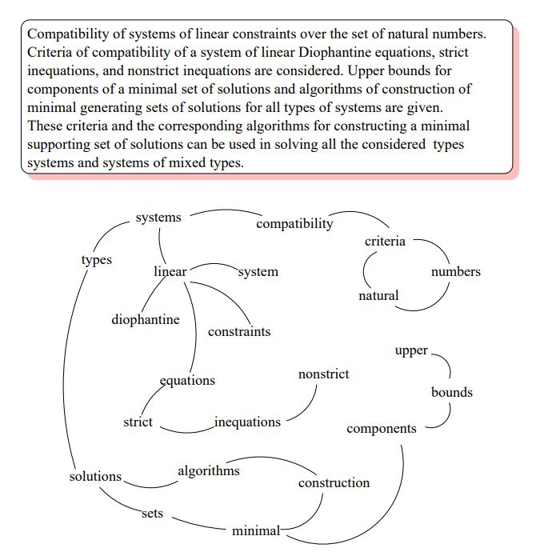
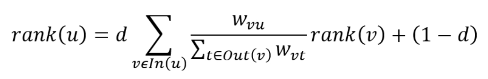
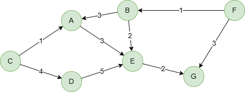

# TextRank

## Overview

TextRank, derived from <a target="_blank" href="/docs/graph-algorithms/pagerank">PageRank</a>, is a graph-based ranking model for text processing. It can be used for various natural language processing tasks, including keyword extraction, keyphrase extraction, and text summarization.

- R. Mihalcea, P. Tarau, <a href="https://web.eecs.umich.edu/~mihalcea/papers/mihalcea.emnlp04.pdf" target="_blank">TextRank: Bringing Order Into Texts</a> (2004)

## Concepts

### Text as a Graph

To apply the TextRank algorithm, the text must first be represented as a graph. The structure of the graph depends on the specific application:

- **Nodes:** Text units that best fit the task, such as words, collocations, or sentences, are added as nodes in the graph.
- **Edges:** Relationships between text units, such as semantic similarity, co-occurrence, or contextual overlap, are used to connect nodes with edges.

<center><br><span style="color:#999;">Sample graph build for keyphrase extraction (Source: Original paper)</span></center>

### TextRank Model

TextRank computes the ranks of all text units recursively using a "recommendation" mechanism, similar to the <a target="_blank" href="/docs/graph-algorithms/pagerank">PageRank</a> algorithm. It incorporates edge weights through a modified formula:

<center></center>

where,
- `Out(v)` is the set of nodes that node `v` points to;
- <code>w<sub>vu</sub></code> is the edge weight between nodes `v` and `u`;
- `d` is the damping factor.

Compared to PageRank:

- **Undirected**: All edges are treated as undirected.
- **Weighted**: Edge weights influence rank propagation.
- **Unnormalized**: The base rank is `(1 - d)` instead of `(1 - d) / n`, so scores do not sum to 1.

## Considerations

- The rank of isolated text units will stay the same as the value of `(1 - d)`.
- A self-loop acts as both a successor and a predecessor, meaning a node can pass some rank to itself. If a network has many self-loops, it will take more iterations to converge.

## Example Graph

<center></center>

```gql
INSERT (A:default {_id: "A"}), (B:default {_id: "B"}),
       (C:default {_id: "C"}), (D:default {_id: "D"}),
       (E:default {_id: "E"}), (F:default {_id: "F"}),
       (G:default {_id: "G"}),
       (A)-[:default {weight: 3}]->(E), (B)-[:default {weight: 3}]->(A),
       (B)-[:default {weight: 2}]->(E), (C)-[:default {weight: 1}]->(A),
       (C)-[:default {weight: 4}]->(D), (D)-[:default {weight: 5}]->(E),
       (E)-[:default {weight: 2}]->(G), (F)-[:default {weight: 1}]->(B),
       (F)-[:default {weight: 3}]->(G)
```

## Parameters

| Name | Type | Default | Description |
| -- | -- | -- | -- |
| `weight` | `STRING` or `LIST` | / | Edge property name(s) to use as weight (empty = unweighted). |
| `damping` | `FLOAT` | `0.85` | Damping factor (0, 1). |
| `maxIterations` | `INT` | `20` | Maximum number of iterations. |
| `tolerance` | `FLOAT` | `0.0001` | Convergence tolerance. The algorithm terminates when score changes between iterations are less than this value. |
| `limit` | `INT` | `-1` | Limits the number of results returned (-1 = all). |
| `order` | `STRING` | / | Sorts the results by `score`: `asc` or `desc`. |

## Run Mode

**Returns:**

| Column | Type | Description |
| -- | -- | -- |
| `nodeId` | `STRING` | Node identifier (`_id`) |
| `score` | `FLOAT` | TextRank score |
| `rank` | `INT` | Rank position (1 = highest TextRank) |

TextRank for all nodes:

```gql
CALL algo.textrank({
  weight: "weight",
  damping: 0.8,
  maxIterations: 50,
  order: "desc"
}) YIELD nodeId, score, rank
```

Result:

| nodeId | score | rank |
| -- | -- | -- |
| E | 1.5865674783906416 | 1 |
| D | 1.2034026715882777 | 2 |
| A | 0.9951082779648479 | 3 |
| B | 0.8979722497449373 | 4 |
| G | 0.8473765204002381 | 5 |
| C | 0.741570712326908 | 6 |
| F | 0.7264444005265889 | 7 |

## Stream Mode

Returns the same columns as run mode, streamed for memory efficiency.

```gql
CALL algo.textrank.stream({
  order: "desc",
  limit: 3
}) YIELD nodeId, score
RETURN nodeId, score
```

Result:

| nodeId | score |
| -- | -- |
| E | 1.4296320035955716 |
| A | 1.0934842307056216 |
| B | 1.0934842307056216 |

## Stats Mode

**Returns:**

| Column | Type | Description |
| -- | -- | -- |
| `nodeCount` | `INT` | Total number of nodes |
| `minScore` | `FLOAT` | Minimum TextRank score |
| `maxScore` | `FLOAT` | Maximum TextRank score |
| `avgScore` | `FLOAT` | Average TextRank score |

```gql
CALL algo.textrank.stats() YIELD nodeCount, minScore, maxScore, avgScore
```

Result:

| nodeCount | minScore | maxScore | avgScore |
| -- | -- | -- | -- |
| 7 | 0.7856051724452637 | 1.4296320035955716 | 0.9667775447847021 |

## Write Mode

Computes results and writes them back to node properties. The write configuration is passed as a second argument map.

**Write parameters:**

| Name | Type | Description |
| -- | -- | -- |
| `db.property` | `STRING` or `MAP` | Node property to write results to. String: writes the `score` column in results to a property. Map: explicit column-to-property mapping (e.g., `{score: 'tr_score', rank: 'tr_rank'}`). |

**Writable columns:**

| Column | Type | Description |
| -- | -- | -- |
| `score` | `FLOAT` | TextRank score |
| `rank` | `INT` | Rank position |

**Returns:**

| Column | Type | Description |
| -- | -- | -- |
| `task_id` | `STRING` | Task identifier for tracking via `SHOW TASKS` |
| `nodesWritten` | `INT` | Number of nodes with properties written |
| `computeTimeMs` | `INT` | Time spent computing the algorithm (milliseconds) |
| `writeTimeMs` | `INT` | Time spent writing properties to storage (milliseconds) |

```gql
CALL algo.textrank.write({damping: 0.85}, {
  db: {
    property: "tr_score"
  }
}) YIELD task_id, nodesWritten, computeTimeMs, writeTimeMs
```
