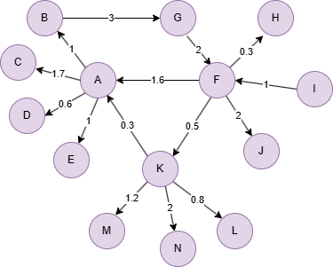

# Modularity Optimization

## Overview

The Modularity Optimization algorithm detects communities by directly maximizing the modularity score using simulated annealing. Starting with each node in its own community, it iteratively moves nodes between communities, accepting moves that improve modularity and occasionally accepting worse moves to escape local optima.

For larger graphs where speed is prioritized, consider using <a href="/docs/graph-algorithms/louvain">Louvain</a> or <a href="/docs/graph-algorithms/leiden">Leiden</a> instead. Modularity Optimization is better suited for smaller graphs where partition quality is critical.

## Concepts

### Modularity

<a href="/docs/graph-algorithms/modularity">Modularity</a> is a measure of community partition quality that compares the density of edges within communities to what would be expected in a random graph.

### Simulated Annealing

The algorithm uses **simulated annealing** to explore the solution space. Each iteration:

1. Pick a random node                                     
2. Pick a random neighbor of that node                        
3. Try moving the node to that neighbor's community  

If the move improves modularity, it is accepted. If not, it may still be accepted with a probability that decreases over time (controlled by the `coolingRate`). This allows the algorithm to escape local optima early in the process while converging to a stable solution.

For example, consider a graph with communities `{A, B, C}` and `{D, E}`. At some iteration, node `C` is randomly selected and considered for moving to `{D, E}`:

- If the move **increases** modularity (e.g., `C` has more connections to `D` and `E` than to `A` and `B`), the move is always accepted.
- If the move **decreases** modularity, the move may still be accepted depending on the current **temperature**. 

The **temperature** starts at 1 and multiplies by `coolingRate` each iteration. If the move decreases modularity, compares a random number (0 to 1) against the temperature and accepts if it is below the temperature. Early in the process (high temperature), the acceptance probability is high, allowing the algorithm to explore broadly. After 100 iterations with `coolingRate` 0.95, the temporature becomes `0.95^100 ≈ 0.006`, so only ~0.6% chance of accepting a bad move.

This balance between exploration and exploitation helps avoid getting stuck in poor local optima — for instance, a partition where one node is misplaced but no single move improves modularity, yet a sequence of moves through a temporarily worse state leads to a better overall partition.

## Considerations

- The algorithm treats all edges as undirected.
- Results may vary between runs due to the randomized simulated annealing process.

## Example Graph

<center></center>

```gql
INSERT (A:default {_id: "A"}), (B:default {_id: "B"}),
       (C:default {_id: "C"}), (D:default {_id: "D"}),
       (E:default {_id: "E"}), (F:default {_id: "F"}),
       (G:default {_id: "G"}), (H:default {_id: "H"}),
       (I:default {_id: "I"}), (J:default {_id: "J"}),
       (K:default {_id: "K"}), (L:default {_id: "L"}),
       (M:default {_id: "M"}), (N:default {_id: "N"}),
       (A)-[:default {weight: 1}]->(B), (A)-[:default {weight: 1.7}]->(C),
       (A)-[:default {weight: 0.6}]->(D), (A)-[:default {weight: 1}]->(E),
       (B)-[:default {weight: 3}]->(G), (F)-[:default {weight: 1.6}]->(A),
       (F)-[:default {weight: 0.3}]->(H), (F)-[:default {weight: 2}]->(J),
       (F)-[:default {weight: 0.5}]->(K), (G)-[:default {weight: 2}]->(F),
       (I)-[:default {weight: 1}]->(F), (K)-[:default {weight: 0.3}]->(A),
       (K)-[:default {weight: 0.8}]->(L), (K)-[:default {weight: 1.2}]->(M),
       (K)-[:default {weight: 2}]->(N)
```

## Parameters

| Name | Type | Default | Description |
| -- | -- | -- | -- |
| `iterations` | `INT` | `100` | Number of simulated annealing iterations. |
| `coolingRate` | `FLOAT` | `0.95` | Cooling rate for simulated annealing (0 < coolingRate < 1). Lower values cool faster. |
| `limit` | `INT` | `-1` | Limits the number of results returned (-1 = all). |
| `order` | `STRING` | / | Sorts the results by `community`: `asc` or `desc`. |

## Run Mode

**Returns:**

| Column | Type | Description |
| -- | -- | -- |
| `nodeId` | `STRING` | Node identifier (`_id`) |
| `community` | `INT` | Community identifier |
| `modularity` | `FLOAT` | Final modularity score |

```gql
CALL algo.modularityopt() YIELD nodeId, community, modularity
```

## Stream Mode

Returns the same columns as run mode, streamed for memory efficiency.

```gql
CALL algo.modularityopt.stream() YIELD nodeId, community
RETURN community, COLLECT(nodeId) AS members
GROUP BY community
```

## Stats Mode

**Returns:**

| Column | Type | Description |
| -- | -- | -- |
| `nodeCount` | `INT` | Total number of nodes |
| `communityCount` | `INT` | Number of communities detected |
| `largestCommunitySize` | `INT` | Size of the largest community |
| `smallestCommunitySize` | `INT` | Size of the smallest community |
| `modularity` | `FLOAT` | Final modularity score |

```gql
CALL algo.modularityopt.stats() YIELD nodeCount, communityCount, largestCommunitySize, smallestCommunitySize, modularity
```

## Write Mode

Computes results and writes them back to node properties. The write configuration is passed as a second argument map.

**Write parameters:**

| Name | Type | Description |
| -- | -- | -- |
| `db.property` | `STRING` or `MAP` | Node property to write results to. String: writes the `community` column in results to a property. Map: explicit column-to-property mapping (e.g., `{community: 'mod_comm'}`). |

**Writable columns:**

| Column | Type | Description |
| -- | -- | -- |
| `community` | `INT` | Community identifier |

**Returns:**

| Column | Type | Description |
| -- | -- | -- |
| `task_id` | `STRING` | Task identifier for tracking via `SHOW TASKS` |
| `nodesWritten` | `INT` | Number of nodes with properties written |
| `computeTimeMs` | `INT` | Time spent computing the algorithm (milliseconds) |
| `writeTimeMs` | `INT` | Time spent writing properties to storage (milliseconds) |

```gql
CALL algo.modularityopt.write({}, {
  db: {
    property: "mod_comm"
  }
}) YIELD task_id, nodesWritten, computeTimeMs, writeTimeMs
```
