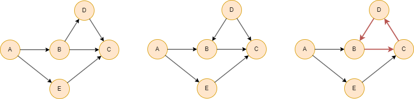
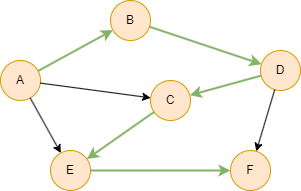

# Topological Sort

## Overview

The Topological Sort algorithm produces an ordering of nodes in a directed acyclic graph (DAG) such that for every edge, the source node appears before the target node. It uses Kahn's algorithm, processing nodes level by level from source nodes (in-degree 0).

Topological sorting is widely used for dependency resolution, task scheduling, and build ordering.

## Concepts

### Directed Acyclic Graph (DAG)

A **directed acyclic graph (DAG)** is a directed graph with no directed cycles. That is, it is not possible to start at any node `v` and follow a directed path to return back to `v`.

As shown here, the first and second graphs are DAGs, while the third graph contains a directed cycle (`B→C→D→B`) and therefore does not qualify as a DAG.

<div align=center></div>

A directed graph is a DAG if and only if it can be topologically sorted.

### Topological Sort

Every DAG has at least one topological sorting. In the above examples, the first graph has 3 possible sortings:

- `A, E, B, D, C`
- `A, B, E, D, C`
- `A, B, D, E, C`

A DAG has a unique topological sorting if and only if it has a directed path containing all the nodes, in which case the sorting is the same as the order in which the nodes appear in the path.

In the following example, the nodes have only 1 possible topological sorting: `A, B, D, C, E, F`.

<div align=center></div>

## Considerations

- The algorithm only works on directed acyclic graphs (DAGs). If the graph contains a cycle, an error is returned.
- Each node is assigned a `level` based on its BFS depth from source nodes (nodes with in-degree 0 are level 0).

## Example Graph

<center></center>

```gql
INSERT (A:default {_id: "A"}), (B:default {_id: "B"}),
       (C:default {_id: "C"}), (D:default {_id: "D"}),
       (E:default {_id: "E"}), (F:default {_id: "F"}),
       (G:default {_id: "G"}), (H:default {_id: "H"}),
       (A)-[:default]->(B), (A)-[:default]->(C),
       (A)-[:default]->(D), (A)-[:default]->(E),
       (E)-[:default]->(G), (F)-[:default]->(D),
       (F)-[:default]->(E), (H)-[:default]->(G)
```

## Parameters

| Name | Type | Default | Description |
| -- | -- | -- | -- |
| `limit` | `INT` | `-1` | Limits the number of results returned (-1 = all). |
| `order` | `STRING` | / | Sorts the results by `order`: `asc` or `desc`. |

## Run Mode

**Returns:**

| Column | Type | Description |
| -- | -- | -- |
| `nodeId` | `STRING` | Node identifier (`_id`) |
| `order` | `INT` | Topological order position (0-based) |
| `level` | `INT` | BFS level in the DAG (0 = source nodes) |

```gql
CALL algo.topologicalsort() YIELD nodeId, order, level
```

Result:

| nodeId | order | level |
| -- | -- | -- |
| F | 0 | 0 |
| A | 1 | 0 |
| H | 2 | 0 |
| E | 3 | 1 |
| D | 4 | 1 |
| C | 5 | 1 |
| B | 6 | 1 |
| G | 7 | 2 |

## Stream Mode

Returns the same columns as run mode, streamed for memory efficiency.

```gql
CALL algo.topologicalsort.stream() YIELD nodeId, order, level
FILTER level = 0
RETURN nodeId
```

Result:

| nodeId |
| -- |
| F |
| A |
| H |

## Stats Mode

**Returns:**

| Column | Type | Description |
| -- | -- | -- |
| `nodeCount` | `INT` | Total number of nodes |
| `maxLevel` | `INT` | Maximum BFS level in the DAG |

```gql
CALL algo.topologicalsort.stats() YIELD nodeCount, maxLevel
```

Result:

| nodeCount | maxLevel |
| -- | -- |
| 8 | 2 |
