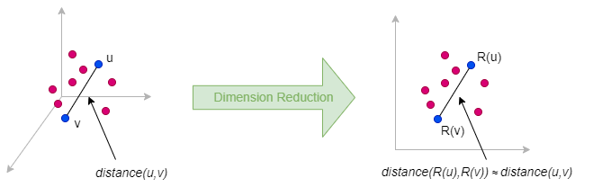
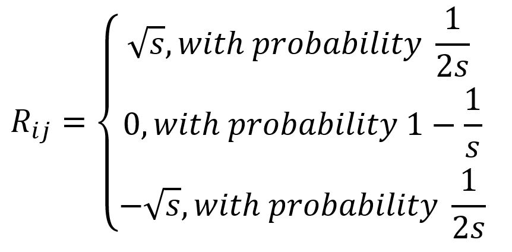

# FastRP

## Overview

FastRP (Fast Random Projection) is a scalable and efficient algorithm for learning node representations in a graph. It computes node embeddings iteratively through two main steps: first, constructing a node similarity matrix; second, reducing dimension using random projection.

FastRP was proposed by H. Chen et al. in 2019:

- H. Chen, S.F. Sultan, Y. Tian, M. Chen, S. Skiena, <a target="_blank" href="https://arxiv.org/pdf/1908.11512.pdf">Fast and Accurate Network Embeddings via Very Sparse
Random Projection</a> (2019)

## Concepts

### Very Sparse Random Projection

**Random projection** is a dimension reduction method that approximately preserves pairwise distances between data points when embedding them from a high-dimensional space to a lower-dimensional space. Its theoretical foundation is primarily based on the <a target="_blank" href="https://en.wikipedia.org/wiki/Johnson%E2%80%93Lindenstrauss_lemma">Johnson-Lindenstrauss Lemma</a>.

<center></center>

The idea behind random projection is very simple: to reduce a matrix <code>M<sub>n×m</sub></code> (`n = m` for graph data) to a lower-dimensional matrix <code>N<sub>n×d</sub></code> where `d ≪ n`, we multiply `M` by a random projection matrix <code>R<sub>m×d</sub></code>, i.e., `N = M ⋅ R`.

The matrix `R` is generated by independently sampling its entries from a random distribution. Specifically, FastRP uses **very sparse random projection** for dimension reduction, where each entry of `R` is sampled from the following distribution:

<center></center>

This implementation uses `s = 3` (a standard choice from Achlioptas, 2003), giving `2/3` zero entries regardless of graph size.

### FastRP Process

This implementation uses a simplified version of FastRP:

1. **Initialize**: Assign each node a random embedding vector of size `dimensions` from the matrix `R`.
2. **Iterations**: In each iteration, update each node's embedding with the degree-normalized sum of its neighbors' embeddings. The weight for each neighbor is `(1/√deg(node)) × (1/√deg(neighbor))`. L2-normalize all embeddings after each iteration.

The final embeddings capture higher-order neighborhood structure. More iterations incorporate information from farther neighbors.

<center></center>

Consider this graph with `dimensions = 3`, and `iterations = 3`.

**Initialize**: Each node gets a random vector from `R`:

| Node | Initial Embedding |
| -- | -- |
| A | [√3, 0, -√3] |
| B | [-√3, √3, 0] |
| C | [0, -√3, √3] |
| D | [√3, √3, 0] |
| E | [-√3, 0, √3] |

**Iteration 1**: Replace each node's embedding with the degree-normalized sum of its neighbors' embeddings.

- **A** (deg 2, neighbors `B`, `C`):
  - `w(B) = 1/√2 × 1/√2 = 0.5`, `w(C) = 1/√2 × 1/√3 = 0.408`
  - New `A = 0.5 × [-√3, √3, 0] + 0.408 × [0, -√3, √3] = [-0.866, 0.159, 0.707]`
- **B** (deg 2, neighbors `A`, `C`):
  - `w(A) = 1/√2 × 1/√2 = 0.5`, `w(C) = 1/√2 × 1/√3 = 0.408`
  - New `B = 0.5 × [√3, 0, -√3] + 0.408 × [0, -√3, √3] = [0.866, -0.707, -0.159]`
- **C** (deg 3, neighbors `A`, `B`, `D`):
  - `w(A) = w(B) = w(D) = 1/√3 × 1/√2 = 0.408`
  - New `C = 0.408 × ([√3, 0, -√3] + [-√3, √3, 0] + [√3, √3, 0]) = 0.408 × [√3, 2√3, -√3] = [0.707, 1.414, -0.707]`
- **D** (deg 2, neighbors `C`, `E`):
  - `w(C) = 1/√2 × 1/√3 = 0.408`, `w(E) = 1/√2 × 1/√1 = 0.707`
  - New `D = 0.408 × [0, -√3, √3] + 0.707 × [-√3, 0, √3] = [-1.225, -0.707, 1.932]`
- **E** (deg 1, neighbor `D`):
  - `w(D) = 1/√1 × 1/√2 = 0.707`
  - New `E = 0.707 × [√3, √3, 0] = [1.225, 1.225, 0]`

L2-normalize each embedding:

| Node | After Aggregation | After L2 Normalization |
| -- | -- | -- |
| A | [-0.866, 0.159, 0.707] | [-0.767, 0.141, 0.626] |
| B | [0.866, -0.707, -0.159] | [0.767, -0.626, -0.141] |
| C | [0.707, 1.414, -0.707] | [0.408, 0.817, -0.408] |
| D | [-1.225, -0.707, 1.932] | [-0.512, -0.295, 0.807] |
| E | [1.225, 1.225, 0] | [0.707, 0.707, 0] |

**Iteration 2**: Aggregate using iteration 1's normalized embeddings, then L2-normalize.

| Node | After Aggregation | After L2 Normalization |
| -- | -- | -- |
| A | [0.550, 0.020, -0.237] | [0.918, 0.033, -0.396] |
| B | [-0.218, 0.404, 0.147] | [-0.452, 0.838, 0.305] |
| C | [-0.209, -0.318, 0.527] | [-0.322, -0.489, 0.811] |
| D | [0.666, 0.833, -0.166] | [0.617, 0.772, -0.154] |
| E | [-0.362, -0.209, 0.571] | [-0.511, -0.295, 0.807] |

**Iteration 3**: Aggregate using iteration 2's normalized embeddings, then L2-normalize.

| Node | After Aggregation | After L2 Normalization |
| -- | -- | -- |
| A | [-0.357, 0.219, 0.484] | [-0.558, 0.342, 0.756] |
| B | [0.328, -0.183, 0.133] | [0.822, -0.459, 0.333] |
| C | [0.442, 0.670, -0.100] | [0.546, 0.828, -0.124] |
| D | [-0.492, -0.409, 0.902] | [-0.445, -0.370, 0.816] |
| E | [0.436, 0.546, -0.109] | [0.617, 0.772, -0.154] |

The final embeddings after 3 iterations capture higher-order neighborhood structure. For example, `D` and `E` (connected by a direct edge at the graph's periphery) have similar embeddings, while `C` (the hub connecting the triangle to the tail) has a distinct representation.

## Considerations

- The FastRP algorithm treats all edges as undirected, ignoring their original direction.

## Example Graph

<center></center>

```gql
INSERT (A:default {_id: "A"}), (B:default {_id: "B"}),
       (C:default {_id: "C"}), (D:default {_id: "D"}),
       (E:default {_id: "E"}), (F:default {_id: "F"}),
       (G:default {_id: "G"}), (H:default {_id: "H"}),
       (I:default {_id: "I"}), (J:default {_id: "J"}),
       (A)-[:default]->(B), (A)-[:default]->(C),
       (C)-[:default]->(D), (D)-[:default]->(F),
       (E)-[:default]->(C), (E)-[:default]->(F),
       (F)-[:default]->(G), (G)-[:default]->(J),
       (H)-[:default]->(G), (H)-[:default]->(I)
```

## Parameters

| Name | Type | Default | Description |
| -- | -- | -- | -- |
| `dimensions` | `INT` | `128` | Embedding dimensionality. |
| `iterations` | `INT` | `3` | Number of neighborhood aggregation iterations. |

## Run Mode

**Returns:**

| Column | Type | Description |
| -- | -- | -- |
| `nodeId` | `STRING` | Node identifier (`_id`) |
| `embedding` | `LIST` | Embedding vector as list of floats |

```gql
CALL algo.fastrp({
  dimensions: 4,
  iterations: 3
}) YIELD nodeId, embedding
```

Result:

| nodeId | embedding |
| -- | -- |
| E | [-0.12305584238216578, -0.9849289931977, 0, 0.1215406846047056] |
| D | [-0.12305584238216578, -0.9849289931977, 0, 0.1215406846047056] |
| G | [0.19944689569581864, -0.6307138719181029, 0, 0.7499472965264802] |
| F | [0.33127632268542906, 0.8402566887979876, 0.4220239661881277, -0.07823341307333669] |
| A | [0.6233740178591791, -0.7819238031023892, 0, 0] |
| C | [0.37617303576428474, 0.40282571625744723, 0.8344011562105825, 0] |
| B | [0.18257418583505539, -0.3651483716701107, 0.9128709291752769, 0] |
| I | [0.16562448094810187, -0.22624724846371902, 0, 0.9598857816809603] |
| H | [0.039463326335005856, 0.6482021517653542, -0.5176220095931053, -0.5570853359281113] |
| J | [0.0978369619009961, 0.9523606161276394, -0.14938828920367186, -0.24722525110466798] |

## Stream Mode

Returns the same columns as run mode, streamed for memory efficiency.

```gql
CALL algo.fastrp.stream({
  dimensions: 4,
  iterations: 5
}) YIELD nodeId, embedding
RETURN nodeId, embedding
```

Result:

| nodeId | embedding |
| -- | -- |
| E | [0.05238941834261638, -0.976612633080473, 0, 0.2085260505388901] |
| D | [0.05238941834261638, -0.976612633080473, 0, 0.2085260505388901] |
| G | [0.14336228340880974, -0.6690631576935938, 0, 0.7292473837545729] |
| F | [0.3386046522415813, 0.802008181222618, 0.4722741460937271, -0.138155338889913] |
| A | [0.46037110185570496, -0.8871117229991454, 0, 0.03303391429503269] |
| C | [0.36661402390927234, 0.4375674709423969, 0.8205196705825633, -0.02960297338457617] |
| B | [0.2744041947368475, -0.09100420525735527, 0.9572985806613835, 0] |
| I | [0.18248026388033173, -0.3837038891535745, 0, 0.9052470815984914] |
| H | [0.0842161106069158, 0.7741056956969005, -0.3896263793987979, -0.49179193067845817] |
| J | [0.1539592446239621, 0.9207471581791898, -0.13197903833051786, -0.33332079914268237] |

## Stats Mode

**Returns:**

| Column | Type | Description |
| -- | -- | -- |
| `nodeCount` | `INT` | Total number of nodes processed |
| `dimensions` | `INT` | Embedding dimensionality |

```gql
CALL algo.fastrp.stats({
  dimensions: 4
}) YIELD nodeCount, dimensions
```

Result:

| nodeCount | dimensions |
| -- | -- |
| 10 | 4 |

## Write Mode

Computes results and writes them back to node properties. The write configuration is passed as a second argument map.

**Write parameters:**

| Name | Type | Description |
| -- | -- | -- |
| `db.property` | `STRING` or `MAP` | Node property to write results to. |

**Writable columns:**

| Column | Type | Description |
| -- | -- | -- |
| `embedding` | `LIST` | Embedding vector |

**Returns:**

| Column | Type | Description |
| -- | -- | -- |
| `task_id` | `STRING` | Task identifier for tracking via `SHOW TASKS` |
| `nodesWritten` | `INT` | Number of nodes with properties written |
| `computeTimeMs` | `INT` | Time spent computing the algorithm (milliseconds) |
| `writeTimeMs` | `INT` | Time spent writing properties to storage (milliseconds) |

```gql
CALL algo.fastrp.write({dimensions: 4}, {
  db: {
    property: "embedding"
  }
}) YIELD task_id, nodesWritten, computeTimeMs, writeTimeMs
```
