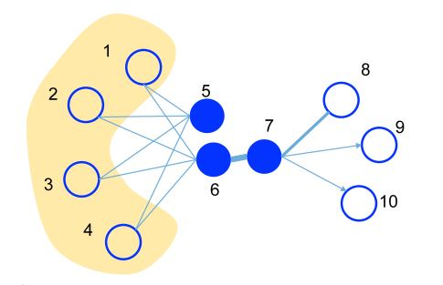
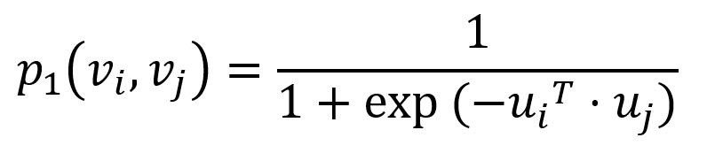
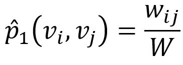
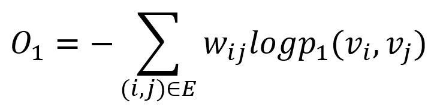
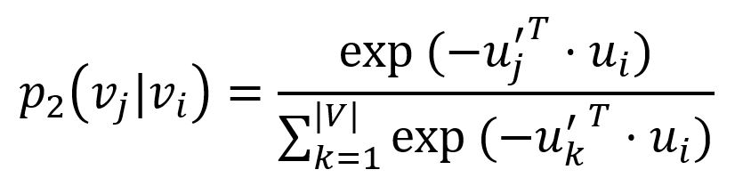
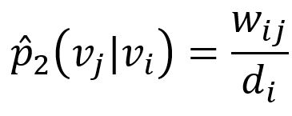
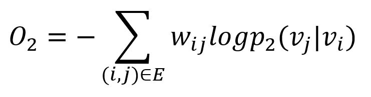
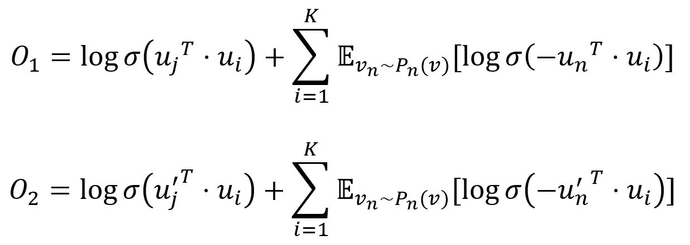
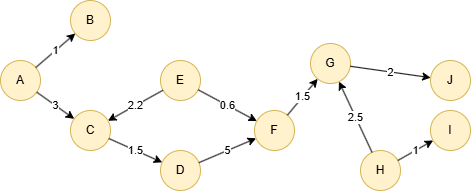

# LINE

## Overview

LINE (Large-scale Information Network Embedding) is a network embedding model that preserves the local or global network structures. LINE is able to scale to very large, arbitrary types of networks, it was originally proposed in 2015:

- J. Tang, M. Qu, M. Wang, M. Zhang, J. Yan, Q. Zhu, <a target="_blank" href="https://www.microsoft.com/en-us/research/wp-content/uploads/2016/02/frp0228-Tang.pdf">LINE: Large-scale Information Network Embedding</a> (2015)

## Concepts

### First-order Proximity and Second-order Proximity

<b>First-order proximity</b> in a network shows the local proximity between two nodes, and it is contingent upon connectivity. A link between two nodes—or a stronger (positive) link weight—indicates higher first-order proximity. If no link exists between them, their first-order proximity is considered 0.

On the other hand, <b>second-order proximity</b> measures the similarity between the neighborhood structures of two nodes, based on shared neighbors. If two nodes have no common neighbors, their second-order proximity is 0.

<center></center>

In this graph, the edge thickness signifies its weight:

- A substantial weight on the edge between nodes 6 and 7 indicates a strong <b>first-order</b> proximity, meaning they should have similar representations in the embedding space. 
- Although nodes 5 and 6 are not directly connected, their considerable common neighbors create a significant <b>second-order</b> proximity. As a result, they are also expected to be represented close to each other in the embedding space.

### LINE Model

The LINE model is designed to embed nodes in graph `G = (V,E)` into low-dimensional vectors, while preserving either the first-order or second-order proximity between nodes.

#### First-order Proximity

To capture the first-order proximity, LINE defines the joint probability for each edge `(i,j) ∈ E` connecting nodes <code>v<sub>i</sub></code> and <code>v<sub>j</sub></code> as:

<center></center>

where <code>u<sub>i</sub></code> is the vector representation of node <code>v<sub>i</sub></code>. <code>p<sub>1</sub></code> ranges from 0 to 1: the closer the vectors (i.e., the higher their dot product), the higher the joint probability.

Empirically, the joint probability between node <code>v<sub>i</sub></code> and <code>v<sub>j</sub></code> is defined as:

<center></center>

where <code>w<sub>ij</sub></code> denotes the edge weight between two nodes, `W` is the sum of all edge weights in the graph.

The <a href="https://en.wikipedia.org/wiki/Kullback%E2%80%93Leibler_divergence" target="_blank">KL-divergence</a> is adopted to measure the difference between <code>p<sub>1</sub></code> (model's prediction) and <code>p̂<sub>1</sub></code> (ground truth):

<center></center>

This serves as the objective function that needs to be minimized during training when preserving the first-order proximity.

#### Second-order Proximity

To model the second-order proximity, LINE defines two roles for each node: one as the node itself, another as "context" for other nodes. For each edge `(i,j) ∈ E`, LINE defines the probability of "context" <code>v<sub>j</sub></code> be observed by node <code>v<sub>i</sub></code> as:

<center></center>

where <code>u'<sub>j</sub></code> is the representation of node <code>v<sub>j</sub></code> when it is regarded as the "context". Importantly, the denominator involves the whole "context" in the graph. 

The corresponding empirical probability is defined as:

<center></center>

where <code>w<sub>ij</sub></code> is weight of edge `(i,j)`, <code>d<sub>i</sub></code> is the weighted degree of node <code>v<sub>i</sub></code>.

Similarly, the <a href="https://en.wikipedia.org/wiki/Kullback%E2%80%93Leibler_divergence" target="_blank">KL-divergence</a> is adopted to measure the difference between <code>p<sub>2</sub></code> (model's prediction) and <code>p̂<sub>2</sub></code> (ground truth):

<center></center>

This serves as the objective function that needs to be minimized during training when preserving the second-order proximity.

### Model Optimization

#### Negative Sampling

To improve computation efficiency, LINE uses <a target="_blank" href="/docs/graph-algorithms/skip-gram-optimization#Negative-Sampling">negative sampling</a>, drawing multiple negative edges from a noise distribution for each edge `(i,j)`. The two objective functions are adjusted as:

<center></center>

where `σ` is the <a target="_blank" href="/docs/graph-algorithms/backpropagation#Activation-Function">sigmoid function</a>, `K` is the number of negative edges drawn from the noise distribution <code>P<sub>n</sub>(v) ∝ d<sub>v</sub><sup>3/4</sup></code>, <code>d<sub>v</sub></code> is the weighted degree of node `v`.

#### Edge-Sampling

Since edge weights are included in both objective functions, they are also applied to the gradients during optimization. This can cause gradient explosion and degrade model performance. To address this, LINE samples edges with probabilities proportional to their weights and treats the sampled edges as binary during model updates.

## Considerations

- The LINE algorithm treats all edges as undirected, ignoring their original direction.

## Example Graph

<center></center>

```gql
INSERT (A:default {_id: "A"}), (B:default {_id: "B"}),
       (C:default {_id: "C"}), (D:default {_id: "D"}),
       (E:default {_id: "E"}), (F:default {_id: "F"}),
       (G:default {_id: "G"}), (H:default {_id: "H"}),
       (I:default {_id: "I"}), (J:default {_id: "J"}),
       (K:default {_id: "K"}),
       (A)-[:default]->(B), (A)-[:default]->(C),
       (C)-[:default]->(D), (D)-[:default]->(C),
       (D)-[:default]->(F), (E)-[:default]->(C),
       (E)-[:default]->(F), (F)-[:default]->(G),
       (G)-[:default]->(J), (H)-[:default]->(G),
       (H)-[:default]->(I), (I)-[:default]->(I),
       (J)-[:default]->(G)
```

## Parameters

| Name | Type | Default | Description |
| -- | -- | -- | -- |
| `dimensions` | `INT` | `128` | Embedding dimensionality. |
| `order` | `INT` | `2` | Proximity order: `1` for first-order, `2` for second-order, `3` for both (concatenated). |
| `negSamples` | `INT` | `5` | Number of negative samples per edge. |
| `iterations` | `INT` | `5` | Number of SGD training iterations. |
| `learningRate` | `FLOAT` | `0.025` | Initial learning rate for SGD. |

## Run Mode

**Returns:**

| Column | Type | Description |
| -- | -- | -- |
| `nodeId` | `STRING` | Node identifier (`_id`) |
| `embedding` | `LIST` | Embedding vector as list of floats |

```gql
CALL algo.line({
  dimensions: 4,
  order: 1,
  iterations: 10
}) YIELD nodeId, embedding
```

## Stream Mode

Returns the same columns as run mode, streamed for memory efficiency.

```gql
CALL algo.line.stream({
  dimensions: 4,
  order: 2
}) YIELD nodeId, embedding
RETURN nodeId, embedding
```

## Stats Mode

**Returns:**

| Column | Type | Description |
| -- | -- | -- |
| `nodeCount` | `INT` | Total number of nodes processed |
| `dimensions` | `INT` | Embedding dimensionality |

```gql
CALL algo.line.stats({
  dimensions: 4
}) YIELD nodeCount, dimensions
```

## Write Mode

Computes results and writes them back to node properties. The write configuration is passed as a second argument map.

**Write parameters:**

| Name | Type | Description |
| -- | -- | -- |
| `db.property` | `STRING` or `MAP` | Node property to write results to. |

**Writable columns:**

| Column | Type | Description |
| -- | -- | -- |
| `embedding` | `LIST` | Embedding vector |

**Returns:**

| Column | Type | Description |
| -- | -- | -- |
| `task_id` | `STRING` | Task identifier for tracking via `SHOW TASKS` |
| `nodesWritten` | `INT` | Number of nodes with properties written |
| `computeTimeMs` | `INT` | Time spent computing the algorithm (milliseconds) |
| `writeTimeMs` | `INT` | Time spent writing properties to storage (milliseconds) |

```gql
CALL algo.line.write({dimensions: 4, order: 1}, {
  db: {
    property: "embedding"
  }
}) YIELD task_id, nodesWritten, computeTimeMs, writeTimeMs
```
