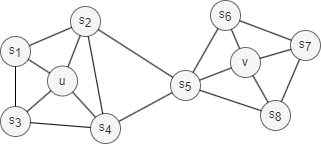
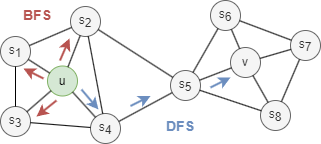
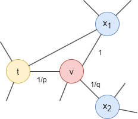

# Node2Vec

## Overview

Node2Vec is a semi-supervised algorithm designed for feature learning of nodes in graphs, while efficiently preserving their neighborhood structure. It introduces a flexible search strategy that enables exploration of node neighborhoods using both BFS and DFS approaches. Additionally, it extends the <a target="_blank" href="/docs/graph-algorithms/skip-gram">Skip-gram</a> model to graphs for training node embeddings. Node2Vec was proposed by A. Grover and J. Leskovec at Stanford University in 2016.

- A. Grover, J. Leskovec, <a target="_blank" href="https://arxiv.org/pdf/1607.00653.pdf">node2vec: Scalable Feature Learning for Networks</a> (2016)

## Concepts

### Node Similarity

Node2Vec learns a mapping of nodes into a low-dimensional vector space, aiming to ensure that similar nodes in the network exhibit close embeddings in the vector space. 

Nodes in a network often alternate between two types of similarities:

<center></center>

<b>1. Homophily</b>

Homophily in networks refers to the tendency of nodes with similar properties, characteristics, or behaviors to be more likely connected or grouped into the same or similar communities (nodes `u` and <code>s<sub>1</sub></code> in the graph above belong to the same community).

For example, in social networks, people with similar backgrounds, interests, or opinions are more likely to form connections.

<b>2. Structural Equivalence</b>

Structural equivalence in networks refers to the concept that nodes are considered equivalent if they occupy similar **structural roles**. This means they share similar patterns of connections to other nodes, also known as similar local topology, regardless of their individual attributes. For example, nodes `u` and `v` in the graph above act as hubs within their respective communities, which indicates structural equivalence.

In social networks, structurally equivalent individuals may hold similar roles or positions within their groups, even if they are not directly connected.

Unlike homophily, structural equivalence does not require nodes to be adjacent or close in the network. Nodes can be far apart and still perform the same structural function.

There are two key points to keep in mind when discussing structural equivalence. First, perfect structural equivalence is uncommon in real-world networks, so the focus is often on measuring <i>structural similarity</i>. Second, as the neighborhood range being analyzed increases, the degree of structural similarity between two nodes tends to decrease.

### Search Strategies

<center></center>

Generally, there are two extreme search strategies for generating a neighborhood set <code>N<sub>S</sub></code> of `k` nodes:

- <b>Breadth-first Search (BFS):</b> <code>N<sub>S</sub></code> is restricted to nodes which are immediate neighbors of the start node. E.g., <code>N<sub>S</sub>(u) = s<sub>1</sub>, s<sub>2</sub>, s<sub>3</sub></code> of size `k = 3` in the graph above.
- <b>Depth-first Search (DFS):</b> <code>N<sub>S</sub></code> consists of nodes sequentially searched at increasing distances from the start node. E.g., <code>N<sub>S</sub>(u) = s<sub>4</sub>, s<sub>5</sub>, v</code> of size `k = 3` in the graph above.

BFS and DFS strategies play a key role in generating node embeddings that capture either homophily or structural equivalence:

- BFS samples nodes that are close to the starting node, resulting in embeddings that emphasize structural equivalence. This approach provides a detailed, microscopic view of the local neighborhood, which is often sufficient to characterize the local topology.
- DFS explores nodes farther from the starting node, producing embeddings that emphasize homophily. This broader, macro-level view of the neighborhood is useful for capturing community-level patterns and relationships based on shared properties or affiliations.

### Node2Vec Framework

#### 1. Node2Vec Walk

Node2Vec employs a biased random walk with the <b>return parameter</b> `p` and <b>in-out parameter</b> `q` to guide the walk.

<center></center>

Consider a random walk that has just traversed edge `(t,v)` and arrived at node `v`. The next step is determined by the transition probabilities on edges `(v,x)` originating from `v`, which are proportional to the edge weights (which are 1 in unweighted graphs). The weights of edges `(v,x)` are adjusted using parameters `p` and `q` based on the shortest distance <code>d<sub>tx</sub></code> between nodes `t` and `x`:

- If <code>d<sub>tx</sub> = 0</code>, the edge weight is scaled by `1/p`. In the provided graph, <code>d<sub>tt</sub> = 0</code>. Parameter `p` influences the inclination to revisit the node just left. When `p < 1`, backtracking a step becomes more probable; when `p > 1`, otherwise.
- If <code>d<sub>tx</sub> = 1</code>, the edge weight remains unaltered. In the provided graph, <code>d<sub>tx<sub>1</sub></sub> = 1</code>.
- If <code>d<sub>tx</sub> = 2</code>, the edge weight is scaled by `1/q`. In the provided graph, <code>d<sub>tx<sub>2</sub></sub> = 2</code>. Parameter `q` determines whether the walk moves inward (`q > 1`) or outward (`q < 1`).

Note that <code>d<sub>tx</sub></code> must be one of `{0, 1, 2}`.

Through the two parameters, Node2Vec enables control over the trade-off between exploration and exploitation during random walk generation. This flexibility allows the algorithm to learn node representations that span a spectrum—from homophily to structural equivalence.

#### 2. Node Embeddings

The node sequences generated from random walks are converted into embeddings through two steps:

**Step 1: Co-occurrence matrix.** For each node, count how often other nodes appear nearby within a sliding `window` across all walks. Closer nodes within the window are weighted more heavily (`weight = 1/distance`). This produces a high-dimensional co-occurrence vector per node — essentially a fingerprint of each node's neighborhood context.

For example, given walk `[A, B, C, D, E, F, G, H, I]` with `window = 2` (2 nodes on each side, up to 4 context nodes per position), node `D` co-occurs with `B`, `C`, `E`, and `F`:

<center></center>

| | A | B | C | D | E | F | G | H | I |
| -- | -- | -- | -- | -- | -- | -- | -- | -- | -- |
| distance | 3 | 2 | 1 | 0 | 1 | 2 | 3 | 4 | 5 |
| weight | 0 | 0.5 | 1 | 0 | 1 | 0.5 | 0 | 0 | 0 |

So the co-occurrence vector of node `D` is `[0, 0.5, 1, 0, 1, 0.5, 0, 0, 0]`.

The full co-occurrence matrix from this walk:

<center></center>

Each row is a node's co-occurrence vector. In practice, all walks contribute to **one** shared co-occurrence matrix. Values accumulate across walks, so nodes that frequently appear near each other build up higher co-occurrence weights, leading to similar embeddings after projection.

**Step 2: Random projection.** The co-occurrence vectors have one dimension per node — too high-dimensional for practical use. To compress them to the desired `dimensions`, a random projection matrix is generated with entries randomly chosen from {-1, 0, +1}. Each co-occurrence vector is multiplied by this matrix to produce a compact embedding.

For example, to project the 9-dimensional co-occurrence vectors to `dimensions = 3`, generate a 9×3 random matrix:

<center></center>

Node D's co-occurrence vector `[0, 0.5, 1, 0, 1, 0.5, 0, 0, 0]` is multiplied by this matrix:

- dim 1 = 0×0 + 0.5×1 + 1×0 + 0×0 + 1×(-1) + 0.5×0 + 0 + 0 + 0 = -0.5
- dim 2 = 0×0 + 0.5×0 + 1×(-1) + 0×0 + 1×0 + 0.5×1 + 0 + 0 + 0 = -0.5
- dim 3 = 0×(-1) + 0.5×0 + 1×0 + 0×1 + 1×0 + 0.5×0 + 0 + 0 + 0 = 0

After L2 normalization: `[-0.707, -0.707, 0]`. This is node D's final 3-dimensional embedding.

The key property of random projection is that nodes with similar co-occurrence vectors (i.e., similar neighborhood contexts) will produce similar embeddings, even after compression.

## Considerations

- The Node2Vec algorithm treats all edges as undirected, ignoring their original direction.

## Example Graph

<center></center>

```gql
INSERT (A:default {_id: "A"}), (B:default {_id: "B"}),
       (C:default {_id: "C"}), (D:default {_id: "D"}),
       (E:default {_id: "E"}), (F:default {_id: "F"}),
       (G:default {_id: "G"}), (H:default {_id: "H"}),
       (I:default {_id: "I"}), (J:default {_id: "J"}),
       (K:default {_id: "K"}),
       (A)-[:default]->(B), (A)-[:default]->(C),
       (C)-[:default]->(D), (D)-[:default]->(C),
       (D)-[:default]->(F), (E)-[:default]->(C),
       (E)-[:default]->(F), (F)-[:default]->(G),
       (G)-[:default]->(J), (H)-[:default]->(G),
       (H)-[:default]->(I), (I)-[:default]->(I),
       (J)-[:default]->(G)
```

## Parameters

| Name | Type | Default | Description |
| -- | -- | -- | -- |
| `dimensions` | `INT` | `128` | Embedding dimensionality. |
| `walkLength` | `INT` | `80` | Length of each random walk. |
| `walksPerNode` | `INT` | `10` | Number of walks per node. |
| `p` | `FLOAT` | `1.0` | Return parameter. Lower values increase the probability of backtracking. |
| `q` | `FLOAT` | `1.0` | In-out parameter. Lower values favor DFS-like exploration; higher values favor BFS-like. |
| `window` | `INT` | `10` | Context window size for co-occurrence. |

## Run Mode

**Returns:**

| Column | Type | Description |
| -- | -- | -- |
| `nodeId` | `STRING` | Node identifier (`_id`) |
| `embedding` | `LIST` | Embedding vector as list of floats |

```gql
CALL algo.node2vec({
  dimensions: 4,
  walkLength: 10,
  walksPerNode: 20,
  p: 0.5,
  q: 2
}) YIELD nodeId, embedding
```

Result:

| nodeId | embedding |
| -- | -- |
| A | [-0.48372056089628945, -0.6357324606841996, 0.6013889542051531, -0.013783437837631458] |
| B | [-0.36045214776195084, -0.5508237648029576, 0.7502306597036826, 0.06181736441057505] |
| C | [-0.5538753052919664, -0.6821447165292697, 0.45370522268339186, 0.14850017780712396] |
| D | [-0.6414486928559872, -0.7030288081005561, 0.2810340693564049, 0.12374942939277028] |
| E | [-0.5480502155526631, -0.772257339050635, 0.2980141868209736, 0.12019612293475156] |
| F | [-0.5669570133358625, -0.8140811312403149, -0.0008999841708854426, 0.12582069311627614] |
| G | [0.021758173749748144, -0.5989373088641934, -0.7976716364495499, 0.06723572212366416] |
| H | [0.47538118068512353, 0.06937769065245865, -0.8044620435678411, 0.3493426534919584] |
| I | [0.6049120279336361, 0.2978777035695885, -0.6173718802911496, 0.4052187971986179] |
| J | [0.38031405262713963, -0.3056477014073686, -0.7898261395043742, -0.3716387672920172] |
| K | [0, 0, 0, 0] |

## Stream Mode

Returns the same columns as run mode, streamed for memory efficiency.

```gql
CALL algo.node2vec.stream({
  dimensions: 3,
  window: 5
}) YIELD nodeId, embedding
RETURN nodeId, embedding
```

Result:

| nodeId | embedding |
| -- | -- |
| A | [0.4825932024334693, -0.8490054911754442, -0.21515918971531584] |
| B | [0.4355279537421462, -0.7878012458852536, -0.4355279537421462] |
| C | [0.2965955700771393, -0.9547792277652305, 0.020680764943460873] |
| D | [0.2474203497172428, -0.9481648876433595, 0.19941543667944278] |
| E | [0.24956007085155454, -0.948662662763526, 0.19431655440281903] |
| F | [0.15546150228125452, -0.9351185438351336, 0.3184101604599244] |
| G | [0.10655139535419882, -0.8423367131649943, 0.5283139803208574] |
| H | [0, -0.8154124973688095, 0.5788803495842308] |
| I | [0, -0.7354413318202832, 0.6775884056345771] |
| J | [0, -0.8237918982526997, 0.5668923252022502] |
| K | [0, 0, 0] |

## Stats Mode

**Returns:**

| Column | Type | Description |
| -- | -- | -- |
| `nodeCount` | `INT` | Total number of nodes processed |
| `dimensions` | `INT` | Embedding dimensionality |

```gql
CALL algo.node2vec.stats({
  dimensions: 3,
  window: 5
}) YIELD nodeCount, dimensions
```

Result:

| nodeCount | dimensions |
| -- | -- |
| 11 | 3 |

## Write Mode

Computes results and writes them back to node properties. The write configuration is passed as a second argument map.

**Write parameters:**

| Name | Type | Description |
| -- | -- | -- |
| `db.property` | `STRING` or `MAP` | Node property to write results to. String: writes the `embedding` column to a property. Map: explicit column-to-property mapping. |

**Writable columns:**

| Column | Type | Description |
| -- | -- | -- |
| `embedding` | `LIST` | Embedding vector |

**Returns:**

| Column | Type | Description |
| -- | -- | -- |
| `task_id` | `STRING` | Task identifier for tracking via `SHOW TASKS` |
| `nodesWritten` | `INT` | Number of nodes with properties written |
| `computeTimeMs` | `INT` | Time spent computing the algorithm (milliseconds) |
| `writeTimeMs` | `INT` | Time spent writing properties to storage (milliseconds) |

```gql
CALL algo.node2vec.write({dimensions: 4}, {
  db: {
    property: "embedding"
  }
}) YIELD task_id, nodesWritten, computeTimeMs, writeTimeMs
```
