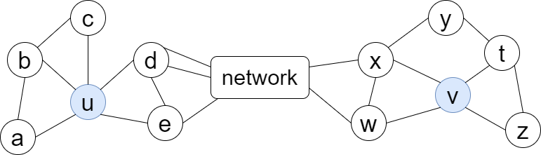
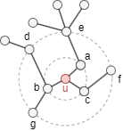
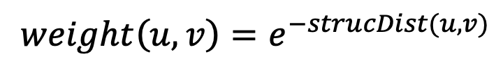

# Struc2Vec 

## Overview

Struc2Vec, short for "structure to vector", is an algorithm that generates node embeddings while preserving the graph's structural properties. It focuses on capturing topological similarities between nodes, enabling structurally similar nodes to have similar vector representations. 

- L. Ribeiro, P. Saverese, D. Figueiredo, <a target="_blank" href="https://arxiv.org/pdf/1704.03165v3.pdf">struc2vec: Learning Node Representations from Structural Identity</a> (2017)

While <a target="_blank" href="/docs/graph-algorithms/node2vec">Node2Vec</a> captures a certain degree of structural similarity among nodes, it is limited by the depth of random walks used during the generation process.Struc2Vec, on the other hand, overcomes this limitation by explicitly preserving structural roles, ensuring that nodes with similar topological characteristics are positioned closely in the embedding space.

The choice between Node2Vec and Struc2Vec depends on the nature of downstream tasks:

- Node2Vec is better suited for tasks that emphasize node homophily, capturing similarity in attributes and connections.
- Struc2Vec is ideal for tasks that focus on local topology similarity, preserving the structural relationships among nodes.

## Concepts

### Structural Similarity

In various networks, nodes often exhibit distinct <b>structural identities</b> that reflect their specific functions or roles. Nodes that perform similar functions naturally belong to the same class, signifying a high degree of structural similarity. For instance, in a company's social network, all interns might exhibit similar structural roles.

<b>Structural similarity</b> implies that the neighborhood topologies of such nodes are homogenous or symmetrical. In other words, nodes with similar functions tend to have analogous patterns of connections and relationships with their neighbors.

<center></center>

As illustrated here, nodes `u` and `v` are structurally similar—they have degrees of 5 and 4, are connected to 3 and 2 triangles respectively, and each connects to the rest of the network through 2 nodes. Despite not sharing a direct link or common neighbor, and possibly being far apart in the graph, they still exhibit similar structural roles.

However, when the distance between such nodes exceeds the walk depth, methods like Node2Vec struggle to generate similar representations for them. This limitation is effectively addressed by the Struc2Vec algorithm.

### Struc2Vec Framework

#### 1. Measure structural similarity

Intuitively, two nodes with the same degrees are considered structurally similar. If their neighbors also share the same degrees, the structural similarity becomes even stronger.

For each node, the algorithm uses BFS to collect the **degree sequence** at each hop level (up to `layers` hops). These degree sequences are converted into **histogram feature vectors** — counting how many neighbors at each hop level have each degree.

<center></center>

For example, with `layers=2`, node `u` in the graph above has:

- 1-hop neighbors `{a, b, c}` with degrees `[2, 2, 3]`
- 2-hop neighbors `{d, e, f, g}` with degrees `[1, 1, 2, 4]`

The histogram counts nodes at each (hop, degree) combination:

| | degree = 1 | degree = 2 | degree = 3 | degree = 4 |
| -- | -- | -- | -- | -- |
| **1-hop** | 0 | 2 | 1 | 0 |
| **2-hop** | 2 | 1 | 0 | 1 |

This is flattened into a feature vector: `[0, 2, 1, 0, 2, 1, 0, 1]`.

The **structural distance** between two nodes is the **L1 distance** between their feature vectors — the sum of absolute differences at each position. If node `v` has a similar neighborhood structure (similar degrees at each hop level), its feature vector will be close to `v`'s, resulting in a small structural distance.

#### 2. Compute structural similarity weights

For each pair of neighboring nodes in the original graph, the algorithm computes:

<center></center>

Nodes with smaller structural distance (more similar topology) get higher edge weights. These weights guide the random walks toward structurally similar neighbors.

#### 3. Generate context for nodes

The algorithm performs weighted random walks on the original graph, where the transition probability to each neighbor is proportional to its structural similarity weight. The walker prefers to visit structurally similar nodes.

The random walks have a fixed depth and are repeated a fixed number of times per node.

#### 4. Generate embeddings

The node sequences generated from the random walks are converted into embeddings using **random projection** on co-occurrence counts (the same approach as <a href="/docs/graph-algorithms/node2vec">Node2Vec</a>).

## Considerations

- When calculating the degree of a node, each self-loop is counted twice.
- The Struc2Vec algorithm treats all edges as undirected, ignoring their original direction.

## Example Graph

<center></center>

```gql
INSERT (A:default {_id: "A"}), (B:default {_id: "B"}),
       (C:default {_id: "C"}), (D:default {_id: "D"}),
       (E:default {_id: "E"}), (F:default {_id: "F"}),
       (G:default {_id: "G"}), (H:default {_id: "H"}),
       (I:default {_id: "I"}), (J:default {_id: "J"}),
       (K:default {_id: "K"}),
       (A)-[:default]->(B), (A)-[:default]->(C),
       (C)-[:default]->(D), (D)-[:default]->(C),
       (D)-[:default]->(F), (E)-[:default]->(C),
       (E)-[:default]->(F), (F)-[:default]->(G),
       (G)-[:default]->(J), (H)-[:default]->(G),
       (H)-[:default]->(I), (I)-[:default]->(I),
       (J)-[:default]->(G)
```

## Parameters

| Name | Type | Default | Description |
| -- | -- | -- | -- |
| `dimensions` | `INT` | `128` | Embedding dimensionality. |
| `walkLength` | `INT` | `10` | Length of random walks and max k-hop for structural features. |
| `walksPerNode` | `INT` | `10` | Number of random walks per node. |
| `layers` | `INT` | `3` | Number of structural layers in the multilayer graph. |

## Run Mode

**Returns:**

| Column | Type | Description |
| -- | -- | -- |
| `nodeId` | `STRING` | Node identifier (`_id`) |
| `embedding` | `LIST` | Embedding vector as list of floats |

```gql
CALL algo.struc2vec({
  dimensions: 4,
  walkLength: 10,
  walksPerNode: 10
}) YIELD nodeId, embedding
```

Result:

| nodeId | embedding |
| -- | -- |
| A | [-0.1517999408445059, -0.5957091086242015, 0.7869805309460142, -0.052431667660810595] |
| B | [-0.1260557181121648, -0.5447022565362009, 0.8271775972635529, 0.05645024571153609] |
| C | [-0.3387481848656116, -0.8432686042100113, 0.41580386600362085, -0.03542419258636294] |
| D | [-0.5316323705289215, -0.8228510602156255, -0.020407930609802182, -0.1996664009693321] |
| E | [-0.4990171569852062, -0.824599091003917, 0.22957554690595255, -0.13532658427947003] |
| F | [-0.5392362072419458, -0.8256251504428826, -0.00591626729816032, -0.16592896533379978] |
| G | [-0.4066498012237148, -0.8644801816867658, -0.1953843887840016, -0.22166392411719074] |
| H | [0.6144946133482324, 0.08409785371804689, -0.6670224205775029, 0.4128014191023971] |
| I | [0.6052933090959778, 0.26971784783140107, -0.6052933090959778, 0.44101281442660967] |
| J | [-0.33883607473822536, -0.8831336369455672, -0.1644861429716103, -0.2796594402511917] |
| K | [0, 0, 0, 0] |

## Stream Mode

Returns the same columns as run mode, streamed for memory efficiency.

```gql
CALL algo.struc2vec.stream({
  dimensions: 4
}) YIELD nodeId, embedding
RETURN nodeId, embedding
```

## Stats Mode

**Returns:**

| Column | Type | Description |
| -- | -- | -- |
| `nodeCount` | `INT` | Total number of nodes processed |
| `dimensions` | `INT` | Embedding dimensionality |

```gql
CALL algo.struc2vec.stats({
  dimensions: 4
}) YIELD nodeCount, dimensions
```

Result:

| nodeCount | dimensions |
| -- | -- |
| 11 | 4 |

## Write Mode

Computes results and writes them back to node properties. The write configuration is passed as a second argument map.

**Write parameters:**

| Name | Type | Description |
| -- | -- | -- |
| `db.property` | `STRING` or `MAP` | Node property to write results to. |

**Writable columns:**

| Column | Type | Description |
| -- | -- | -- |
| `embedding` | `LIST` | Embedding vector |

**Returns:**

| Column | Type | Description |
| -- | -- | -- |
| `task_id` | `STRING` | Task identifier for tracking via `SHOW TASKS` |
| `nodesWritten` | `INT` | Number of nodes with properties written |
| `computeTimeMs` | `INT` | Time spent computing the algorithm (milliseconds) |
| `writeTimeMs` | `INT` | Time spent writing properties to storage (milliseconds) |

```gql
CALL algo.struc2vec.write({dimensions: 4}, {
  db: {
    property: "embedding"
  }
}) YIELD task_id, nodesWritten, computeTimeMs, writeTimeMs
```
