# HyperANF

## Overview

The HyperANF (Hyper-Approximate Neighborhood Function) algorithm estimates the average graph distance and the number of reachable nodes from each node using HyperLogLog counters. It provides a balance between accuracy and computational efficiency, making it well-suited for large-scale graphs where calculating exact distances is infeasible.

Related material of the algorithm:

- P. Boldi, M. Rosa, S. Vigna, <a href="https://arxiv.org/pdf/1011.5599.pdf" target="_blank">HyperANF: Approximating the Neighbourhood Function of Very Large Graphs on a Budget</a> (2011)

## Concepts

### Average Graph Distance

The <b>average graph distance</b> is a metric used to measure the average number of steps or edges required to traverse between any two nodes in a graph. It quantifies the overall connectivity or closeness of the nodes in the graph.

<center>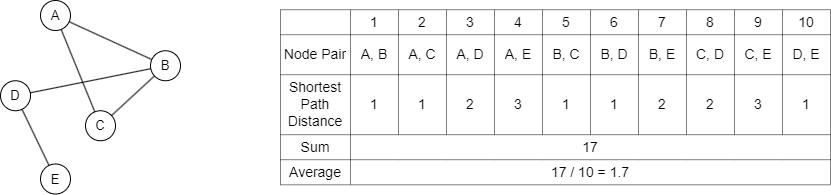</center>

As described above, the average graph distance is typically calculated by performing graph traversals to find the shortest path between every pair of nodes, summing these distances, and dividing by the total number of node pairs to get the average.

### Approximate Neighborhood Function (ANF)

Graph traversals can be computationally expensive and memory-intensive, especially for large-scale graphs. In such cases, <b>approximate neighborhood function (ANF)</b> algorithms are commonly used to estimate the average graph distance more efficiently.

ANF algorithms aim to estimate the neighborhood function (NF):

- The <b>neighborhood function</b> (NF) of a graph, denoted as `N(t)`, returns the number of node pairs such that the two nodes can reach each other with <i>t</i> or fewer steps.
- The <b>individual neighborhood function</b> (INF) of a node `x` in a graph, denoted as `N(x,t)`, returns the number of nodes that can be reached from `x` with `t` or fewer steps.
- In an undirected graph `G = (V, E)`, the relationship between NF and INF is:

<center>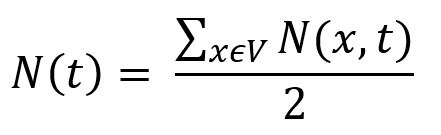</center>

The NF can help to reveal some features of graphs, including the average graph distance:

<center>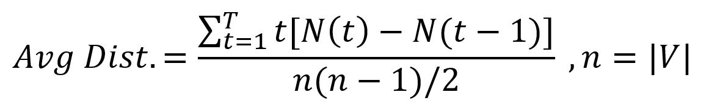</center>

The calculation of the above example graph is shown below:

<center>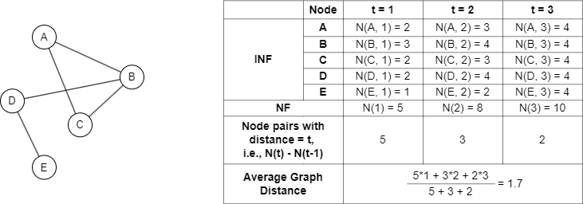</center>

However, it is very expensive to compute the NF exactly on large graphs. By approximating the neighborhood function, ANF algorithms can estimate the average graph distance without traversing the entire graph.

### HyperLogLog Counter

<b>HyperLogLog counter</b> is used to count approximately the number of distinct elements (i.e., the cardinality) in a large set or stream of elements. Calculating the exact cardinality often requires an amount of memory proportional to the cardinality, which is impractical for very large data sets. HyperLoglog uses significantly less memory, with the space complexity as `O(log(log n))` (this is the reason why these counters are called HyperLogLog).

A HyperLogLog counter can be viewed as an array of <code>m = 2<sup>b</sup></code> <b>registers</b>, and each register is initialized to `-∞`. For example, `b = 3`, then `M[0] = M[1] = ... = M[7] = -∞`.

> The number of registers depends on the desired precision of the estimation. More registers can provide a more accurate estimation, but also require more memory.

First, each element `x` in the set is mapped into a fixed-size binary sequence by a hash function `h()`. For example, `h(x) = 0100001110101...`.

Then, update the registers. For each element `x` in the set:

<center>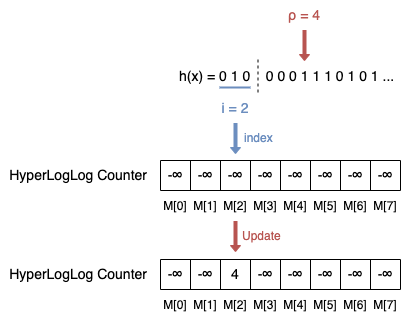</center>

- Calculate the index `i` of the register by the integer value of the leftmost `b` bits of `h(x)`, i.e., <code>h<sub>b</sub>(x)</code>. In the example, <code>i = h<sub>b</sub>(x) = 010 = 0\*2<sup>2</sup> + 1\*2<sup>1</sup> + 0\*2<sup>0</sup> = 2</code>.
- Let <code>h<sup>b</sup>(x)</code> be the sequence of remaining bits of `h(x)`, and <code>ρ(h<sup>b</sup>(x))</code> be the position of the leftmost 1 of <code>h<sup>b</sup>(x)</code>. In the example, <code>ρ(h<sup>b</sup>(x)) = ρ(0001110101...) = 4</code>.
- Update register <code>M[i] = max(M[i], ρ(h<sup>b</sup>(x)))</code>. In the example, `M[2] = max(-∞, 4) = 4`.

After reading all elements, the cardinality is calculated by the HyperLogLog counter as:

<center>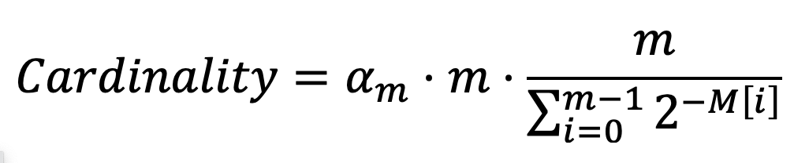</center>

It is actually a normalized version of the harmonic mean of the <code>2<sup>M[i]</sup></code>, where <code>α<sub>m</sub></code> is a constant calculated by `m` as:

<center>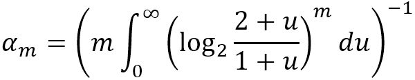</center>

### HyperANF

HyperANF is one popular ANF algorithm, it is a breakthrough improvement in terms of speed and scalability.

The algorithm is based on the observation that `B(x,t)`, the set of reachable nodes from node `x` with distance `t` or less, satisfies

<center>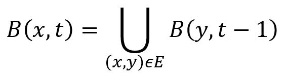</center>

In the example graph below, node `a` has 3 adjacent edges `(a,b)`, `(a,c)` and `(a,d)`, so `B(a,3) = B(b,2) ∪ B(c,2) ∪ B(d,2)`.

<center>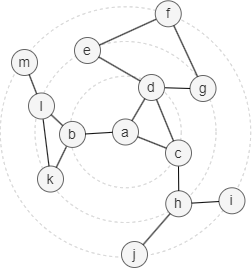</center>

Instead of keeping track of `B(x,t)`, the HyperANF algorithm employs HyperLogLog counters to simplify the computation process, as illustrated by the example graph above:

- Each node `x` is mapped to a binary representation `h(x)`, and is assigned a HyperLogLog counter <code>C<sub>x</sub>(t)</code>. Set `b = 2`, so each counter has <code>m = 2<sup>b</sup> = 4</code> registers.
- <code>C<sub>x</sub>(0)</code> is then computed by the value of `i` and `ρ`. Note: we use 0 instead of -∞ for the calculation, the result is the same.
- In the `t`-th iteration, for each node `x`, the union of `B(y,t-1)` (`(x,y)∈E`) is implemented by combining the counters of all neighbors of node `x`, that is, maximizing the values of the counter of node `x` register by register.
- The values of all counters remain unchanged after 6 iterations because the diameter of the graph is 6.
- `|B(x,t)|` is computed in each iteration by the cardinality equation with the constant <code>α<sub>m</sub> = 0.53243</code>.

<center>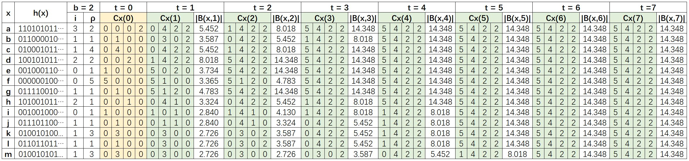</center>

Since `B(x,0) = {x}`, then `|N(x,t)| = |B(x,t)| - 1`. In this example, the average graph distance computed by the algorithm is 3.2041. The exact average graph distance of this example is 3.

## Considerations

- The HyperANF algorithm is typically best suited for connected graphs. For disconnected graphs, the algorithm may not provide accurate results.
- The algorithm treats all edges as undirected.
- Results are approximate due to the HyperLogLog estimation.

## Example Graph

<center>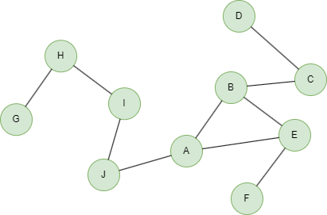</center>

```gql
INSERT (A:default {_id: "A"}), (B:default {_id: "B"}),
       (C:default {_id: "C"}), (D:default {_id: "D"}),
       (E:default {_id: "E"}), (F:default {_id: "F"}),
       (G:default {_id: "G"}), (H:default {_id: "H"}),
       (I:default {_id: "I"}), (J:default {_id: "J"}),
       (G)-[:default]->(H), (H)-[:default]->(I),
       (I)-[:default]->(J), (J)-[:default]->(A),
       (A)-[:default]->(B), (A)-[:default]->(E),
       (E)-[:default]->(F), (B)-[:default]->(E),
       (B)-[:default]->(C), (C)-[:default]->(D)
```

## Parameters

| Name | Type | Default | Description |
| -- | -- | -- | -- |
| `maxIterations` | `INT` | `10` | Maximum number of hops (iterations). |
| `precision` | `INT` | `10` | HyperLogLog precision `b` (number of registers <code>m = 2<sup>b</sup></code>). Range: 4-16. Higher values give better accuracy but use more memory. |

## Run Mode

**Returns:**

| Column | Type | Description |
| -- | -- | -- |
| `nodeId` | `STRING` | Node identifier (`_id`) |
| `reachable` | `INT` | Estimated number of reachable nodes at max hop |
| `closeness` | `FLOAT` | Approximate closeness centrality (1/avg_distance) |

```gql
CALL algo.hyperanf({
  maxIterations: 5,
  precision: 4
}) YIELD nodeId, reachable, closeness
```

Result:

| nodeId | reachable | closeness |
| -- | -- | -- |
| E | 8 | 0.5965532301951378 |
| D | 8 | 0.34341452360360125 |
| G | 6 | 0.27985924668795603 |
| F | 8 | 0.3996822154660621 |
| A | 8 | 0.5965532301951378 |
| C | 8 | 0.47933092250796094 |
| B | 8 | 0.6101912344377625 |
| I | 8 | 0.39154003724083103 |
| H | 6 | 0.3876337890055861 |
| J | 8 | 0.4746971359742313 |

## Stream Mode

Returns the same columns as run mode, streamed for memory efficiency.

```gql
CALL algo.hyperanf.stream({
  maxIterations: 10,
  precision: 10
}) YIELD nodeId, reachable, closeness
RETURN nodeId, reachable, closeness
```

Result:

| nodeId | reachable | closeness |
| -- | -- | -- |
| E | 10 | 0.4085657061461551 |
| D | 10 | 0.25686127108769014 |
| G | 10 | 0.230532216041899 |
| F | 10 | 0.2996826682798575 |
| A | 10 | 0.4731716299064865 |
| C | 10 | 0.3329032372979068 |
| B | 10 | 0.4280138237136014 |
| I | 10 | 0.35959571365548715 |
| H | 10 | 0.28998011925615325 |
| J | 10 | 0.42817415133736225 |

## Stats Mode

**Returns:**

| Column | Type | Description |
| -- | -- | -- |
| `nodeCount` | `INT` | Total number of nodes |
| `avgGraphDistance` | `FLOAT` | Average graph distance across all reachable pairs |
| `avgReachable` | `FLOAT` | Average estimated reachable nodes |
| `estimatedDiameter` | `INT` | Estimated diameter (hop where neighborhood function stabilizes) |

```gql
CALL algo.hyperanf.stats({
  maxIterations: 10,
  precision: 10
}) YIELD nodeCount, avgGraphDistance, avgReachable, estimatedDiameter
```

Result:

| nodeCount | avgGraphDistance | avgReachable | estimatedDiameter |
| -- | -- | -- | -- |
| 10 | 3.0197961999815877 | 10 | 7 |
