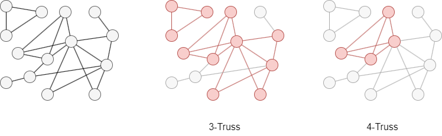

# k-Truss

## Overview

The k-Truss algorithm identifies cohesive subgraphs called <i>trusses</i> in the graph. It is widely used in fields such as social networks, biology, and transportation. By revealing communities or clusters of closely related nodes, it helps uncover the structure and connectivity of complex networks.

The concept of k-Truss was originally defined by J. Cohen in 2005:

- J. Cohen, <a target='blank' href="https://documents.pub/document/trusses-cohesive-subgraphs-for-social-network-analysis.html">Trusses: Cohesive Subgraphs for Social Network Analysis</a> (2005)

## Concepts

### k-Truss

The truss is motivated by a natural observation of social cohesion: if two people are strongly tied, it is likely that they also share ties to others. A <b>k-Truss</b> is thus defined in this way: a tie between A and B is considered legitimate only if it is supported by at least `k–2` other people who are each tied to both A and B. In other words, each edge in a k-truss connects two nodes that have at least `k–2` common neighbors.

Formally, a k-truss is a maximal subgraph in which every edge is supported by at least `k–2` triangles that include that edge.

In the graph below, the 3-Truss and 4-Truss are highlighted in red. The graph does not contain any truss with `k` equal to or greater than 5.

<center></center>

### Truss Number

The **truss number** of a node is the maximum `k` for which the node belongs to a k-truss. This algorithm computes the truss number for every node and identifies which nodes belong to the specified k-truss.

## Considerations

- At least 3 nodes are contained in a truss (when `k ≥ 3`).
- The algorithm treats all edges as undirected.
- Multi-edges between the same pair of nodes are deduplicated and counted as a single connection. This ensures correct triangle counting — without deduplication, parallel edges would inflate triangle counts and cause edges to appear more supported than they actually are.

## Example Graph

<center></center>

```gql
INSERT (a:default {_id: "a"}), (b:default {_id: "b"}),
       (c:default {_id: "c"}), (d:default {_id: "d"}),
       (e:default {_id: "e"}), (f:default {_id: "f"}),
       (g:default {_id: "g"}), (h:default {_id: "h"}),
       (i:default {_id: "i"}), (j:default {_id: "j"}),
       (k:default {_id: "k"}), (l:default {_id: "l"}),
       (m:default {_id: "m"}),
       (b)-[:default]->(a), (d)-[:default]->(a),
       (c)-[:default]->(a), (d)-[:default]->(c),
       (f)-[:default]->(a), (f)-[:default]->(d),
       (d)-[:default]->(e), (e)-[:default]->(f),
       (f)-[:default]->(c), (c)-[:default]->(h),
       (i)-[:default]->(m), (i)-[:default]->(g),
       (k)-[:default]->(c), (k)-[:default]->(c),
       (k)-[:default]->(f), (j)-[:default]->(l),
       (k)-[:default]->(l), (g)-[:default]->(k),
       (m)-[:default]->(k), (l)-[:default]->(f),
       (m)-[:default]->(f), (f)-[:default]->(g),
       (g)-[:default]->(m), (m)-[:default]->(l)
```

## Parameters

| Name | Type | Default | Description |
| -- | -- | -- | -- |
| `k` | `INT` | `3` | Minimum truss level (`k ≥ 2`). Each edge in the k-truss must be part of at least `k-2` triangles. |

## Run Mode

**Returns:**

| Column | Type | Description |
| -- | -- | -- |
| `nodeId` | `STRING` | Node identifier (`_id`) |
| `trussNumber` | `INT` | Maximum truss number for this node |
| `inKTruss` | `INT` | 1 if the node is in the specified k-truss, 0 otherwise |

```gql
CALL algo.ktruss({
  k: 4
}) YIELD nodeId, trussNumber, inKTruss
```

Result:

| nodeId | trussNumber | inKTruss |
| -- | -- | -- |
| e | 3 | 0 |
| d | 4 | 1 |
| g | 4 | 1 |
| f | 4 | 1 |
| a | 4 | 1 |
| c | 4 | 1 |
| b | 2 | 0 |
| m | 4 | 1 |
| l | 4 | 1 |
| i | 3 | 0 |
| h | 2 | 0 |
| k | 4 | 1 |
| j | 2 | 0 |

## Stream Mode

Returns the same columns as run mode, streamed for memory efficiency.

```gql
CALL algo.ktruss.stream({
  k: 4
}) YIELD nodeId, trussNumber, inKTruss
FILTER inKTruss = 1
RETURN nodeId, trussNumber
```

Result:

| nodeId | trussNumber |
| -- | -- |
| d | 4 |
| g | 4 |
| f | 4 |
| a | 4 |
| c | 4 |
| m | 4 |
| l | 4 |
| k | 4 |

## Stats Mode

**Returns:**

| Column | Type | Description |
| -- | -- | -- |
| `nodeCount` | `INT` | Total number of nodes |
| `edgeCount` | `INT` | Number of edges in the k-truss |
| `trussNodeCount` | `INT` | Number of nodes in the k-truss |

```gql
CALL algo.ktruss.stats({
  k: 4
}) YIELD nodeCount, edgeCount, trussNodeCount
```

Result:

| nodeCount | edgeCount | trussNodeCount |
| -- | -- | -- |
| 13 | 15 | 8 |