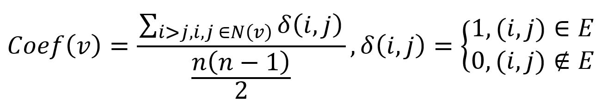
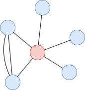
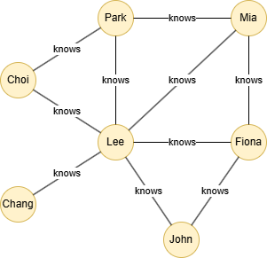

# Local Clustering Coefficient

## Overview

The Local Clustering Coefficient algorithm calculates the density of connection among the immediate neighbors of a node. It quantifies the ratio of actual connections among the neighbors to the maximum possible connections.

The local clustering coefficient provides insights into the cohesion of a node's ego network. In the context of a social network, a high local clustering coefficient suggests that the person's friends are likely to be connected to each other, indicating the presence of a closely-knit social group. Conversely, a low local clustering coefficient indicates a more dispersed ego network.

## Concepts

### Local Clustering Coefficient

Mathematically, the local clustering coefficient of a node in an undirected graph is calculated as the ratio of the number of connected neighbor pairs to the total number of possible neighbor pairs:

<center></center>

where `n` is the number of nodes contained in the 1-hop neighborhood of node `v` (denoted as <code>N(v)</code>), `i` and `j` are any two distinct nodes within <code>N(v)</code>, `δ(i,j)` is equal to 1 if `i` and `j` are connected, and 0 otherwise.

<center></center>

In this example, the local clustering coefficient of the red node is `1/(5*4/2) = 0.1`.

## Example Graph

<center></center>

```gql
INSERT (Lee:default {_id: "Lee"}), (Choi:default {_id: "Choi"}),
       (Mia:default {_id: "Mia"}), (Fiona:default {_id: "Fiona"}),
       (Chang:default {_id: "Chang"}), (John:default {_id: "John"}),
       (Park:default {_id: "Park"}),
       (Choi)-[:knows]->(Park), (Choi)-[:knows]->(Lee),
       (Park)-[:knows]->(Lee), (Park)-[:knows]->(Mia),
       (Lee)-[:knows]->(Mia), (Mia)-[:knows]->(Fiona),
       (Fiona)-[:knows]->(Lee), (Lee)-[:knows]->(Chang),
       (Lee)-[:knows]->(John), (John)-[:knows]->(Fiona)
```

## Parameters

| Name | Type | Default | Description |
| -- | -- | -- | -- |
| `direction` | `STRING` | `both` | Edge direction: `in`, `out`, or `both`. |
| `limit` | `INT` | `-1` | Limits the number of results returned (-1 = all). |
| `order` | `STRING` | / | Sorts the results by `coefficient`: `asc` or `desc`. |

## Run Mode

**Returns:**

| Column | Type | Description |
| -- | -- | -- |
| `nodeId` | `STRING` | Node identifier (`_id`) |
| `coefficient` | `FLOAT` | Local clustering coefficient |
| `triangles` | `INT` | Number of triangles containing the node |
| `degree` | `INT` | Degree of the node |

```gql
CALL algo.localclusteringcoefficient({
  order: "desc"
}) YIELD nodeId, coefficient, triangles, degree
```

Result:

| nodeId | coefficient | triangles | degree |
| -- | -- | -- | -- |
| Choi | 1 | 1 | 2 |
| John | 1 | 1 | 2 |
| Mia | 0.6666666666666666 | 2 | 3 |
| Park | 0.6666666666666666 | 2 | 3 |
| Fiona | 0.6666666666666666 | 2 | 3 |
| Lee | 0.26666666666666666 | 4 | 6 |
| Chang | 0 | 0 | 1 |

## Stream Mode

Returns the same columns as run mode, streamed for memory efficiency.

```gql
CALL algo.localclusteringcoefficient.stream({direction: "in"}) YIELD nodeId, coefficient
RETURN nodeId, coefficient
```

Result:

| nodeId | coefficient |
| -- | -- |
| Choi | 0 |
| Mia | 0.5 |
| Lee | 0 |
| Park | 0 |
| Chang | 0 |
| John | 0 |
| Fiona | 0 |

## Stats Mode

**Returns:**

| Column | Type | Description |
| -- | -- | -- |
| `nodeCount` | `INT` | Total number of nodes |
| `avgCoefficient` | `FLOAT` | Average local clustering coefficient |
| `globalClusteringCoefficient` | `FLOAT` | Global clustering coefficient (3 * triangles / triples) |

```gql
CALL algo.localclusteringcoefficient.stats() YIELD nodeCount, avgCoefficient, globalClusteringCoefficient
```

Result:

| nodeCount | avgCoefficient | globalClusteringCoefficient |
| -- | -- | -- |
| 7 | 0.6095238095238095 | 0.46153846153846156 |

## Write Mode

Computes results and writes them back to node properties. The write configuration is passed as a second argument map.

**Write parameters:**

| Name | Type | Description |
| -- | -- | -- |
| `db.property` | `STRING` or `MAP` | Node property to write results to. String: writes the `coefficient` column in results to a property. Map: explicit column-to-property mapping (e.g., `{coefficient: 'lcc', triangles: 'tri'}`). |

**Writable columns:**

| Column | Type | Description |
| -- | -- | -- |
| `coefficient` | `FLOAT` | Local clustering coefficient |
| `triangles` | `INT` | Triangle count |
| `degree` | `INT` | Node degree |

**Returns:**

| Column | Type | Description |
| -- | -- | -- |
| `task_id` | `STRING` | Task identifier for tracking via `SHOW TASKS` |
| `nodesWritten` | `INT` | Number of nodes with properties written |
| `computeTimeMs` | `INT` | Time spent computing the algorithm (milliseconds) |
| `writeTimeMs` | `INT` | Time spent writing properties to storage (milliseconds) |

```gql
CALL algo.localclusteringcoefficient.write({}, {
  db: {
    property: "lcc"
  }
}) YIELD task_id, nodesWritten, computeTimeMs, writeTimeMs
```
