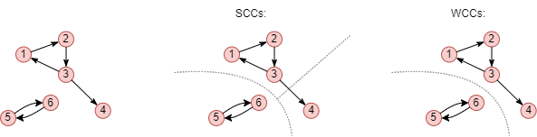
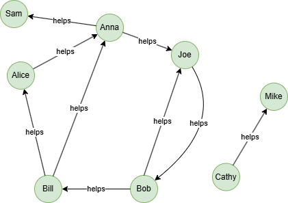

# Weakly Connected Components (WCC)

## Overview

The WCC algorithm identifies the weakly connected components in a graph. A weakly connected component is a maximal subset of nodes where a path exists between any pair of nodes when edge directions are ignored.

The number of connected components serves as a coarse-grained measure of graph connectivity. If the number remains unchanged after modifications to the graph, it suggests that the macroscopic connectivity has not been altered significantly.

## Concepts

### Connected Component

A connected component is a maximal subset of nodes in a graph where all nodes in that subset are reachable from one another by following edges. A maximal subset means that no additional nodes can be added to the subset without breaking the connectivity requirement.

### Weakly vs Strongly Connected Components

- A **weakly connected component (WCC)** is a subset of nodes where a path exists between any pair of nodes when edge directions are ignored.
- A **strongly connected component (SCC)** is a subset of nodes in a directed graph where there is a directed path between every pair of nodes in both directions. See <a href="/docs/graph-algorithms/scc">SCC</a> for details.

<center></center>

This example shows the 3 strongly connected components and 2 weakly connected components of a graph.

## Considerations

- The algorithm treats all edges as undirected.
- Each isolated node constitutes its own connected component.

## Example Graph

<center></center>

```gql
INSERT (Mike:member {_id: "Mike"}), (Cathy:member {_id: "Cathy"}),
       (Anna:member {_id: "Anna"}), (Joe:member {_id: "Joe"}),
       (Sam:member {_id: "Sam"}), (Bob:member {_id: "Bob"}),
       (Bill:member {_id: "Bill"}), (Alice:member {_id: "Alice"}),
       (Cathy)-[:helps]->(Mike), (Anna)-[:helps]->(Sam),
       (Anna)-[:helps]->(Joe), (Joe)-[:helps]->(Bob),
       (Bob)-[:helps]->(Joe), (Bob)-[:helps]->(Bill),
       (Bill)-[:helps]->(Alice), (Bill)-[:helps]->(Anna),
       (Alice)-[:helps]->(Anna)
```

## Run Mode

**Returns:**

| Column | Type | Description |
| -- | -- | -- |
| `nodeId` | `STRING` | Node identifier (`_id`) |
| `componentId` | `INT` | Component identifier |
| `componentSize` | `INT` | Number of nodes in component |

```gql
CALL algo.wcc() YIELD nodeId, componentId, componentSize
```

Result:

| nodeId | componentId | componentSize |
| -- | -- | -- |
| Mike | 0 | 2 |
| Cathy | 0 | 2 |
| Bill | 1 | 6 |
| Alice | 1 | 6 |
| Anna | 1 | 6 |
| Bob | 1 | 6 |
| Joe | 1 | 6 |
| Sam | 1 | 6 |

## Stream Mode

Returns the same columns as run mode, streamed for memory efficiency.

```gql
CALL algo.wcc.stream() YIELD nodeId, componentId, componentSize
RETURN componentId, COLLECT(nodeId) AS members, componentSize
GROUP BY componentId
```

Result:

| componentId | members | componentSize |
| -- | -- | -- |
| 0 | ["Mike", "Cathy"] | 2 |
| 1 | ["Bill", "Alice", "Anna", "Bob", "Joe", "Sam"] | 6 |

## Stats Mode

**Returns:**

| Column | Type | Description |
| -- | -- | -- |
| `nodeCount` | `INT` | Total number of nodes |
| `componentCount` | `INT` | Number of connected components |
| `largestComponentSize` | `INT` | Size of the largest component |
| `smallestComponentSize` | `INT` | Size of the smallest component |

```gql
CALL algo.wcc.stats() YIELD nodeCount, componentCount, largestComponentSize, smallestComponentSize
```

Result:

| nodeCount | componentCount | largestComponentSize | smallestComponentSize |
| -- | -- | -- | -- |
| 8 | 2 | 6 | 2 |

## Write Mode

Computes results and writes them back to node properties. The write configuration is passed as a second argument map.

**Write parameters:**

| Name | Type | Description |
| -- | -- | -- |
| `db.property` | `STRING` or `MAP` | Node property to write results to. String: writes the `componentId` column in results to a property. Map: explicit column-to-property mapping (e.g., `{componentId: 'wcc_id'}`). |

**Writable columns:**

| Column | Type | Description |
| -- | -- | -- |
| `componentId` | `INT` | Component identifier |
| `componentSize` | `INT` | Component size |

**Returns:**

| Column | Type | Description |
| -- | -- | -- |
| `task_id` | `STRING` | Task identifier for tracking via `SHOW TASKS` |
| `nodesWritten` | `INT` | Number of nodes with properties written |
| `computeTimeMs` | `INT` | Time spent computing the algorithm (milliseconds) |
| `writeTimeMs` | `INT` | Time spent writing properties to storage (milliseconds) |

```gql
CALL algo.wcc.write({}, {
  db: {
    property: "wcc_id"
  }
}) YIELD task_id, nodesWritten, computeTimeMs, writeTimeMs
```
