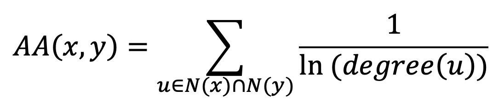
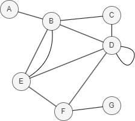

# Adamic-Adar Index

## Overview

The Adamic-Adar Index (AA Index) is a node similarity metric named after its creators Lada Adamic and Eytan Adar. It measures the strength of potential connection between two nodes based on their common neighbors.

- L.A. Adamic, E. Adar, <a href="http://cond.org/fnn.pdf" target="_blank">Friends and Neighbors on the Web</a> (2003)

The core idea behind the AA Index is that common neighbors with lower degrees contribute more valuable information about the similarity between two nodes than those with higher degrees. The index is calculated using the following formula:

<center></center>

For each common neighbor `u` of the two nodes, the AA Index first calculates the reciprocal of the natural logarithm of its degree, and then sums these values across all common neighbors.

A higher AA Index score indicates greater similarity between the nodes, while a score of 0 indicates no similarity between two nodes.

<center></center>

In this example, `N(D) ∩ N(E) = {B, F}`, <code>AA(D,E) = <math><mfrac><mn>1</mn><mi>ln4</mi></mfrac></math> + <math><mfrac><mn>1</mn><mi>ln3</mi></mfrac></math> = 1.631586747</code>.

## Considerations

- The AA Index algorithm treats all edges as undirected, ignoring their original direction.

## Example Graph

<center></center>

```gql
INSERT (A:default {_id: "A"}), (B:default {_id: "B"}),
       (C:default {_id: "C"}), (D:default {_id: "D"}),
       (E:default {_id: "E"}), (F:default {_id: "F"}),
       (G:default {_id: "G"}), (A)-[:default]->(B),
       (B)-[:default]->(E), (C)-[:default]->(B),
       (C)-[:default]->(D), (C)-[:default]->(F),
       (D)-[:default]->(B), (D)-[:default]->(E),
       (F)-[:default]->(D)
```

## Parameters

| Name | Type | Default | Description |
| -- | -- | -- | -- |
| `node1` | `STRING` | / | **Required.** First node `_id`. |
| `node2` | `STRING` | / | **Required.** Second node `_id`. |

## Run Mode

**Returns:**

| Column | Type | Description |
| -- | -- | -- |
| `node1` | `STRING` | First node identifier (`_id`) |
| `node2` | `STRING` | Second node identifier (`_id`) |
| `score` | `FLOAT` | Adamic-Adar score |

```gql
CALL algo.adamicadar({
  node1: "C",
  node2: "E"
}) YIELD node1, node2, score
```

Result:

| node1 | node2 | score |
| -- | -- | -- |
| C | E | 1.4426950408889634 |

## Stream Mode

Returns the same columns as run mode, streamed for memory efficiency.

```gql
CALL algo.adamicadar.stream({
  node1: "C",
  node2: "E"
}) YIELD node1, node2, score
RETURN node1, node2, score
```

Result:

| node1 | node2 | score |
| -- | -- | -- |
| C | E | 1.4426950408889634 |

## Stats Mode

**Returns:**

| Column | Type | Description |
| -- | -- | -- |
| `score` | `FLOAT` | Adamic-Adar score |

```gql
CALL algo.adamicadar.stats({
  node1: "C",
  node2: "E"
}) YIELD score
```

Result:

| score |
| -- |
| 1.4426950408889634 |