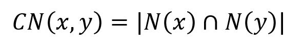
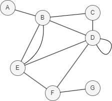

# Common Neighbors

## Overview

The Common Neighbors algorithm measures the similarity between two nodes by counting how many neighbors they share.

The logic behind this algorithm is that two nodes with many common neighbors are more likely to be similar or have a potential connection. This similarity score is calculated using the following formula:

<center></center>

where `N(x)` and `N(y)` are the sets of adjacent nodes to nodes `x` and `y` respectively. 

More common neighbors indicate greater similarity between nodes, while a number of 0 indicates no similarity between two nodes.

<center></center>

In this example, `CN(D,E) = |N(D) ∩ N(E)| = |{B, F}| = 2`.

## Considerations

- The Common Neighbors algorithm treats all edges as undirected, ignoring their original direction.

## Example Graph

<center></center>

```gql
INSERT (A:default {_id: "A"}), (B:default {_id: "B"}),
       (C:default {_id: "C"}), (D:default {_id: "D"}),
       (E:default {_id: "E"}), (F:default {_id: "F"}),
       (G:default {_id: "G"}), (A)-[:default]->(B),
       (B)-[:default]->(E), (C)-[:default]->(B),
       (C)-[:default]->(D), (C)-[:default]->(F),
       (D)-[:default]->(B), (D)-[:default]->(E),
       (F)-[:default]->(D)
```

## Parameters

| Name | Type | Default | Description |
| -- | -- | -- | -- |
| `node1` | `STRING` | / | **Required.** First node `_id`. |
| `node2` | `STRING` | / | **Required.** Second node `_id`. |

## Run Mode

**Returns:**

| Column | Type | Description |
| -- | -- | -- |
| `node1` | `STRING` | First node identifier (`_id`) |
| `node2` | `STRING` | Second node identifier (`_id`) |
| `score` | `FLOAT` | Number of common neighbors |

```gql
CALL algo.commonneighbors({
  node1: "C",
  node2: "E"
}) YIELD node1, node2, score
```

Result:

| node1 | node2 | score |
| -- | -- | -- |
| C | E | 2 |

## Stream Mode

Returns the same columns as run mode, streamed for memory efficiency.

```gql
CALL algo.commonneighbors.stream({
  node1: "C",
  node2: "E"
}) YIELD node1, node2, score
RETURN node1, node2, score
```

Result:

| node1 | node2 | score |
| -- | -- | -- |
| C | E | 2 |

## Stats Mode

**Returns:**

| Column | Type | Description |
| -- | -- | -- |
| `score` | `FLOAT` | Common neighbors score |

```gql
CALL algo.commonneighbors.stats({
  node1: "C",
  node2: "E"
}) YIELD score
```

Result:

| score |
| -- |
| 2 |