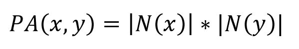
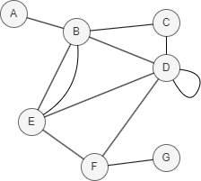

# Preferential Attachment

## Overview

Preferential attachment is a common phenomenon in complex networks, where nodes with more existing connections are more likely to attract new ones. When both nodes have a large number of connections, the probability of them forming a connection is significantly higher. This phenomenon was utilized by A. Barabási and R. Albert in their proposed BA model for generating random scale-free networks in 2002:

- R. Albert, A. Barabási, <a href="https://arxiv.org/pdf/cond-mat/0106096.pdf" target="_blank">Statistical mechanics of complex networks</a> (2001)

The Preferential Attachment algorithm measures the similarity between two nodes by multiplying the number of neighbors each node has. It is computed using the following formula:

<center></center>

where `N(x)` and `N(y)` are the sets of adjacent nodes to nodes `x` and `y` respectively. 

Higher Preferential Attachment scores indicate a greater similarity between two nodes, while a score of 0 indicates no such similarity.

<center></center>

In this example, `PA(D,E) = |N(D)| * |N(E)| = |{B, C, E, F}| * |{B, D, F}| = 4 * 3 = 12`.

## Considerations

- The Preferential Attachment algorithm treats all edges as undirected, ignoring their original direction.

## Example Graph

<center></center>

```gql
INSERT (A:default {_id: "A"}), (B:default {_id: "B"}),
       (C:default {_id: "C"}), (D:default {_id: "D"}),
       (E:default {_id: "E"}), (F:default {_id: "F"}),
       (G:default {_id: "G"}), (A)-[:default]->(B),
       (B)-[:default]->(E), (C)-[:default]->(B),
       (C)-[:default]->(D), (C)-[:default]->(F),
       (D)-[:default]->(B), (D)-[:default]->(E),
       (F)-[:default]->(D)
```

## Parameters

| Name | Type | Default | Description |
| -- | -- | -- | -- |
| `node1` | `STRING` | / | **Required.** First node `_id`. |
| `node2` | `STRING` | / | **Required.** Second node `_id`. |

## Run Mode

**Returns:**

| Column | Type | Description |
| -- | -- | -- |
| `node1` | `STRING` | First node identifier (`_id`) |
| `node2` | `STRING` | Second node identifier (`_id`) |
| `score` | `FLOAT` | Preferential attachment score (product of degrees) |

```gql
CALL algo.preferentialattachment({
  node1: "C",
  node2: "E"
}) YIELD node1, node2, score
```

Result:

| node1 | node2 | score |
| -- | -- | -- |
| C | E | 6 |

## Stream Mode

Returns the same columns as run mode, streamed for memory efficiency.

```gql
CALL algo.preferentialattachment.stream({
  node1: "C",
  node2: "E"
}) YIELD node1, node2, score
RETURN node1, node2, score
```

Result:

| node1 | node2 | score |
| -- | -- | -- |
| C | E | 6 |

## Stats Mode

**Returns:**

| Column | Type | Description |
| -- | -- | -- |
| `score` | `FLOAT` | Preferential attachment score |

```gql
CALL algo.preferentialattachment.stats({
  node1: "C",
  node2: "E"
}) YIELD score
```

Result:

| score |
| -- |
| 6 |