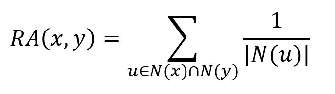
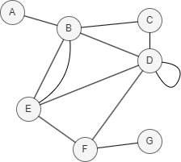

# Resource Allocation

## Overview

The Resource Allocation algorithm assumes that nodes distribute resources to each other through shared neighbors, who act as transmitters. In its basic form, each transmitter is considered to possess a single unit of resource, which is evenly distributed among its neighbors. As a result, the similarity between two nodes is measured by the amount of resource one node is able to transmit to the other through these shared neighbors. This concept was introduced by Tao Zhou, Linyuan Lü, and Yi-Cheng Zhang in 2009:

- T. Zhou, L. Lü, Y. Zhang, <a href="https://arxiv.org/pdf/0901.0553.pdf" target="_blank">Predicting Missing Links via Local Information</a> (2009)

It is computed using the following formula:

<center></center>

where `N(u)` is the set of nodes adjacent to `u`. For each common neighbor `u` of the two nodes, the Resource Allocation first calculates the reciprocal of its degree `|N(u)|`, and then sums these values across all common neighbors.

When calculating the degree for nodes in the graphset:
- Edges connecting the same two nodes are counted only once;
- Self-loops are excluded from the calculation.

Higher Resource Allocation scores indicate greater similarity between nodes, while a score of 0 indicates no similarity.

<center></center>

In this example, `N(D) ∩ N(E) = {B, F}`, <code>RA(D,E) = <math><mfrac><mn>1</mn><mi>|N(B)|</mi></mfrac></math> + <math><mfrac><mn>1</mn><mi>|N(F)|</mi></mfrac></math> = <math><mfrac><mn>1</mn><mi>4</mi></mfrac></math> + <math><mfrac><mn>1</mn><mi>3</mi></mfrac></math> = 0.5833</code>.

## Considerations

- The Resource Allocation algorithm treats all edges as undirected, ignoring their original direction.

## Example Graph

<center></center>

```gql
INSERT (A:default {_id: "A"}), (B:default {_id: "B"}),
       (C:default {_id: "C"}), (D:default {_id: "D"}),
       (E:default {_id: "E"}), (F:default {_id: "F"}),
       (G:default {_id: "G"}), (A)-[:default]->(B),
       (B)-[:default]->(E), (C)-[:default]->(B),
       (C)-[:default]->(D), (C)-[:default]->(F),
       (D)-[:default]->(B), (D)-[:default]->(E),
       (F)-[:default]->(D)
```

## Parameters

| Name | Type | Default | Description |
| -- | -- | -- | -- |
| `node1` | `STRING` | / | **Required.** First node `_id`. |
| `node2` | `STRING` | / | **Required.** Second node `_id`. |

## Run Mode

**Returns:**

| Column | Type | Description |
| -- | -- | -- |
| `node1` | `STRING` | First node identifier (`_id`) |
| `node2` | `STRING` | Second node identifier (`_id`) |
| `score` | `FLOAT` | Resource allocation score |

```gql
CALL algo.resourceallocation({
  node1: "C",
  node2: "E"
}) YIELD node1, node2, score
```

Result:

| node1 | node2 | score |
| -- | -- | -- |
| C | E | 0.5 |

## Stream Mode

Returns the same columns as run mode, streamed for memory efficiency.

```gql
CALL algo.resourceallocation.stream({
  node1: "C",
  node2: "E"
}) YIELD node1, node2, score
RETURN node1, node2, score
```

Result:

| node1 | node2 | score |
| -- | -- | -- |
| C | E | 0.5 |

## Stats Mode

**Returns:**

| Column | Type | Description |
| -- | -- | -- |
| `score` | `FLOAT` | Resource allocation score |

```gql
CALL algo.resourceallocation.stats({
  node1: "C",
  node2: "E"
}) YIELD score
```

Result:

| score |
| -- |
| 0.5 |