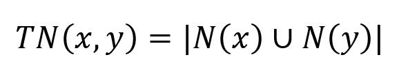
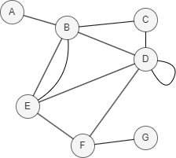

# Total Neighbors

## Overview

The Total Neighbors algorithm measures the similarity between two nodes by calculating the total number of distinct neighbors they have combined.

Unlike algorithms that focus solely on common neighbors, this method provides a broader perspective by considering the entire neighborhood of both nodes, offering a more comprehensive assessment of their similarity. It is computed using the following formula:

<center></center>

where `N(x)` and `N(y)` are the sets of adjacent nodes to nodes `x` and `y` respectively. 

More total neighbors indicate greater similarity between nodes, while a count of 0 indicates no similarity.

<center></center>

In this example, `TN(D,E) = |N(D) ∪ N(E)| = |{B, C, E, F} ∪ {B, D, F}| = |{B, C, D, E, F}| = 5`.

## Considerations

- The Total Neighbors algorithm treats all edges as undirected, ignoring their original direction.

## Example Graph

<center></center>

```gql
INSERT (A:default {_id: "A"}), (B:default {_id: "B"}),
       (C:default {_id: "C"}), (D:default {_id: "D"}),
       (E:default {_id: "E"}), (F:default {_id: "F"}),
       (G:default {_id: "G"}), (A)-[:default]->(B),
       (B)-[:default]->(E), (C)-[:default]->(B),
       (C)-[:default]->(D), (C)-[:default]->(F),
       (D)-[:default]->(B), (D)-[:default]->(E),
       (F)-[:default]->(D)
```

## Parameters

| Name | Type | Default | Description |
| -- | -- | -- | -- |
| `node1` | `STRING` | / | **Required.** First node `_id`. |
| `node2` | `STRING` | / | **Required.** Second node `_id`. |

## Run Mode

**Returns:**

| Column | Type | Description |
| -- | -- | -- |
| `node1` | `STRING` | First node identifier (`_id`) |
| `node2` | `STRING` | Second node identifier (`_id`) |
| `score` | `FLOAT` | Total neighbors count (union of neighborhoods) |

```gql
CALL algo.totalneighbors({
  node1: "C",
  node2: "E"
}) YIELD node1, node2, score
```

Result:

| node1 | node2 | score |
| -- | -- | -- |
| C | E | 3 |

## Stream Mode

Returns the same columns as run mode, streamed for memory efficiency.

```gql
CALL algo.totalneighbors.stream({
  node1: "C",
  node2: "E"
}) YIELD node1, node2, score
RETURN node1, node2, score
```

Result:

| node1 | node2 | score |
| -- | -- | -- |
| C | E | 3 |

## Stats Mode

**Returns:**

| Column | Type | Description |
| -- | -- | -- |
| `score` | `FLOAT` | Total neighbors score |

```gql
CALL algo.totalneighbors.stats({
  node1: "C",
  node2: "E"
}) YIELD score
```

Result:

| score |
| -- |
| 3 |