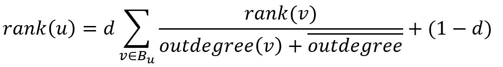
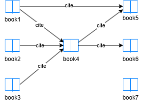

# ArticleRank

## Overview

ArticleRank has been derived from <a target="_blank" href="/docs/graph-analytics-algorithms/pagerank">PageRank</a> to measure the influence of journal articles.

- J. Li, P. Willett, <a target="_blank" href="https://www.emerald.com/insight/content/doi/10.1108/00012530911005544/full/html">ArticleRank: a PageRank-based Alternative to Numbers of Citations for Analysing Citation Networks</a> (2009)

## Concepts

### ArticleRank

Like links between webpages, citations between articles (e.g., books or reports) indicate authority and quality. It is generally assumed that the more citations an article receives, the greater its perceived impact within its research domain.

However, not all articles are equally important. Hence, this approach based on <a target="_blank" href="/docs/graph-analytics-algorithms/pagerank">PageRank</a> was proposed to rank articles.

ArticleRank retains the basic PageRank methodology while making some modifications. When an article passes its rank among its forward links, it does not divide the rank equally by the out-degree of that article, but by the sum of the out-degree of that article and the average out-degree of all articles. The rank of article `u` after one iteration is:

<center></center>

where <code>B<sub>u</sub></code> is the backlink set of `u`, `d` is the damping factor. This change in the denominator reduces the bias that makes articles with few out-links seem to contribute more to their forward links.

## Considerations

The implementation uses a normalized variant where scores sum to 1. The base rank `(1 - d)` is replaced by `(1 - d) / n`, where `n` is the total number of nodes. Additionally, ranks from dangling nodes (nodes with no outgoing edges) are redistributed equally to all nodes.

In comparison with WWW, some features have to be considered for citation networks, such as:

- An article cannot cite itself, i.e., there is no self-loop in the network.
- Mutual citations are not allowed; an article cannot be both a forward link and a backlink at the same time.
- Citations in a published article are fixed, meaning its forward links remain static.

## Example Graph

<center></center>

```gql
INSERT (book1:book {_id: "book1"}), (book2:book {_id: "book2"}),
       (book3:book {_id: "book3"}), (book4:book {_id: "book4"}),
       (book5:book {_id: "book5"}), (book6:book {_id: "book6"}),
       (book7:book {_id: "book7"}),
       (book1)-[:cite]->(book4), (book1)-[:cite]->(book5),
       (book2)-[:cite]->(book4), (book3)-[:cite]->(book4),
       (book4)-[:cite]->(book5), (book4)-[:cite]->(book6)
```

## Parameters

| Name | Type | Default | Description |
| -- | -- | -- | -- |
| `damping` | `FLOAT` | `0.85` | Damping factor (0, 1). |
| `maxIterations` | `INT` | `20` | Maximum number of iterations. |
| `tolerance` | `FLOAT` | `0.0001` | Convergence tolerance. The algorithm terminates when score changes between iterations are less than this value. |
| `limit` | `INT` | `-1` | Limits the number of results returned (-1 = all). |
| `order` | `STRING` | / | Sorts the results by `score`: `asc` or `desc`. |

## Run Mode

**Returns:**

| Column | Type | Description |
| -- | -- | -- |
| `nodeId` | `STRING` | Node identifier (`_id`) |
| `score` | `FLOAT` | ArticleRank score |

ArticleRank for all nodes:

```gql
CALL algo.articlerank({
  damping: 0.8,
  maxIterations: 50,
  order: "desc"
}) YIELD nodeId, score
```

Result:

| nodeId | score |
| -- | -- |
| book4 | 0.1180591192912963 |
| book5 | 0.10384991583415497 |
| book6 | 0.08861301181641573 |
| book1 | 0.057111503220339345 |
| book2 | 0.057111503220339345 |
| book3 | 0.057111503220339345 |
| book7 | 0.057111503220339345 |

## Stream Mode

Returns the same columns as run mode, streamed for memory efficiency.

```gql
CALL algo.articlerank.stream({
  order: "desc",
  limit: 3
}) YIELD nodeId, score
RETURN nodeId, score
```

Result:

| nodeId | score |
| -- | -- |
| book4 | 0.1007561488726028 |
| book5 | 0.08916975310588023 |
| book6 | 0.07578394318603501 |

## Stats Mode

**Returns:**

| Column | Type | Description |
| -- | -- | -- |
| `nodeCount` | `INT` | Total number of nodes |
| `minScore` | `FLOAT` | Minimum ArticleRank score |
| `maxScore` | `FLOAT` | Maximum ArticleRank score |
| `avgScore` | `FLOAT` | Average ArticleRank score |

```gql
CALL algo.articlerank.stats() YIELD nodeCount, minScore, maxScore, avgScore
```

Result:

| nodeCount | minScore | maxScore | avgScore |
| -- | -- | -- | -- |
| 7 | 0.04721290919322198 | 0.1007561488726028 | 0.06493735456248655 |

## Write Mode

Computes results and writes them back to node properties. The write configuration is passed as a second argument map.

**Write parameters:**

| Name | Type | Description |
| -- | -- | -- |
| `db.property` | `STRING` or `MAP` | Node property to write results to. String: writes the `score` column in results to a property. Map: explicit column-to-property mapping (e.g., `{score: 'ar_score'}`). |

**Writable columns:**

| Column | Type | Description |
| -- | -- | -- |
| `score` | `FLOAT` | ArticleRank score |

**Returns:**

| Column | Type | Description |
| -- | -- | -- |
| `task_id` | `STRING` | Task identifier for tracking via `SHOW TASKS` |
| `nodesWritten` | `INT` | Number of nodes with properties written |
| `computeTimeMs` | `INT` | Time spent computing the algorithm (milliseconds) |
| `writeTimeMs` | `INT` | Time spent writing properties to storage (milliseconds) |

```gql
CALL algo.articlerank.write({damping: 0.85}, {
  db: {
    property: "ar_score"
  }
}) YIELD task_id, nodesWritten, computeTimeMs, writeTimeMs
```
