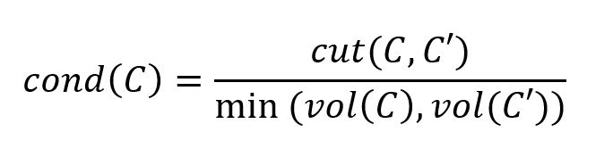
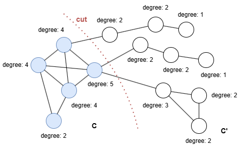
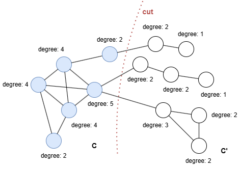
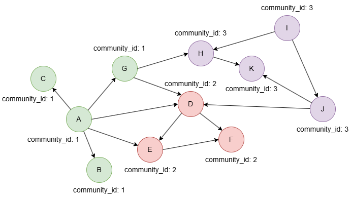

# Conductance

## Overview

Conductance is a metric used to evaluate the quality of a community or cluster within a graph. Studies have shown that scoring functions that are based on conductance best capture the structure of ground-truth communities.

- J. Yang, J. Leskovec, <a href="https://cs.stanford.edu/~jure/pubs/comscore-icdm12.pdf" target="_blank">Defining and Evaluating Network Communities based on Ground-truth</a> (2012)

## Concepts

### Conductance

Intuitively, a good community should have strong internal connections and only weak connections to the rest of the graph.

For a community `C` and its complement `C'`, the conductance of `C` is defined as the ratio of the **cut size** (the number of edges crossing between `C` and `C'`) to the minimum **volume** of `C` and `C'` (i.e., the sum of degrees of nodes within each set):

<center></center>

In the example below, the community `C` is connected to the rest of the graph with three edges, i.e., `cut(C, C') = 3`. The conductance of `C` is then `cond(C) = 3/min(19, 17) = 3/17 = 0.176471`.

<div align=center></div>

If we adjust the cut to include one more node in `C`, the conductance becomes `cond(C) = 3/min(21, 15) = 3/15 = 0.2`.

<div align=center></div>

A small conductance value is desirable in community detection because it indicates a dense community with relatively few edges connecting to the outside. Conversely, a large conductance value means the community is loosely connected internally and has many edges reaching nodes outside the community.

## Example Graph

<div align=center></div>

```gql
INSERT (A:default {_id: "A", community_id: 1}), (B:default {_id: "B", community_id: 1}),
       (C:default {_id: "C", community_id: 1}), (D:default {_id: "D", community_id: 2}),
       (E:default {_id: "E", community_id: 2}), (F:default {_id: "F", community_id: 2}),
       (G:default {_id: "G", community_id: 1}), (H:default {_id: "H", community_id: 3}),
       (I:default {_id: "I", community_id: 3}), (J:default {_id: "J", community_id: 3}),
       (K:default {_id: "K", community_id: 3}),
       (A)-[:default]->(B), (A)-[:default]->(C),
       (A)-[:default]->(D), (A)-[:default]->(E),
       (A)-[:default]->(G), (D)-[:default]->(E),
       (D)-[:default]->(F), (E)-[:default]->(F),
       (G)-[:default]->(D), (G)-[:default]->(H),
       (H)-[:default]->(K), (I)-[:default]->(H),
       (I)-[:default]->(J), (J)-[:default]->(D),
       (J)-[:default]->(K)
```

## Parameters

| Name | Type | Default | Description |
| -- | -- | -- | -- |
| `communityProperty` | `STRING` | / | Node property name storing community assignment. |

## Run Mode

**Returns:**

| Column | Type | Description |
| -- | -- | -- |
| `community` | `INT` | Community identifier |
| `conductance` | `FLOAT` | Conductance score (lower is better) |
| `volume` | `FLOAT` | Volume of the community (sum of degrees) |
| `cut` | `FLOAT` | Cut size (edges crossing community boundary) |

```gql
CALL algo.conductance({
  communityProperty: "community_id"
}) YIELD community, conductance, volume, cut
```

Result:

| community | conductance | volume | cut |
| -- | -- | -- | -- |
| 3 | 0.2 | 10 | 2 |
| 2 | 0.4 | 10 | 4 |
| 1 | 0.4 | 10 | 4 |

## Stream Mode

Returns the same columns as run mode, streamed for memory efficiency.

```gql
CALL algo.conductance.stream({
  communityProperty: "community_id"
}) YIELD community, conductance
RETURN community, conductance
```

Result:

| community | conductance |
| -- | -- |
| 2 | 0.4 |
| 1 | 0.4 |
| 3 | 0.2 |

## Stats Mode

**Returns:**

| Column | Type | Description |
| -- | -- | -- |
| `nodeCount` | `INT` | Total number of nodes |
| `communityCount` | `INT` | Number of communities |
| `avgConductance` | `FLOAT` | Average conductance across communities |
| `minConductance` | `FLOAT` | Minimum conductance value |
| `maxConductance` | `FLOAT` | Maximum conductance value |

```gql
CALL algo.conductance.stats({
  communityProperty: "community_id"
}) YIELD nodeCount, communityCount, avgConductance, minConductance, maxConductance
```

Result:

| nodeCount | communityCount | avgConductance | minConductance | maxConductance |
| -- | -- | -- | -- | -- |
| 11 | 3 | 0.3333333333333333 | 0.2 | 0.4 |
