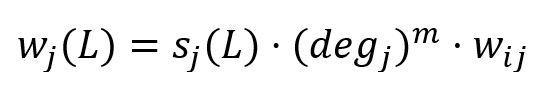
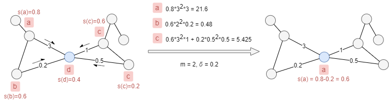

# HANP

## Overview

The HANP (Hop Attenuation & Node Preference) algorithm extends the traditional <a target="_blank" href="/docs/graph-analytics-algorithms/label-propagation">Label Propagation algorithm (LPA)</a> by incorporating a label score attenuation mechanism. The goal of HANP is to improve the accuracy and robustness of community detection in networks. It was proposed in 2009:

- I.X.Y. Leung, P. Hui, P. Liò, J. Crowcroft, <a target="_blank" href="https://arxiv.org/pdf/0808.2633.pdf">Towards real-time community detection in large networks</a> (2009)

## Concepts

### Hop Attenuation

HANP associates each label with a <b>score</b> which decreases as it propagates from its origin. Initially, all labels are assigned a score of 1. Each time a node adopts a new label from its neighborhood, the score of that label is attenuated by subtracting a <b>hop attenuation</b> factor `δ` (0 < `δ` ≤ 1).

The hop attenuation mechanism helps limit the spread of labels to nearby nodes and prevents any single label from dominating the entire network.

### Node Preference

In the calculation of the new maximal label, HANP incorporates <b>node preference</b> based on node degree. When node <code>j ∈ N<sub>i</sub></code> propagates its label `L` to node `i`, the weight of label `L` is calculated by:

<center></center>

where,

- <code>s<sub>j</sub>(L)</code> is the score of label `L` in `j`.
- <code>deg<sub>j</sub></code> is the degree of `j`. When `m > 0`, more preference is given to nodes with high degree; `m < 0`, more preference is given to nodes with low degree; `m = 0`, no node preference is applied.
- <code>w<sub>ij</sub></code> is the sum of edge weights between `i` and `j`.

Given the edge weights and label scores shown in the example below, if we set `m = 2` and `δ = 0.2`, the blue node will update its label from `d` to `a`. The score of label `a` in the blue node will be attenuated to 0.6.

<center></center>

## Considerations

- The algorithm treats all edges as undirected.
- Due to factors such as the order of nodes, random selection among labels with equal weights, and parallel computations, the results may vary between runs.

## Example Graph

<center></center>

```gql
INSERT (A:user {_id: "A"}), (B:user {_id: "B"}),
       (C:user {_id: "C"}), (D:user {_id: "D"}),
       (E:user {_id: "E"}), (F:user {_id: "F"}),
       (G:user {_id: "G"}), (H:user {_id: "H"}),
       (I:user {_id: "I"}), (J:user {_id: "J"}),
       (K:user {_id: "K"}), (L:user {_id: "L"}),
       (M:user {_id: "M"}), (N:user {_id: "N"}),
       (O:user {_id: "O"}),
       (A)-[:connect]->(B), (A)-[:connect]->(C),
       (A)-[:connect]->(F), (A)-[:connect]->(K),
       (B)-[:connect]->(C), (C)-[:connect]->(D),
       (D)-[:connect]->(A), (D)-[:connect]->(E),
       (E)-[:connect]->(A), (F)-[:connect]->(G),
       (F)-[:connect]->(J), (G)-[:connect]->(H),
       (H)-[:connect]->(F), (I)-[:connect]->(F),
       (I)-[:connect]->(H), (J)-[:connect]->(I),
       (K)-[:connect]->(F), (K)-[:connect]->(N),
       (L)-[:connect]->(M), (L)-[:connect]->(N),
       (M)-[:connect]->(K), (M)-[:connect]->(N),
       (N)-[:connect]->(M), (O)-[:connect]->(N)
```

## Parameters

| Name | Type | Default | Description |
| -- | -- | -- | -- |
| `maxIterations` | `INT` | `10` | Maximum number of propagation iterations. |
| `delta` | `FLOAT` | `0.5` | Hop attenuation factor (0 < δ ≤ 1). Higher values cause labels to decay faster. |
| `m` | `FLOAT` | `0` | Node degree preference exponent. `m` > 0 favors high-degree nodes; `m` < 0 favors low-degree; `m` = 0 no preference. |
| `limit` | `INT` | `-1` | Limits the number of results returned (-1 = all). |
| `order` | `STRING` | / | Sorts the results by `community`: `asc` or `desc`. |

## Run Mode

**Returns:**

| Column | Type | Description |
| -- | -- | -- |
| `nodeId` | `STRING` | Node identifier (`_id`) |
| `community` | `INT` | Community identifier |

```gql
CALL algo.hanp({
  maxIterations: 10,
  m: 0,
  delta: 0.5
}) YIELD nodeId, community
```

## Stream Mode

Returns the same columns as run mode, streamed for memory efficiency.

```gql
CALL algo.hanp.stream({
  maxIterations: 10,
  m: 0,
  delta: 0.5
}) YIELD nodeId, community
RETURN community, COLLECT(nodeId) AS members
GROUP BY community
```

## Stats Mode

**Returns:**

| Column | Type | Description |
| -- | -- | -- |
| `nodeCount` | `INT` | Total number of nodes |
| `communityCount` | `INT` | Number of communities detected |
| `largestCommunitySize` | `INT` | Size of the largest community |
| `smallestCommunitySize` | `INT` | Size of the smallest community |

```gql
CALL algo.hanp.stats({
  delta: 0.2
}) YIELD nodeCount, communityCount, largestCommunitySize, smallestCommunitySize
```

## Write Mode

Computes results and writes them back to node properties. The write configuration is passed as a second argument map.

**Write parameters:**

| Name | Type | Description |
| -- | -- | -- |
| `db.property` | `STRING` or `MAP` | Node property to write results to. String: writes the `community` column in results to a property. Map: explicit column-to-property mapping (e.g., `{community: 'comm_id'}`). |

**Writable columns:**

| Column | Type | Description |
| -- | -- | -- |
| `community` | `INT` | Community identifier |

**Returns:**

| Column | Type | Description |
| -- | -- | -- |
| `task_id` | `STRING` | Task identifier for tracking via `SHOW TASKS` |
| `nodesWritten` | `INT` | Number of nodes with properties written |
| `computeTimeMs` | `INT` | Time spent computing the algorithm (milliseconds) |
| `writeTimeMs` | `INT` | Time spent writing properties to storage (milliseconds) |

```gql
CALL algo.hanp.write({delta: 0.2}, {
  db: {
    property: "comm_id"
  }
}) YIELD task_id, nodesWritten, computeTimeMs, writeTimeMs
```
