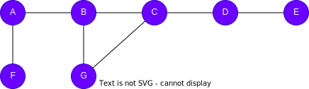
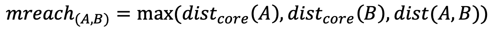

# HDBSCAN

## Overview

HDBSCAN (Hierarchical Density-Based Spatial Clustering of Applications with Noise) is a density-based clustering algorithm that finds clusters of varying density and identifies outlier (noise) nodes.

- R.J.G.B. Campello, D. Moulavi, J. Sander, <a target="_blank" href="https://link.springer.com/chapter/10.1007/978-3-642-37456-2_14">Density-Based Clustering Based on Hierarchical Density Estimates</a> (2013)

## Concepts

### Density-Based Clustering

Unlike algorithms like k-Means that partition all nodes into clusters, HDBSCAN finds clusters based on **density**: tightly connected regions of the graph form clusters, while loosely connected nodes are treated as **noise** (outliers). This means HDBSCAN can discover clusters of different sizes and shapes, and it doesn't require specifying the number of clusters.

In the HDBSCAN algorithm, **distance** between two nodes is the shortest-path length (hop count) between them. The **core distance** of a node answers the question: "How far does a node need to reach to find **at least** k nearby neighbors?"

<div align=center></div>

For example, to find at least 3 neighbors:

- Node `A` needs 2 hops (1 hop reaches `B` and `F`, 2 hops reaches `C` or `G`) → <code>dist<sub>core</sub>(A) = 2</code>
- Node `B` only needs 1 hop (reaches `A`, `C`, and `G`) → <code>dist<sub>core</sub>(B) = 1</code>
- Node `E` needs 3 hops (1 hop reaches `D`, 2 hops reaches `C`, 3 hops reaches `B` or `G`) → <code>dist<sub>core</sub>(E) = 3</code>

A node in a dense region has a small core distance, while a node in a sparse region has a large core distance.

The **mutual reachability distance** between two nodes `A` and `B` is:

<div align=center></div>

This smooths out density differences — connections between dense and sparse regions are penalized, which helps prevent sparse nodes from being pulled into dense clusters.

Consider the graph above with minimum 3 neighbors to find:

- <code>mreach(A,B) = max(2,1,1) = 2</code>
- <code>mreach(A,E) = max(2,3,4) = 4</code>
- <code>mreach(B,E) = max(1,3,3) = 3</code>

The mutual reachability distance between `A` and `B` is smaller than each of them with `E`. This makes sparse-region connections weaker.

### Hierarchical Clustering and Cluster Extraction

1. **Build a <a href="/docs/graph-algorithms/minimum-spanning-tree">minimum spanning tree (MST)</a>** using mutual reachability distances as edge weights.

2. **Build the condensed cluster hierarchy.** Process MST edges from lightest to heaviest, merging nodes at each step. Each merge is tracked at a **density level** `λ = 1 / weight`. A cluster is "born" when a merged component first reaches `minClusterSize`, and "dies" when it merges into a larger component at a lower density level.

3. **Extract the most stable clusters.** The **stability** of a cluster measures how long it persists across density levels. A cluster with higher stability represents a more persistent, meaningful grouping. When a parent cluster's stability exceeds the combined stability of its children, the parent is selected; otherwise the children are kept. Nodes not belonging to any selected cluster are labeled as **noise** (cluster = -1).

### Outlier Detection

Each node receives an **outlier score** between 0 and 1:

- **Noise nodes**: outlier score = `1.0`
- **Clustered nodes**: outlier score = `coreDist / (coreDist + 1)`

Nodes in denser regions (smaller core distance) get lower outlier scores. Nodes in sparser regions get higher scores, even if they belong to a cluster.

## Considerations

- The algorithm treats edges as undirected for distance computation.
- By default, distance is measured by shortest-path hop count on the graph structure. When `nodeProperty` is set, the algorithm uses Euclidean distance between numeric vectors stored in that property instead.
- The minimum cluster size (`minClusterSize`) and the number of neighbors (`minSamples`) used to compute core distance both significantly affect results — smaller values produce more, smaller clusters; larger values produce fewer, denser clusters.

## Example Graph

<div align=center></div>

```gql
INSERT (A:user {_id: "A"}), (B:user {_id: "B"}),
       (C:user {_id: "C"}), (D:user {_id: "D"}),
       (E:user {_id: "E"}), (F:user {_id: "F"}),
       (G:user {_id: "G"}), (H:user {_id: "H"}),
       (I:user {_id: "I"}), (J:user {_id: "J"}),
       (K:user {_id: "K"}), (L:user {_id: "L"}),
       (M:user {_id: "M"}), (N:user {_id: "N"}),
       (O:user {_id: "O"}),
       (A)-[:connect]->(B), (A)-[:connect]->(C),
       (A)-[:connect]->(F), (A)-[:connect]->(K),
       (B)-[:connect]->(C), (C)-[:connect]->(D),
       (D)-[:connect]->(A), (D)-[:connect]->(E),
       (E)-[:connect]->(A), (F)-[:connect]->(G),
       (F)-[:connect]->(J), (G)-[:connect]->(H),
       (H)-[:connect]->(F), (I)-[:connect]->(F),
       (I)-[:connect]->(H), (J)-[:connect]->(I),
       (K)-[:connect]->(F), (K)-[:connect]->(N),
       (L)-[:connect]->(M), (L)-[:connect]->(N),
       (M)-[:connect]->(K), (M)-[:connect]->(N),
       (O)-[:connect]->(N)
```

## Parameters

| Name | Type | Default | Description |
| -- | -- | -- | -- |
| `minClusterSize` | `INT` | `5` | Minimum number of nodes to form a cluster. |
| `minSamples` | `INT` | `5` | Minimum samples used to compute core distance. |
| `nodeProperty` | `STRING` | / | Node property containing a numeric vector for attribute-based distance. If unset, uses graph structure distance (shortest-path hop count). |
| `limit` | `INT` | `-1` | Limits the number of results returned (-1 = all). |
| `order` | `STRING` | / | Sorts the results by `cluster`: `asc` or `desc`. |

## Run Mode

**Returns:**

| Column | Type | Description |
| -- | -- | -- |
| `nodeId` | `STRING` | Node identifier (`_id`) |
| `cluster` | `INT` | Cluster assignment (-1 = noise) |
| `outlierScore` | `FLOAT` | Outlier score (higher = more likely outlier) |

```gql
CALL algo.hdbscan({
  minClusterSize: 3,
  minSamples: 2
}) YIELD nodeId, cluster, outlierScore
```

## Stream Mode

Returns the same columns as run mode, streamed for memory efficiency.

```gql
CALL algo.hdbscan.stream({
  minClusterSize: 3,
  minSamples: 2
}) YIELD nodeId, cluster
RETURN cluster, COLLECT(nodeId) AS members, COUNT(nodeId) AS size
GROUP BY cluster
```

## Stats Mode

**Returns:**

| Column | Type | Description |
| -- | -- | -- |
| `nodeCount` | `INT` | Total number of nodes |
| `clusterCount` | `INT` | Number of clusters (excluding noise) |
| `noiseCount` | `INT` | Number of noise points |
| `avgOutlierScore` | `FLOAT` | Average outlier score |

```gql
CALL algo.hdbscan.stats({
  minClusterSize: 3,
  minSamples: 2
}) YIELD nodeCount, clusterCount, noiseCount, avgOutlierScore
```

## Write Mode

Computes results and writes them back to node properties. The write configuration is passed as a second argument map.

**Write parameters:**

| Name | Type | Description |
| -- | -- | -- |
| `db.property` | `STRING` or `MAP` | Node property to write results to. String: writes the `cluster` column in results to a property. Map: explicit column-to-property mapping (e.g., `{cluster: 'hdb_cluster', outlierScore: 'hdb_outlier'}`). |

**Writable columns:**

| Column | Type | Description |
| -- | -- | -- |
| `cluster` | `INT` | Cluster assignment |
| `outlierScore` | `FLOAT` | Outlier score |

**Returns:**

| Column | Type | Description |
| -- | -- | -- |
| `task_id` | `STRING` | Task identifier for tracking via `SHOW TASKS` |
| `nodesWritten` | `INT` | Number of nodes with properties written |
| `computeTimeMs` | `INT` | Time spent computing the algorithm (milliseconds) |
| `writeTimeMs` | `INT` | Time spent writing properties to storage (milliseconds) |

```gql
CALL algo.hdbscan.write({minClusterSize: 3, minSamples: 2}, {
  db: {
    property: "hdb_cluster"
  }
}) YIELD task_id, nodesWritten, computeTimeMs, writeTimeMs
```
