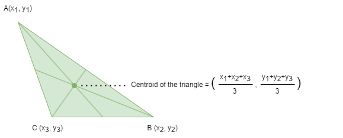
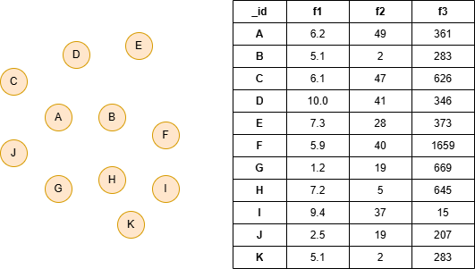

# k-Means

## Overview

The k-Means algorithm is a widely used clustering technique that partitions nodes in a graph into <i>k</i> clusters based on their similarity. Each node is assigned to the cluster whose centroid is closest, measured by Euclidean distance.

The concept of the k-Means algorithm dates back to 1957, but it was formally named and popularized by J. MacQueen in 1967:

- J. MacQueen, <a target="_blank" href="http://www.cs.cmu.edu/~bhiksha/courses/mlsp.fall2010/class14/macqueen.pdf">Some methods for classification and analysis of multivariate observations</a> (1967)

Since then, the algorithm has been widely applied across various domains, including vector quantization, clustering analysis, feature learning, computer vision, and more.

## Concepts

### Centroid

The centroid, or geometric center, of an object in an N-dimensional space is the average position of all its points across each of the N coordinate directions.

<div align=center></div>

In the context of clustering algorithms such as k-Means, a centroid refers to the geometric center of a cluster. When node features are defined using multiple node properties, the centroid summarizes those features by averaging them across all nodes in the cluster. To find the centroid of a cluster, the algorithm calculates the mean feature value of each feature dimension from the nodes assigned to that cluster.

The algorithm starts by selecting `k` initial centroids by random sampling.

### Clustering Iterations

During each iterative process of k-Means, each node calculates its distance to each of the current cluster centroids and is assigned to the cluster with the closest centroid. Once all nodes have been assigned to clusters, the centroids are updated by recalculating the mean feature values of the nodes within each cluster.

The iteration ends when the clustering results stabilize, or the maximum number of iterations is reached.

## Considerations

- The success of the k-Means algorithm depends on appropriately choosing the value of `k`.
- If two or more identical centroids exist, only one of them will take effect, while the other equivalent centroids will form empty clusters.
- Results may vary between runs due to random initial centroid selection.

## Example Graph

<div align=center></div>

```gql
INSERT (:default {_id: "A", f1: 6.2, f2: 49, f3: 361}),
       (:default {_id: "B", f1: 5.1, f2: 2, f3: 283}),
       (:default {_id: "C", f1: 6.1, f2: 47, f3: 626}),
       (:default {_id: "D", f1: 10.0, f2: 41, f3: 346}),
       (:default {_id: "E", f1: 7.3, f2: 28, f3: 373}),
       (:default {_id: "F", f1: 5.9, f2: 40, f3: 1659}),
       (:default {_id: "G", f1: 1.2, f2: 19, f3: 669}),
       (:default {_id: "H", f1: 7.2, f2: 5, f3: 645}),
       (:default {_id: "I", f1: 9.4, f2: 37, f3: 15}),
       (:default {_id: "J", f1: 2.5, f2: 19, f3: 207}),
       (:default {_id: "K", f1: 5.1, f2: 2, f3: 283})
```

## Parameters

| Name | Type | Default | Description |
| -- | -- | -- | -- |
| `propertyKeys` | `LIST` | / | **Required.** List of numeric node property names to use as feature dimensions. |
| `k` | `INT` | `3` | Number of clusters. |
| `iterations` | `INT` | `25` | Maximum number of iterations. |
| `limit` | `INT` | `-1` | Limits the number of results returned (-1 = all). |
| `order` | `STRING` | / | Sorts the results by `cluster`: `asc` or `desc`. |

## Run Mode

**Returns:**

| Column | Type | Description |
| -- | -- | -- |
| `nodeId` | `STRING` | Node identifier (`_id`) |
| `cluster` | `INT` | Cluster assignment |
| `distance` | `FLOAT` | Distance to cluster centroid |

```gql
CALL algo.kmeans({
  k: 3,
  propertyKeys: ["f1", "f2", "f3"],
  iterations: 25
}) YIELD nodeId, cluster, distance
```

Result:

| nodeId | cluster | distance |
| -- | -- | -- |
| E | 0 | 75.3604919702625 |
| D | 0 | 103.70934745720851 |
| G | 0 | 220.86219402604874 |
| F | 1 | 0 |
| A | 0 | 90.72683588663278 |
| C | 0 | 179.21588587510874 |
| B | 0 | 166.72712361820436 |
| I | 2 | 96.4826538814102 |
| H | 0 | 197.68082544849918 |
| K | 0 | 166.72712361820436 |
| J | 2 | 96.4826538814102 |

## Stream Mode

Returns the same columns as run mode, streamed for memory efficiency.

```gql
CALL algo.kmeans.stream({
  k: 3,
  propertyKeys: ["f1", "f2", "f3"]
}) YIELD nodeId, cluster
RETURN cluster, COLLECT(nodeId) AS members
GROUP BY cluster
```

Result:

| cluster | members |
| -- | -- |
| 0 | ["E", "D", "G", "A", "C", "B", "H", "K"] |
| 1 | ["F"] |
| 2 | ["I", "J"] |

## Stats Mode

**Returns:**

| Column | Type | Description |
| -- | -- | -- |
| `nodeCount` | `INT` | Total number of nodes |
| `clusterCount` | `INT` | Number of clusters |
| `avgDistance` | `FLOAT` | Average distance to centroid |
| `minDistance` | `FLOAT` | Minimum distance to centroid |
| `maxDistance` | `FLOAT` | Maximum distance to centroid |

```gql
CALL algo.kmeans.stats({
  k: 3,
  propertyKeys: ["f1", "f2", "f3"]
}) YIELD nodeCount, clusterCount, avgDistance, minDistance, maxDistance
```

Result:

| nodeCount | clusterCount | avgDistance | minDistance | maxDistance |
| -- | -- | -- | -- | -- |
| 11 | 3 | 126.72501233299907 | 0 | 220.86219402604874 |

## Write Mode

Computes results and writes them back to node properties. The write configuration is passed as a second argument map.

**Write parameters:**

| Name | Type | Description |
| -- | -- | -- |
| `db.property` | `STRING` or `MAP` | Node property to write results to. String: writes the `cluster` column in results to a property. Map: explicit column-to-property mapping (e.g., `{cluster: 'km_cluster', distance: 'km_dist'}`). |

**Writable columns:**

| Column | Type | Description |
| -- | -- | -- |
| `cluster` | `INT` | Cluster assignment |
| `distance` | `FLOAT` | Distance to centroid |

**Returns:**

| Column | Type | Description |
| -- | -- | -- |
| `task_id` | `STRING` | Task identifier for tracking via `SHOW TASKS` |
| `nodesWritten` | `INT` | Number of nodes with properties written |
| `computeTimeMs` | `INT` | Time spent computing the algorithm (milliseconds) |
| `writeTimeMs` | `INT` | Time spent writing properties to storage (milliseconds) |

```gql
CALL algo.kmeans.write({k: 3, propertyKeys: ["f1", "f2", "f3"]}, {
  db: {
    property: "km_cluster"
  }
}) YIELD task_id, nodesWritten, computeTimeMs, writeTimeMs
```
