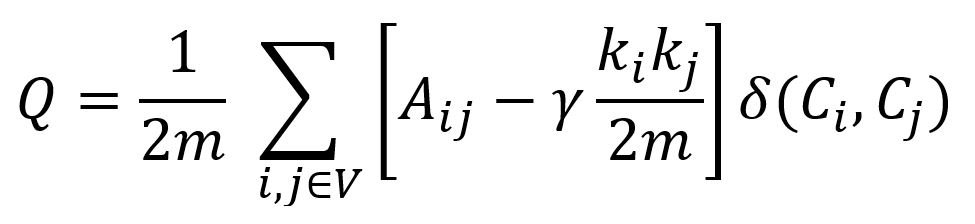
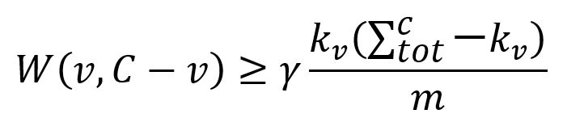
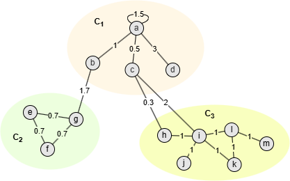
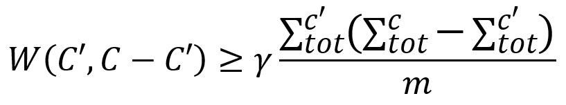
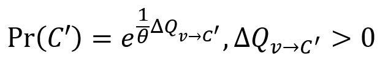
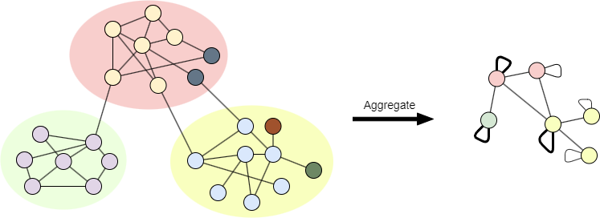
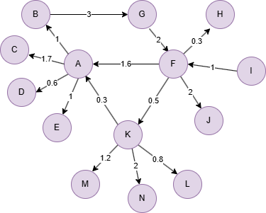

# Leiden

## Overview

The Leiden algorithm is a community detection method designed to optimize modularity while addressing some of the limitations of the widely used <a target="_blank" href="/docs/graph-analytics-algorithms/louvain">Louvain</a> algorithm. Unlike Louvain, which may produce poorly connected or even disconnected communities, Leiden guarantees well-connected communities. Additionally, the Leiden algorithm is faster. It is named after the city of Leiden, where it was developed.

References:

- V.A. Traag, L. Waltman, N.J. van Eck, <a target="balnk" href="https://arxiv.org/pdf/1810.08473.pdf">From Louvain to Leiden: guaranteeing well-connected communities</a> (2019)
- V.A. Traag, P. Van Dooren, Y. Nesterov, <a target="_blank" href="https://arxiv.org/pdf/1104.3083v1.pdf">Narrow scope for resolution-limit-free community detection</a> (2011)

## Concepts

### Modularity

The Leiden algorithm optimizes <a href="/docs/graph-algorithms/modularity">modularity</a> with an additional **resolution parameter** `γ` (gamma):

<center></center>

The parameter `γ` controls the granularity of the detected communities by modulating the balance between intra-community and inter-community connections:

- When `γ` > 1, the algorithm favors more and smaller communities that are tightly connected internally.
- When 0 < `γ` < 1, it favors fewer and larger communities that may be less densely connected internally.

### Leiden

When the Leiden algorithm starts, each node is placed in its own community. The algorithm then iteratively proceeds through passes, each consisting of three phases:

#### Phase 1: Fast Modularity Optimization

In the first phase of <a target="_blank" href="/docs/graph-analytics-algorithms/louvain">Louvain</a>, the algorithm repeatedly visits all nodes in the graph until no further node movements can increase the modularity. The Leiden algorithm improves efficiency by only visiting all nodes once initially, and afterwards, only revisiting nodes whose neighborhoods have changed. 

To achieve this, the Leiden algorithm maintains a queue, initializes it with all nodes in the graph in a random order, then repeats the following steps until the queue is empty:

- Remove the first node `v` from the front of the queue. 
- Reassign node `v` to a different community `C` that provides the maximum gain of modularity (`ΔQ`), or keep `v` in its current community if there is no positive gain. 
- If `v` is moved to a new community `C`, add to the rear of the queue all neighbors of `v` that do not belong to `C` and that are not already in the queue. 

#### Phase 2: Refinement

This phase produces a refined partition <code>P<sub>refined</sub></code> based on the partition `P` obtained from the first phase. Initially, <code>P<sub>refined</sub></code> is set as a singleton partition, where each node—either from the original graph or the aggregated graph—is placed in its own community. Then, each community `C ∈ P` is refined individually as follows:

1\. Find each node `v ∈ C` that is well-connected within `C` by this formula:

<center></center>

where,

- `W(v,C-v)` is the sum of edge weights between node `v` and the other nodes in `C`.
- <code>k<sub>v</sub></code> is the total edge weights between node `v` and the other nodes in the graph.
- <code><math><mmultiscripts><mi>∑</mi><mi>tot</mi><mi>c</mi></mmultiscripts></math></code> is the sum of `k` of all nodes in `C`.
- `m` is the sum of all edge weights in the graph.

<center></center>

Take community <code>C<sub>1</sub></code> in the graph above as an example, where 

- m = 18.1
- <math><mmultiscripts><mi>∑</mi><mi>tot</mi><mi><math><msub><mi>C</mi><mn>1</mn></msub></math></mi></mmultiscripts></math> = k<sub>a</sub> + k<sub>b</sub> + k<sub>c</sub> + k<sub>d</sub> = 6 + 2.7 + 2.8 + 3 = 14.5

Set `γ` as 1.2, then:

- W(a, C<sub>1</sub>) - γ/m ⋅ k<sub>a</sub> ⋅ (<math><mmultiscripts><mi>∑</mi><mi>tot</mi><mi><math><msub><mi>C</mi><mn>1</mn></msub></math></mi></mmultiscripts></math> - k<sub>a</sub>) = 4.5 - 1.2/18.1\*6\*(14.5 - 6) = 1.12
- W(b, C<sub>1</sub>) - γ/m ⋅ k<sub>b</sub> ⋅ (<math><mmultiscripts><mi>∑</mi><mi>tot</mi><mi><math><msub><mi>C</mi><mn>1</mn></msub></math></mi></mmultiscripts></math> - k<sub>b</sub>) = 1 - 1.2/18.1\*2.7\*(14.5 - 2.7) = -1.11
- W(c, C<sub>1</sub>) - γ/m ⋅ k<sub>c</sub> ⋅ (<math><mmultiscripts><mi>∑</mi><mi>tot</mi><mi><math><msub><mi>C</mi><mn>1</mn></msub></math></mi></mmultiscripts></math> - k<sub>c</sub>) = 0.5 - 1.2/18.1\*2.8\*(14.5 - 2.8) = -1.67
- W(d, C<sub>1</sub>) - γ/m ⋅ k<sub>d</sub> ⋅ (<math><mmultiscripts><mi>∑</mi><mi>tot</mi><mi><math><msub><mi>C</mi><mn>1</mn></msub></math></mi></mmultiscripts></math> - k<sub>d</sub>) = 3 - 1.2/18.1\*3\*(14.5 - 3) = 0.71

Therefore, nodes `a` and `d` are considered well-connected in <code>C<sub>1</sub></code>.

2\. Visit each node `v`. If it remains in its own singleton community in <code>P<sub>refined</sub></code>, randomly merge it into a community <code>C' ∈ P<sub>refined</sub></code> that increases the modularity. The merge is allowed only if `C'` is well-connected with `C`, determined by the following condition:

<center></center>

Note that each node `v` is not necessarily merged greedily with the community that yields the maximum gain of modularity. Instead, the larger the modularity gain, the more likely that community is to be selected. The degree of randomness in selecting a community `C'` is determined by a parameter `θ` (theta) as: 

<center></center>

Randomness in the selection of a community allows the partition space to be explored more broadly.

#### Phase 3: Community Aggregation

The aggregate graph is constructed based on the <code>P<sub>refined</sub></code> obtained from the previous phase. This aggregation process is the same as in <a target="_blank" href="/docs/graph-analytics-algorithms/louvain">Louvain</a>. Note that each node is a single community in the aggregate graph in Louvain. However, the aggregate graph in Leiden is partitioned based on `P`, so multiple nodes may belong to the same community.

<center></center>
<center><code>P</code> is denoted by color blocks, <code>P<sub>refined</sub></code> is denoted by node colors</center><br>

Once this third phase is completed, another pass is applied to the aggregate graph. These passes are iterated until no further changes occur in the node communities, and the modularity reaches its maximum.

## Considerations

- If node `v` has any self-loop, when calculating <code>k<sub>v</sub></code>, the weight of self-loop is counted only once.
- The Leiden algorithm treats all edges as undirected, ignoring their original direction.

## Example Graph

<center></center>

```gql
INSERT (A:default {_id: "A"}), (B:default {_id: "B"}),
       (C:default {_id: "C"}), (D:default {_id: "D"}),
       (E:default {_id: "E"}), (F:default {_id: "F"}),
       (G:default {_id: "G"}), (H:default {_id: "H"}),
       (I:default {_id: "I"}), (J:default {_id: "J"}),
       (K:default {_id: "K"}), (L:default {_id: "L"}),
       (M:default {_id: "M"}), (N:default {_id: "N"}),
       (A)-[:default {weight: 1}]->(B), (A)-[:default {weight: 1.7}]->(C),
       (A)-[:default {weight: 0.6}]->(D), (A)-[:default {weight: 1}]->(E),
       (B)-[:default {weight: 3}]->(G), (F)-[:default {weight: 1.6}]->(A),
       (F)-[:default {weight: 0.3}]->(H), (F)-[:default {weight: 2}]->(J),
       (F)-[:default {weight: 0.5}]->(K), (G)-[:default {weight: 2}]->(F),
       (I)-[:default {weight: 1}]->(F), (K)-[:default {weight: 0.3}]->(A),
       (K)-[:default {weight: 0.8}]->(L), (K)-[:default {weight: 1.2}]->(M),
       (K)-[:default {weight: 2}]->(N)
```

## Parameters

| Name | Type | Default | Description |
| -- | -- | -- | -- |
| `maxLevels` | `INT` | `10` | Maximum number of optimization passes. Each pass consists of 3 phases. |
| `resolution` | `FLOAT` | `1.0` | Resolution parameter `γ`. Values > 1 favor smaller, tighter communities; values < 1 favor larger communities. |
| `theta` | `FLOAT` | `0.01` | Controls randomness during refinement phase. Set to `0` to disable randomness and always select the maximum modularity gain. |
| `weight` | `STRING` | / | Numeric edge property to use as weight. If unset, all edges have unit weight. |
| `limit` | `INT` | `-1` | Limits the number of results returned (-1 = all). |
| `order` | `STRING` | / | Sorts the results by community size: `asc` or `desc`. |

## Run Mode

**Returns:**

| Column | Type | Description |
| -- | -- | -- |
| `nodeId` | `STRING` | Node identifier (`_id`) |
| `community` | `INT` | Community identifier |
| `level` | `INT` | Number of optimization passes completed before convergence |
| `modularity` | `FLOAT` | Final modularity score |

```gql
CALL algo.leiden({
  weight: "weight"
}) YIELD nodeId, community, level, modularity
```

## Stream Mode

Returns the same columns as run mode, streamed for memory efficiency.

```gql
CALL algo.leiden.stream({
  weight: "weight"
}) YIELD nodeId, community
RETURN community, COLLECT(nodeId) AS members
GROUP BY community
```

## Stats Mode

**Returns:**

| Column | Type | Description |
| -- | -- | -- |
| `nodeCount` | `INT` | Total number of nodes |
| `communityCount` | `INT` | Number of communities detected |
| `largestCommunitySize` | `INT` | Size of the largest community |
| `smallestCommunitySize` | `INT` | Size of the smallest community |
| `modularity` | `FLOAT` | Final modularity score |

```gql
CALL algo.leiden.stats({
  weight: "weight"
}) YIELD nodeCount, communityCount, largestCommunitySize, smallestCommunitySize, modularity
```

## Write Mode

Computes results and writes them back to node properties. The write configuration is passed as a second argument map.

**Write parameters:**

| Name | Type | Description |
| -- | -- | -- |
| `db.property` | `STRING` or `MAP` | Node property to write results to. String: writes the `community` column in results to a property. Map: explicit column-to-property mapping (e.g., `{community: 'comm_id', level: 'lvl'}`). |

**Writable columns:**

| Column | Type | Description |
| -- | -- | -- |
| `community` | `INT` | Community identifier |
| `level` | `INT` | Number of optimization passes completed before convergence |
| `modularity` | `FLOAT` | Final modularity score |

**Returns:**

| Column | Type | Description |
| -- | -- | -- |
| `task_id` | `STRING` | Task identifier for tracking via `SHOW TASKS` |
| `nodesWritten` | `INT` | Number of nodes with properties written |
| `computeTimeMs` | `INT` | Time spent computing the algorithm (milliseconds) |
| `writeTimeMs` | `INT` | Time spent writing properties to storage (milliseconds) |

```gql
CALL algo.leiden.write({weight: "weight"}, {
  db: {
    property: "community_id"
  }
}) YIELD task_id, nodesWritten, computeTimeMs, writeTimeMs
```
