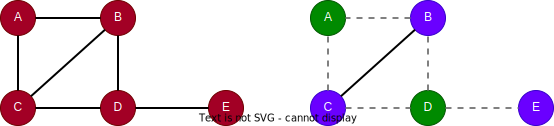

# Max k-Cut

## Overview

The Max k-Cut algorithm partitions the nodes of a graph into `k` groups such that the number of edges between different groups is maximized. It uses a greedy local search approach: starting from a random partition, it iteratively moves each node to the partition that maximizes the cut size.

Unlike community detection algorithms that maximize intra-group connectivity, Max k-Cut maximizes inter-group edges. It has applications in network design, VLSI layout, and frequency assignment.

## Concepts

### Maximum k-Cut

Given a graph and an integer `k`, the **maximum k-cut** problem seeks to partition the nodes into `k` disjoint sets such that the total number of edges crossing between sets is maximized. When `k = 2`, this is the classic **maximum cut** problem.

<div align=center></div>

In this example with `k = 2`, the optimal cut places nodes `{A, D}` in one partition and `{B, C, E}` in the other, cutting 5 of the 6 edges.

The Max k-Cut problem is NP-hard, so the algorithm uses an approximation via local search that converges to a locally optimal solution.

## Considerations

- The algorithm treats all edges as undirected.
- Results may vary between runs due to random initialization.

## Example Graph

<div align=center></div>

```gql
INSERT (A:default {_id: "A"}), (B:default {_id: "B"}),
       (C:default {_id: "C"}), (D:default {_id: "D"}),
       (E:default {_id: "E"}), (F:default {_id: "F"}),
       (G:default {_id: "G"}), (H:default {_id: "H"}),
       (A)-[:default]->(B), (A)-[:default]->(C),
       (A)-[:default]->(D), (A)-[:default]->(E),
       (A)-[:default]->(G), (D)-[:default]->(E),
       (D)-[:default]->(F), (E)-[:default]->(F),
       (G)-[:default]->(D), (G)-[:default]->(H)
```

## Parameters

| Name | Type | Default | Description |
| -- | -- | -- | -- |
| `k` | `INT` | `2` | Number of partitions (≥ 2). |
| `iterations` | `INT` | `100` | Number of local search iterations. |
| `limit` | `INT` | `-1` | Limits the number of results returned (-1 = all). |
| `order` | `STRING` | / | Sorts the results by `partition`: `asc` or `desc`. |

## Run Mode

**Returns:**

| Column | Type | Description |
| -- | -- | -- |
| `nodeId` | `STRING` | Node identifier (`_id`) |
| `partition` | `INT` | Partition assignment |
| `cutSize` | `FLOAT` | Total number of edges crossing between partitions |

```gql
CALL algo.maxkcut({
  k: 3
}) YIELD nodeId, partition, cutSize
```

Result:

| nodeId | partition | cutSize |
| -- | -- | -- |
| E | 2 | 10 |
| D | 0 | 10 |
| G | 2 | 10 |
| F | 1 | 10 |
| A | 1 | 10 |
| C | 0 | 10 |
| B | 0 | 10 |
| H | 0 | 10 |

## Stream Mode

Returns the same columns as run mode, streamed for memory efficiency.

```gql
CALL algo.maxkcut.stream({
  k: 2
}) YIELD nodeId, partition
RETURN partition, COLLECT(nodeId) AS members
GROUP BY partition
```

Result:

| partition | members |
| -- | -- |
| 1 | [E, D, C, B, H] |
| 0 | [G, F, A] |

## Stats Mode

**Returns:**

| Column | Type | Description |
| -- | -- | -- |
| `nodeCount` | `INT` | Total number of nodes |
| `partitionCount` | `INT` | Number of partitions |
| `cutSize` | `FLOAT` | Total number of edges crossing between partitions |

```gql
CALL algo.maxkcut.stats({
  k: 2
}) YIELD nodeCount, partitionCount, cutSize
```

Result:

| nodeCount | partitionCount | cutSize |
| -- | -- | -- |
| 8 | 2 | 8 |

## Write Mode

Computes results and writes them back to node properties. The write configuration is passed as a second argument map.

**Write parameters:**

| Name | Type | Description |
| -- | -- | -- |
| `db.property` | `STRING` or `MAP` | Node property to write results to. String: writes the `partition` column in results to a property. Map: explicit column-to-property mapping (e.g., `{partition: 'cut_group'}`). |

**Writable columns:**

| Column | Type | Description |
| -- | -- | -- |
| `partition` | `INT` | Partition assignment |

**Returns:**

| Column | Type | Description |
| -- | -- | -- |
| `task_id` | `STRING` | Task identifier |
| `status` | `STRING` | Task status (`running`) |

The write executes asynchronously in the background. Use `SHOW TASKS` with the `task_id` to check progress and results.

```gql
CALL algo.maxkcut.write({k: 3}, {
  db: {
    property: "cut_group"                   // String: writes partition to one property
    // property: {partition: "cut_group"}   // Map: explicit column-to-property
  }
}) YIELD task_id, status
```
